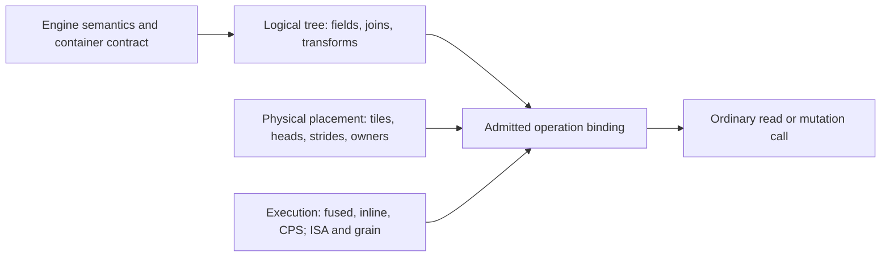

# Ikea

Ikea supplies composable data containers, codecs and computational kernels for
SixDB. These parts serve column- and row-oriented records, indexes, strings and
standalone structures such as hash tables and sketches. A block's physical layout
can be reused in several containers, with kernels suited to each context.

SeriesPack is the first implemented component, not the extent of Ikea's scope.

| Component | Purpose and current status |
| --- | --- |
| [SeriesPack](seriespack/usage.md) | Headless packed unsigned arrays, 1–64 bits wide; implemented reads, mutation and composition |
| TuplePack | Reserved stub; format and operations need a probe |
| StreamPack | Reserved stub; format and operations need a probe |

Engine owns database semantics, schema, segment definitions and representation
selection. Loom owns buffer acquisition and scheduling; Orbital provides machine
services. Ikea operations expose the contributions and lifetime requirements those
owners need, while kernel bodies concentrate on their computation. These boundaries
also let standalone data structures use blocks without adopting record semantics.

The current executable guides use SeriesPack to demonstrate the composition and
integration model. Future components should earn their own contracts through use;
they need not imitate SeriesPack's array interface.

| Reader | Start here | Executable |
| --- | --- | --- |
| SeriesPack caller | [Using SeriesPack](seriespack/usage.md): storage, construction, reads, selected writes and failures | [ordinary.cpp](examples/seriespack/ordinary.cpp) |
| Kernel or composition author | [Extending SeriesPack](seriespack/extending.md): nested substitution, native bodies, inline/CPS | [composition.cpp](examples/seriespack/composition.cpp), [pipeline.cpp](examples/seriespack/pipeline.cpp) |
| Engine/Loom/Orbital adapter author | [Integrating with owners](integration.md): leases, live state, effects and publication | [integration.cpp](examples/seriespack/integration.cpp) |
| Looking up a contract | [Semantic and execution reference](seriespack/reference.md), [physical formats](seriespack/representation.md) | [Tests](test/seriespack/README.md) |
| Changing the implementation | [Source and compilation boundaries](source.md), [benchmarks](../workbench/benchmarks/seriespack/README.md) | `ikea_validate`, `ikea_seriespack_bench` |

[Capabilities and deliberate limits](capabilities.md) describe the current implementation.
[Campaign evidence](../workbench/spikes/ikea-composition/ikea2-campaign/README.md)
has its own home, including prior implementations and experimental alternatives.

Logical composition, physical placement and execution can change independently:



A nested child can change its layout and owner while its parent keeps the same
logical contract. Different segments in the same collection can keep different
representations. Neither choice forces a different execution style.

## Build and run

From the repository root on Linux, use the [pinned toolchain](../BUILDING.md).
Prefix commands with `orb -m ubuntu` from the macOS workspace. For AVX2:

```sh
cmake -S . -B build/ikea/avx2 -G Ninja -DCMAKE_BUILD_TYPE=Release \
  -DSIXDB_MARCH=x86-64-v3 -DSIXDB_TUNE=zen5
cmake --build build/ikea/avx2 --target ikea_validate -j2
```

For ARM, use a separate directory with `-DSIXDB_MARCH=armv8-a+simd` and
`-DSIXDB_TUNE=neoverse-v2`. AVX-512 uses `x86-64-v4` plus the optional measured
VBMI/VBMI2/GFNI flags described in the [benchmark guide](../workbench/benchmarks/seriespack/README.md).
Run a binary only on a compatible CPU. `ikea_validate` runs correctness checks,
reference-fixture verification and all four examples; it does not time benchmarks.

Consumers link `ikea::seriespack`. `<ikea/seriespack.h>` is the ordinary umbrella;
read-only callers can include `<ikea/seriespack/read.h>`. Supported authoring
headers live under `seriespack/author/`. `seriespack/detail/` is implementation,
even where inline bodies must remain visible to the compiler.
