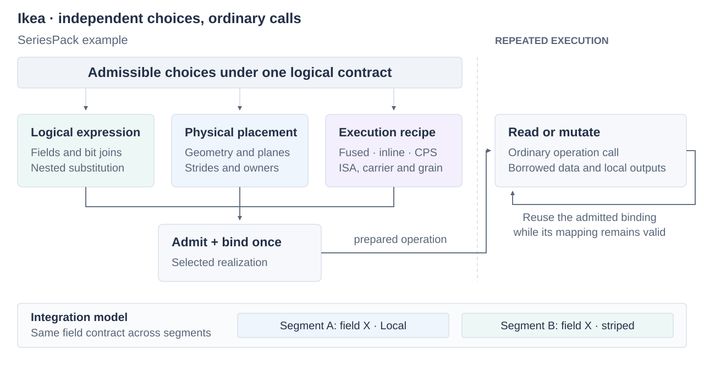

# Ikea

Ikea supplies composable data containers, codecs and computational kernels for
SixDB. These parts serve column- and row-oriented records, indexes, strings and
standalone structures such as hash tables and sketches. A block's physical layout
can be reused in several containers, with kernels suited to each context.

| Component | Purpose |
| --- | --- |
| [SeriesPack](docs/seriespack/usage.md) | Packed unsigned arrays, 1–64 bits wide; reads, mutation and composition |
| [TuplePack](docs/tuplepack/usage.md) | Byte-contained codes in fixed-layout units; manual layouts, point/packet/range reads and mutation, native composition |
| StreamPack | Reserved; no operations available |

Preparing an operation brings together a logical expression, its physical placement
and an execution recipe under the container's contract. Ordinary calls then reuse
that binding. A nested child can change layout or owner without changing its
parent's logical contract; execution style remains a separate choice.



Engine owns database semantics and representation selection; Loom owns buffer
acquisition and scheduling; Orbital provides machine services. The
[integration guide](docs/integration.md) explains storage lifetimes, mutation effects
and publication. [Extending Ikea](docs/extension.md) describes module boundaries and
the shared facilities available to authors.

| Reader | Start here | Executable |
| --- | --- | --- |
| SeriesPack caller | [Using SeriesPack](docs/seriespack/usage.md): storage, construction, reads, selected writes and failures | [ordinary.cpp](examples/seriespack/ordinary.cpp) |
| TuplePack caller | [Using TuplePack](docs/tuplepack/usage.md): manual descriptions, placement, ordered projections, packet shapes and mutation | [ordinary.cpp](examples/tuplepack/ordinary.cpp) |
| TuplePack composition author | [Composing TuplePack](docs/tuplepack/extending.md): child substitution, independent observations, native/CPS execution | [composition.cpp](examples/tuplepack/composition.cpp), [packets.cpp](examples/tuplepack/packets.cpp) |
| Kernel or composition author | [Extending SeriesPack](docs/seriespack/extending.md): nested substitution, native bodies, inline/CPS | [composition.cpp](examples/seriespack/composition.cpp), [pipeline.cpp](examples/seriespack/pipeline.cpp) |
| Engine/Loom/Orbital adapter author | [Integrating with owners](docs/integration.md): leases, live state, effects and publication | [SeriesPack adapter](examples/seriespack/integration.cpp), [TuplePack adapter](examples/tuplepack/integration.cpp) |
| Looking up a contract | [SeriesPack reference](docs/seriespack/reference.md), [physical formats](docs/seriespack/representation.md), [TuplePack reference](docs/tuplepack/reference.md) | [SeriesPack tests](test/seriespack/README.md), [TuplePack tests](test/tuplepack/README.md) |
| Changing the implementation | [Source boundaries](docs/source.md), [SeriesPack benchmarks](../workbench/benchmarks/seriespack/README.md), [TuplePack benchmarks](../workbench/benchmarks/tuplepack/README.md) | `ikea_validate`, module benchmark targets |

[Capabilities and limits](docs/capabilities.md) compare the supported operations.
Performance measurements are linked from each module's benchmark guide.

## Build and run

From the repository root on Linux, use the [pinned toolchain](../BUILDING.md).
Prefix commands with `orb -m ubuntu` from the macOS workspace. For AVX2:

```sh
cmake -S . -B build/ikea/avx2 -G Ninja -DCMAKE_BUILD_TYPE=Release \
  -DSIXDB_MARCH=x86-64-v3 -DSIXDB_TUNE=zen5
cmake --build build/ikea/avx2 --target ikea_validate -j2
```

For ARM, use a separate directory with `-DSIXDB_MARCH=armv8-a+simd` and
`-DSIXDB_TUNE=neoverse-v2`. AVX-512 uses `x86-64-v4` plus the optional measured
VBMI/VBMI2/GFNI flags described in the [benchmark guide](../workbench/benchmarks/seriespack/README.md).
Run a binary only on a compatible CPU. `ikea_validate` runs correctness checks,
reference-fixture verification and both modules' examples; it does not time benchmarks.

SeriesPack consumers link `ikea::seriespack`. `<ikea/seriespack.h>` is its ordinary umbrella;
read-only callers can include `<ikea/seriespack/read.h>`. Supported authoring
headers live under `seriespack/author/`. `seriespack/detail/` is implementation,
even where inline bodies must remain visible to the compiler.

TuplePack consumers link `ikea::tuplepack` and include `<ikea/tuplepack.h>`;
its `author/` and `detail/` directories make the same audience distinction.
Its optimized AVX-512 backend requires VBMI; `-DSIXDB_MARCH=znver5` supplies
the measured Zen 5 profile. The [reference](docs/tuplepack/reference.md) distinguishes
supported operations, fallback paths and deferred research.
