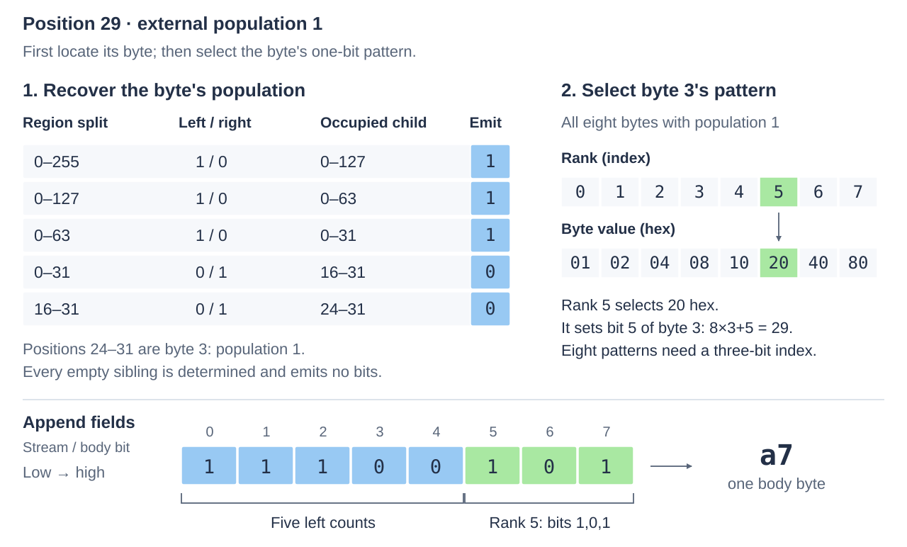

# Bec256 representation

Bec256 (Bisection–Enumerative Code) represents a subset of positions 0..255.
In the plain 32-byte bitset, position `8*j+b` is bit b of byte j.
The **population** is the number of set bits.
Knowing the population limits the possible bitsets, but usually leaves their
positions unknown.

The encoded **body** resolves that uncertainty in two parts: counts describe the
distribution among fixed regions; then an integer identifies each byte's exact
pattern. The decoder receives the total population separately. See [usage](usage.md)
for storing, reading and replacing bodies.

## Divide the positions and recover their counts

Divide the 256 positions into equal halves, 0..127 and 128..255, and repeat until
each region contains eight positions: one plain byte. This gives a fixed binary
tree: each region is a node, its halves are its children, and the 32 byte-sized
regions are its leaves. Five levels of divisions give region sizes
256 → 128 → 64 → 32 → 16 → 8.

The body omits boundaries and tree shape, which are fixed for every bitset.
At each division, let the parent contain `p` set bits and the left half contain
`q`. Encoding the left count is enough: the right count is `p−q`.
Once the decoder has both child counts, it can apply the same rule to each child.


The parent's population also limits how many bits the left count needs. If each
half has `h` positions, neither can hold more than `h` set bits. The legal left
counts therefore form the inclusive interval:

```text
lo = max(0, p − h)
hi = min(p, h)
```

The encoder stores `q−lo`, using `ceil(log2(hi−lo+1))` bits. The decoder already
knows `p` and `h`, so it knows that width; it reads the field and adds `lo` to
recover `q`. When there is only one legal count, the width is zero. In particular,
an empty or full region determines all its descendants without further bits.

The split fields recover **how many** set bits belong in each byte. The second
part of the body identifies their arrangement.

## Identify each byte by its rank

For a byte with population `c`, consider all eight-bit patterns containing
exactly `c` set bits, sorted by increasing unsigned byte value. The byte's
**enumerative rank** is its zero-based index in that list. Storing the index
identifies the byte uniquely because the decoder already knows its population
and therefore which list to use.

There are `choose(8,c)` such patterns: the number of ways to choose `c` positions
from eight. Their ranks need `ceil(log2(choose(8,c)))` bits:

| Byte population c | Possible byte patterns | Bits for the rank |
| --- | --- | --- |
| 0 or 8 | 1 | 0 |
| 1 or 7 | 8 | 3 |
| 2 or 6 | 28 | 5 |
| 3 or 5 | 56 | 6 |
| 4 | 70 | 7 |

Known empty and full bytes reconstruct as `00` and `ff` without rank bits.
For other bytes, the decoder uses the rank to select a pattern from a lookup table.

## Lay out the body

Split fields come first, in **breadth-first** order: finish each level from lower
to higher positions before processing its children. Ranks follow in plain byte
order, 0..31.

```text
split fields: 1 × 256-position region, 2 × 128, 4 × 64, 8 × 32, 16 × 16
byte ranks:   byte 0, byte 1, …, byte 31
```

Fields concatenate without gaps, each least-significant bit first; zero-width
fields contribute nothing. Body byte 0 holds the first eight stream bits,
starting at bit 0. The only padding is zero high bits in the final byte;
trailing bytes are invalid.
Rounding widths up can leave unused codes; values outside the legal split-count
or byte-rank range are invalid.

Decoding follows the information dependencies:

1. Start with the external population of the whole block.
2. Read the split fields in level order, using each known parent count to
   determine the field width and recover both child counts.
3. Use each byte's recovered population to determine its rank width, then use
   the rank to reconstruct that byte.

No field-length tags are needed: earlier counts determine every later width.
The body is **headless**: it contains neither the root population nor a byte
length or address. The caller retains that association. Populations 0 and 256
both require zero body bytes; the supplied population distinguishes their
all-zero and all-one bitsets.

Small populations and large empty or full regions can make the body short.
More mixed regions require more count and rank bits. The format always uses
this structure, even when it exceeds the 32-byte plain form. Its maximum is
374 bits, rounded to 47 bytes: the five split levels need at most
`8 + 2×7 + 4×6 + 8×5 + 16×4 = 150` bits, and the 32 ranks at most `32×7 = 224`.
A block with population four in every byte reaches both bounds.

## Worked examples

### One set bit: locating a byte, then a bit within it

Set only position 29. It belongs to byte 3, at bit 5, so that byte is `20` in
hexadecimal. All other plain bytes are zero, and the external population is 1.
Every region on the occupied path has two possible left counts, 0 and 1,
requiring one bit. Its empty siblings need no fields.



The five split fields establish that byte 3 has population 1. Its pattern list is
`01, 02, 04, 08, 10, 20, 40, 80`, so `20` has rank 5. Appending that three-bit
rank after the five split bits yields `1,1,1,0,0,1,0,1` in stream order: body byte
`a7`. Reading `a7` with population 1 reverses those steps. The
[ordinary example](../../examples/bec256/ordinary.cpp) checks this exact body.

### Several set bits: counts can exceed one

Now also set positions 18 and 21. Plain byte 2 becomes `24`, with population 2;
byte 3 remains `20`, with population 1. The total population is 3. The occupied
regions and their split fields are:

| Region being divided | Left count q | Right count p−q | Stored q−lo | Width |
| --- | --- | --- | --- | --- |
| 0..255 | 3 | 0 | 3 | 2 bits |
| 0..127 | 3 | 0 | 3 | 2 bits |
| 0..63 | 3 | 0 | 3 | 2 bits |
| 0..31 | 0 | 3 | 0 | 2 bits |
| 16..31 | 2 | 1 | 2 | 2 bits |

Each row has four legal left counts, 0..3. The other regions are empty and
contribute no fields. For byte 2, the list of bytes with population 2 starts
`03, 05, 06, 09, 0a, 0c, 11, 12, 14, 18, 21, 22, 24, …`.
Thus `24` has rank 12 among 28 patterns, requiring five bits. Byte 3 still has
rank 5, requiring three. The ten split bits and eight rank bits form the
18-bit body `3f b2 02`, with six zero padding bits in the final byte.

The lower bound matters for dense regions. A 16-position region with population
10 has legal left counts 2..8, since each half holds at most eight. A left count
of 7 is stored as `7−2 = 5` in three bits; the decoder adds 2 back and infers
the right count as `10−7 = 3`.

## Code and related reading

The [scalar codec](../../include/ikea/bec256/detail/scalar.h) shows the two
field passes; [tables.h](../../include/ikea/bec256/detail/tables.h) defines the
byte enumeration. The [wire check](../../test/bec256/check.cpp) compares the
implementation with an independent reference. The [figure generator](images/generate.py)
checks the examples against the scalar codec and rank tables. Run
`orb -m ubuntu python3 ikea/docs/bec256/images/generate.py` from this workspace.

For related compression ideas, Pibiri's
[BIC explanation](https://pages.di.unipi.it/pibiri/papers/BIC.pdf) develops how
previously recovered values narrow the ranges for later values in a sorted
sequence. Ottaviano and Venturini's
[Partitioned Elias–Fano paper](https://pages.di.unipi.it/rossano/assets/pdf/papers/SIGIR14.pdf),
sections 4 and 4.1, builds from the representation of one sequence to chunks
with smaller local universes.
