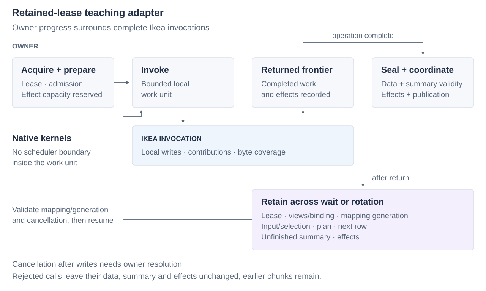

# Integrating with owners

An owner supplies storage, keeps borrowed bindings alive, and coordinates the
visibility of data and summaries. Ikea executes admitted operations within those
lifetimes. The executable [SeriesPack adapter](../examples/seriespack/integration.cpp)
and [TuplePack adapter](../examples/tuplepack/integration.cpp) show how to retain an
in-place mutation across scheduling boundaries and publish its effects.

## Who owns what

| Owner | Responsibility |
| --- | --- |
| Engine | Field semantics; collection/segment schema; representation choices; plans and evidence interpretation; summary validity; publication policy |
| Loom | Buffer leases, queueing, prefetch scheduling, task cancellation/rotation and retained work |
| Orbital | OS-facing services, including the intended UFFD page-COW version mechanism |
| Ikea | Admitted operations over borrowed storage; native contributions and issued-byte coverage; composition and physical descriptions |

Ikea supports in-place and private-copy mutation. Orbital can preserve page
versions through UFFD COW during in-place writes. A summary law may separately
need current old values to calculate a replacement delta. The owner coordinates
version retention, isolation and visibility.

*Teaching flow for in-place mutation. Ikea returns at a complete work frontier;
suspension and coordinated publication remain owner responsibilities.*

## Bind once, invoke bounded work

The SeriesPack example moves the only readable buffer lease into a stable-address work
object. This models caller-owned exclusion and keeps the named view alive for
its borrowed operation. One step invokes a complete 64-row range and returns.
Its kernels do not allocate, wait, format errors or call the scheduler. Chunk
size is an owner scheduling choice, independent of the physical tile and native
instruction grain.

Before invocation, the owner supplies writable/readable extents, stable placement,
input/selection/effect disjointness, sufficient effect capacity, exclusion and a
maintenance policy. Checked endpoints add command validation; trusted endpoints
reuse established proofs. Neither establishes transaction isolation.

Selections name original rows, and empty regions skip work. Keep any predicate
evidence alongside the selection; a cleared activity bit only means the row is
excluded from this operation.

## Retain live state across suspension

Explicit suspension happens after returning to the driver, at a frontier where
all local writes and effects for completed work are recorded. Retain the lease,
source-view identities, prepared bindings and erased endpoints, mapping/version
generation, input and selection, next coordinates, native partial summaries when
unfinished, journal and plan. Do not retain a pointer into a terminated CPS
stage's stack.

A prefetch hint identifies an access and its geometry; it is not a lease or a
readiness guarantee. The owner decides when to submit hints, interleave other work
and resume. On an asynchronous reply, validate generation/mapping before rebinding
or continuing. A stale reply still carries resources that must be released by the
owner. An OS write-protection fault preserves machine state through the OS; it is
distinct from an explicit Loom stop and restart frontier.

## Consume effects and publish

`<ikea/effects.h>` supplies preallocated journals for **issued byte spans**.
Effects identify actual substituted source views and plane-relative offsets.
Resolve them into stable owner/partition coordinates before destroying
those views. Coverage can include neighboring values preserved by a wider store;
it need not be a minimal byte difference. Low-level coverage hooks execute before
their associated local write group. A bulk call can contain multiple such groups;
it is not a transaction-wide pre-notification barrier. Reserve resources before
entry. Coverage and maintenance hooks must neither fail nor suspend mid-group.

SeriesPack's `sum_change` accumulates modulo-u64 replacement deltas. TuplePack's
[observation](tuplepack/extending.md) takes a separate read projection and a
maintenance law. The projection can include untouched dependencies: updating A
and B may require observing A, B and C to maintain a shared row signature.
The law requests old values, new values, both or neither. Row callbacks receive
the original row coordinate; packet callbacks receive the first original row and
active mask. After-values include all child mutations within that window.

Maintenance callbacks can accumulate private contributions for publication or
write persistent summaries using separately admitted resources and byte coverage.
Reserve those resources in addition to the data journal. Shared hash bits cannot
be removed by subtracting one field's contribution, because another field may
share the witness. Use complete recomputation, conservative widening or invalidation
as appropriate for the summary.

Before data becomes visible, readers
must see exact summaries, compatible corrections, conservative evidence or a
valid bypass. Merely queueing an ephemeral repair does not ensure integrity.

The SeriesPack example consumes mapped coverage, applies the delta and returns the
lease to readers at one serialized boundary. A real owner must coordinate this
under its concurrency, durability, recovery and multi-participant rules. The
outcome of cancellation after submission depends on that publication protocol;
the transaction may already have committed.

## Cancellation and failures

Before any mutation, cancellation can return an unused lease. After an in-place
write, cancellation retains dirty state and asks the owner to resolve commit,
rollback or another admitted continuation. Dropping the lease does not undo data
or contributions. The teaching example explicitly elects to finish the operation.
A private candidate can instead be discarded before publication under its own
ownership rules.

A returned checked-call error leaves that call's data, summary and effects
unchanged. Prior successful chunks remain real. Use the error description,
original range, effect capacity and optional binding diagnostic to identify the
bad command or mapping. Keep those diagnostics outside hot kernels. Allocation,
queue failures, stale mappings and publication conflicts belong to the driver or
owner and should be reported with that operation's context.
