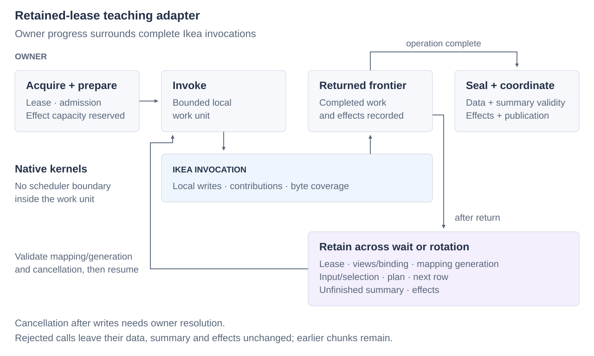

# Integrating with owners

An Ikea call performs local work over borrowed storage. The owner makes that
work part of a larger operation: acquiring bytes, keeping bindings alive,
retaining progress across waits, and publishing data with valid summaries.
The [SeriesPack](../examples/seriespack/integration.cpp) and
[TuplePack](../examples/tuplepack/integration.cpp) adapters demonstrate an
in-place mutation with explicit retained state.

| Owner | Responsibility |
| --- | --- |
| Engine | Logical identity, declared effects/read dependencies, representations and coordinated visibility of data, indexes and summaries |
| Loom | Version-bound buffer leases, queueing, prefetch, retained work and resources for completion |
| Orbital | Durable objects, transaction ordering, retained logical inputs and recovery; physical access and operation lifetimes |
| Ikea | Admitted operations, composition, physical descriptions and issued-byte coverage |

This working division follows Orbital's [logical](../../orbital/BRIEF.md) and
[physical](../../orbital/PHYSICAL.md) briefs; it does not prescribe binding APIs.
Engine declares a mutation's semantic effects and dependencies. Orbital establishes
its position and retained logical inputs; Loom prepares the corresponding storage
and completion resources. Ikea performs bounded local work. The enclosing owner
then coordinates verification, installation and publication through Orbital.

In-place and private-copy mutation are both valid. Page COW is one way to preserve
older data; Orbital also considers no-COW reuse backed by retained reconstruction.
A resident byte lease alone does not retain a logical cut: unresolved predecessors
may require both an old fallback and future results. A newly discovered historical
input can be unavailable. Maintenance may separately need old values for a delta.

*The teaching adapter returns from Ikea at a complete work frontier. The owner
can then suspend or publish while retaining responsibility for the dirty state.*

## Bind once, invoke bounded work

The SeriesPack adapter moves the only readable lease into a stable-address work
object, modeling owner-provided exclusion. That object holds the named view
borrowed by its operation. Each step completes a 64-row range and returns.
Its chunk size is a scheduling choice, independent of physical tile size and
native instruction grain.

At binding, admit storage placement and retain its proof while the mapping stays
valid. Before each invocation, supply stable input/selection, disjoint command
metadata, enough effect capacity and any observation resources. Checked calls
validate the command; trusted entries reuse established proofs. Neither acquires
isolation. Kernels do not allocate, wait or call the scheduler.

## Retain live state across suspension

After a call returns, completed writes and their effects are real. Retain the
lease, named views, prepared bindings and endpoints, mapping/version generation,
input and selection, next original coordinates, unfinished summaries, journal
and plan. A resumed call must not depend on a terminated CPS stage’s stack.

Prefetch identifies a future access; it supplies neither a lease nor proof of
readiness. On an asynchronous reply, the owner validates generation and mapping
before continuing or rebinding. It must also release resources carried by stale
replies. An OS write-protection fault preserves machine state through the OS;
explicit Loom suspension occurs at the returned work frontier.

Loom can reorder physical work around waits; local readiness does not choose
replicated outcomes or epoch membership. Completion capacity must remain available
under pressure, without implying a separate thread or pool for each kind of work.

Selections retain original coordinates. Keep predicate evidence alongside the
selection when needed: an inactive row only means this operation excludes it.

## Consume effects and publish

Three descriptions serve different parts of the owner protocol:

| Description | Meaning | Owner use |
| --- | --- | --- |
| Logical destinations | Codes or bit windows selected for replacement | Apply field semantics |
| Issued byte coverage | Physical stores, including preserved neighbors | Protect and account for actual writes |
| Maintenance dependencies | Values needed by a summary, including untouched fields | Maintain or invalidate evidence before visibility |

`<ikea/effects.h>` journals actual source views and plane-relative byte spans.
Resolve those identities to owner/partition offsets before destroying the views.
Coverage hooks run before their associated local write group. A bulk call may
contain several groups; the journal supplies neither beforeimages nor a
transaction-wide pre-notification barrier. Hooks must have admitted capacity
and cannot fail or suspend mid-group.

This local effect journal is not Orbital's durable log. Issued-byte coverage
cannot substitute for Engine's prior semantic envelope or logical read dependencies.

SeriesPack’s `sum_change` supplies a modulo-u64 replacement delta.
TuplePack’s [observation](tuplepack/extending.md#observe-the-dependencies-of-the-summary)
can read before-values, after-values, both or neither. Its bracket surrounds all
child writes within one window and repeats across a range. The law determines
which dependencies make the summary valid.

Private contributions can survive with the retained operation. Persistent
summary writes need separately admitted resources and byte coverage. Before
data becomes visible, readers must have exact summaries, compatible corrections,
conservative evidence or a valid bypass; an ephemeral repair queue alone leaves
a correctness gap.

The SeriesPack adapter consumes mapped coverage and its delta before returning
the lease to readers. TuplePack models publication of a completed prefix with
summary bypass; its example leaves real lease acquisition and publication to
owner code. A real owner coordinates visibility with concurrency, durability,
recovery and multi-participant rules.

## Cancellation and failures

| Point reached | Meaning of stopping |
| --- | --- |
| Before any mutation | Return an unused lease or discard a private candidate |
| Checked call rejects | That call leaves data, summary and effects unchanged; prior successful calls remain real |
| After in-place writes | Retain dirty state; owner resolves commit, rollback or another admitted continuation |
| Publication submitted | Outcome depends on the owner protocol; cancellation may arrive after commit |

Dropping a dirty lease does not undo writes or contributions. After dirty
cancellation, the SeriesPack example elects to finish the operation; TuplePack
stops after two of four rows and models publishing that prefix with bypass.
A private candidate may instead be discarded before publication under its
ownership rules.

Report command errors with the original range, supplied extents/effect capacity
and optional binding diagnostic. Allocation, queue failure, stale mappings and
publication conflict belong to the enclosing driver or owner.
