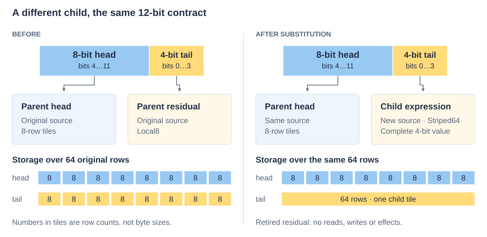
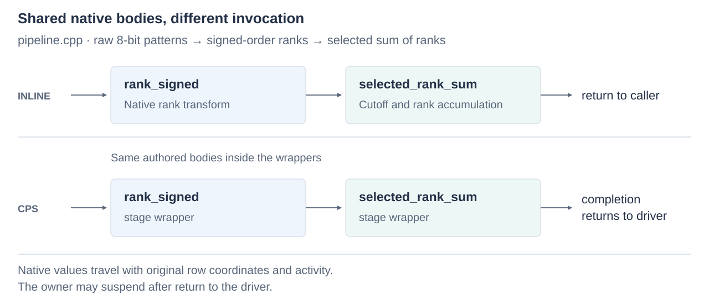

# Composing and extending

The examples build through `ikea_examples`. Start with
[composition.cpp](../../examples/seriespack/composition.cpp), then [pipeline.cpp](../../examples/seriespack/pipeline.cpp).

## Replace a nested child

The composition example replaces a four-bit residual with a complete nested
value expression, preserving the surrounding 12-bit contract.



*Head bits 4–11 keep their source. Residual bits 0–3 are supplied by a
Striped64 child. Reads, writes and effects follow the selected leaves.*

The caller constructs or migrates the selected storage; this example initializes it.

```cpp
const auto original = cp::describe(*parent);
const auto expression = cp::with_payload(
    original, cp::with_tail(original.payload, cp::describe(*child)));
const auto writer = cp::prepare_mutation(expression, count);
```

`with_tail` and `with_payload` preserve logical widths at compilation;
admission checks actual leaf extents and writable overlap. Descriptions own their
small nodes and borrow named source views. Keep every used source alive.

Retired fields do not participate in admission, preservation reads or writes.
The exhaustive [substitution test](../../test/seriespack/mutation/substitution.cpp) makes retired
bytes inaccessible and replaces multiple owners, including a nested value node.
A prefix-bound writable expression may replace that prefix; initialization requires
exact extents in every used leaf so that clearing slack cannot damage a larger child.

The physical format is one possible realization of a logical value. A compound
container need not invent a new container-level contract for each nested layout,
placement or execution choice. Engine can retain different bindings across segments.

## Author a native body

The pipeline example interprets raw eight-bit patterns as signed integers, flips
the sign bit to obtain unsigned order, and consumes selected ranks. Its transform
contains explicit NEON or x86 instructions. Ikea does not require an ISA abstraction
inside that body. The example sums ranks only to make its result observable;
this is not the aggregate law for the original signed field.

A body specifies value domain, native carrier, original coordinates, activity,
readable extent and write footprint. Keep acquisition, publication and fallible
work outside it. Put a shared ISA kernel in
`detail/native/{neon,avx2,avx512}/{read,write}.h`; put owner-independent logical
nodes and evaluators in `author/`. [Source boundaries](../source.md) explain how to
change one responsibility without introducing an artificial call in the inner loop.

`value_expression` and `payload_expression` describe bit-window joins.
`composition::read(ops, expression, rows, mask)` traverses those joins;
`selected_sum` is a shared body used with scalar, native or recording ops.
New semantic transforms supply their own evaluators. For writable nodes,
also define reverse projection/assignment, admission and
issued-byte coverage; a read-only transform is not automatically writable.

Share reconstruction/projection/store bodies across ordinary and compound callers.
Let the wrapping operation select traversal and finalize results. When a new body
has different store widths, its footprint must cover the stores actually issued,
including preserved neighbors. Coverage hooks must be infallible after admission.
[Mutation ownership](../integration.md) remains outside the body.

## Share inline and CPS execution

The pipeline example calls the same `rank_signed` and `selected_rank_sum` bodies
directly and through `Plan::stage<&body>` wrappers.



*Both executions carry native values, original row coordinates and activity.
The consumer sums selected ranks; explicit suspension belongs after return to
the driver.*

A stage receives borrowed bindings, original row, activity, native vectors and
its ordinal. It returns updated values/activity and a stop flag. A stop jumps to
completion; it is not a scheduler suspension.

`chain<K>` carries 16 values. `packet_chain<K,N>` carries 16/32/64 when its native
carrier fits at most eight vector arguments. Native vectors are flattened at the
call boundary: passing a C++ aggregate can otherwise introduce memory handoff.
A carrier change requires a real typed bridge with admitted semantics, never a
function-pointer cast. Clang 21.1.8 and the target ISA are part of this private ABI.

The table has power-of-two slots: 1..Slots−1 stages plus completion. Unused slots
also contain completion. Alignment is at least 64 bytes and at least the table
size, so an early-return cursor can locate the final slot arithmetically. Local
stack addresses and destructors cannot survive a terminating `musttail` hop.
Plans and bindings remain owned by the driver throughout execution.

Choose grain and fusion using representative whole pipelines. Cheap repeated
predicates in 16-row stages are a stress case; CPS need not be the best execution
for that recipe. Fuse cheap adjacent work or choose inline execution when useful.
The [benchmark suite](../../../workbench/benchmarks/seriespack/README.md) compares representative pipelines at several
grains and a 36-recipe inline/CPS catalog for runtime, compile cost and code size.
Manual fusion remains available for critical recipes. These styles implement the
same logical operation, with explicit equivalence obligations.

## Validate the extension

Run `ikea_validate`, then the relevant benchmark suite. Add checks for the new
wire law or semantic behavior, including boundaries, inactive regions, substitution
and effects. Use the frozen reference for existing wire laws; do not modify it to
agree with a changed kernel. Tests should name the format and failing scenario.

Compare the ordinary operation as well as the inner body. Look for repeated
metadata discovery, traversal dispatch, stores/reloads and journal work at the
boundary. Preserve family-wide simplifications before adding per-case exceptions.
