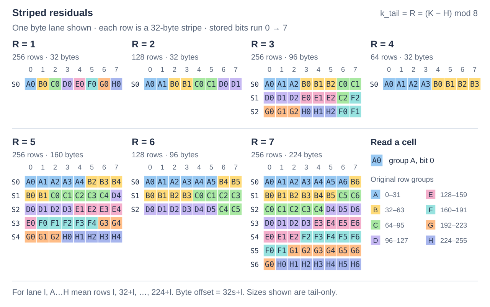

# Physical representation

A value has **K** logical bits. **H** head bits separate its highest one or two
bytes into row-ordered planes; H is 0 (no head), 8 or 16 and cannot exceed K.
The remaining **payload** has K−H bits. Its **body** holds the upper whole bytes,
and its **residual** holds the lowest `k_tail = R = (K−H) % 8` bits of every value.
R=0 means there are no residual bits. A 20-bit value with an eight-bit head has a 12-bit payload:
one body byte and four residual bits. Here “tail” means residual bits, not a
partially occupied final tile.

Local and striped formats arrange these payload pieces into physical tiles.
The owner supplies each present plane's origin and tile stride in bytes, so
payload and heads can occupy separate buffers or interleave with other fields.
Neither placement nor the byte law selects an ISA or an execution style.

## Byte-layout tour

Local uses eight-row tiles. For payload width 11, values 8..15 have body byte 1
and residuals 0..7. Transposing their low three bits produces residual bytes
`aa cc f0` after the eight body bytes. In residual byte b, bit j holds bit b of
original tile row j; body bytes are little-endian per row.


The right pane separates storage for filtering: scan one contiguous head byte
per row, then fetch payloads for candidate rows. Reconstructing those values
still needs both planes. Here the head stride is 64 bytes and the payload stride
is 96 bytes, with independent origins. Row numbers connect the two arrays;
payload tile boundaries do not interrupt the head array.

A common head array across differently represented or ragged payload regions
requires composition or multiple bindings: each view fixes its format and tile
strides. [ordinary.cpp](../../examples/seriespack/ordinary.cpp) demonstrates
interleaved placement with siblings in the stride gaps.

Keeping whole-byte bodies near their residuals limits the cache lines needed to
reconstruct a point or a small group. Version 1 uses these mixed striped layouts;
all numbers in the last column are **bytes**, and width means K−H:

| Payload width | Rows per tile | Payload byte order |
| --- | --- | --- |
| 10 | 128 | `body64 \|\| tail32 \|\| body64` |
| 12 | 64 | `body64 \|\| tail32` |
| 14 | 128 | `body32 \|\| tail32 \|\| body32 \|\| tail32 \|\| body32 \|\| tail32 \|\| body32` |
| 15 | 256 | Eight `body32` chunks alternating with seven `tail32` stripes |
| 20 | 64 | `body64 \|\| tail32 \|\| body64` |

For a headless striped 20-bit tile, the first body covers rows 0–31 and the
second covers rows 32–63. The shared residual stripe sits between them:

```text
byte offsets:  0                64         96                160
               | body rows 0–31 | residual | body rows 32–63 |
```

The middle stripe keeps point and aligned 16-row payload accesses within two
adjacent 64-byte lines at tile phases 0 or 32, as reached by tight 160-byte tiles.
Putting it last would separate the first rows' body and residual by two lines at
phase 0. These are access bounds; heads, siblings and other strides need separate
accounting. The 12-bit body-first layout already meets that bound, and
[measurements](../../../workbench/spikes/ikea-composition/placement/README.md)
found no broad benefit from centering its stripe. Within-tile offsets belong to
the physical format; owners choose plane origins and strides.

## Striped residuals

A stripe contains 32 bytes. At lane j, its byte carries residual bits from rows
j, j+32, and so on within the physical tile. The figure shows one lane; the same
mapping repeats independently at byte offsets 0..31 of each stripe. Its labels
identify the source row group and residual bit, including the deliberately
nonlinear R=3 and R=6 mappings.



For a tail-only payload, K−H=R with R=1..7 and there are no body bytes. Each tile holds
`G = 8/gcd(R,8)` groups of 32 rows in `S = R/gcd(R,8)` stripes: **32G rows and
32S payload bytes**. For example, R=3 holds 256 rows in three stripes, or 96 bytes.
Any separated head planes add their own storage. Mixed payloads such as the
12-bit example retain this residual mapping while placing body bytes alongside
the stripes; their offsets are part of the versioned law below.

Allocate the full occupied storage for the last tile even when only some rows
are logical values. Construction zeroes unused final-tile positions in owned
fields and preserves unowned stride gaps.

## Preset policy

Presets select a physical geometry for each width. Persist the resolved
descriptor for recovery, because preset policies can change. Head separation
is independent of the payload policy and defaults
to zero: `preset_format<20, preset::bulk_x86, 8>` requests the physical tour's
eight-bit head and x86 bulk choice for its 12-bit payload.

| Preset | Striped remaining widths K−H | Intended starting point |
| --- | --- | --- |
| `compact` | None | Uniform Local wire family; point access, small objects and simple composition |
| `bulk_x86` | 1..7, 12, 20 | Curated width-dependent scan recipe |
| `bulk_arm` | 1..7, 10, 12, 14, 15, 20 | ARM-oriented selection including additional mixed stripes |

All other remaining widths use Local. ARM-oriented bytes can be read on x86;
ISA dispatch and execution grain are independent of these choices.

ARM favors stripes at more widths because Local residuals need a bit transpose
to become byte values. NEON usually needs several shift/mask/exchange steps;
GFNI-enabled x86 can use a vector affine instruction, and BMI2 supplies `PEXT`
for Local point extraction. Stripes let NEON bulk paths use byte-lane shifts,
masks and joins directly. The measured presets also account for body
reconstruction, point updates and tile size; enclosing consumers can favor
different choices.

Local's eight-row tiles keep small objects and accesses compact. Stripes amortize
bit work across more rows, but a short array still occupies its full final tile.
Separating heads can let a filter reject rows without fetching their payload;
interleaving frequently consumed pieces can reduce the distinct cache lines
needed when reconstruction is common. These are competing access patterns, so
head separation and placement remain independent choices.

`describe_preset<F>(count, tile_spacing::tight)` suggests minimal independent
plane strides; `cacheline` rounds each to 64 bytes. Padding can avoid an extra
line on point access but increases storage and sometimes scan traffic. Owners
can supply other strides and offsets. The [locality study](../../../workbench/spikes/ikea-composition/probes/ikea-integers/locality/README.md)
records exact geometry, while the [preset selection notes](../../../workbench/spikes/ikea-composition/ikea2-campaign/preset-selection.md)
link the comparative evidence and retained tradeoffs.

## Recovery and descriptor v1

[representation.h](../../include/ikea/seriespack/representation.h) supplies a 40-byte,
little-endian descriptor and checked parsing. It records the resolved physical
choice, not a preset name. Unknown versions, tags and reserved fields fail closed.

| Bytes | Meaning |
| --- | --- |
| 0..1 | ASCII `SP` |
| 2 | Descriptor/wire-law version, currently 1 |
| 3 | Physical family: 0 Local, 1 striped |
| 4, 5 | K and H in bits |
| 6..7 | Reserved, zero |
| 8..15 | Logical count, unsigned little-endian u64 |
| 16..39 | Payload, head0, head1 tile strides, three little-endian u64 values; absent planes have stride zero |

The owner retains each plane's partition/object identity and offset, plus
expression identities, transform semantics and edges for compound containers.
Engine owns that persistence schema; in-process pointers cannot serve as stored
identities. Segments may retain different descriptors indefinitely. Recovery
uses those descriptors and owner mappings, never current preset policy.

`attach_representation<F>` checks an exact physical match before admitting the
supplied plane spans. The descriptor identifies representation; actual residency,
accessible extent, base alignment and overlap still require view admission.
A runtime owner can choose a compiled typed binding or use the compiled dense
headless binder.

Version 1's byte law is executable in [wire.h](../../include/ikea/seriespack/detail/wire.h)
and [point.h](../../include/ikea/seriespack/detail/point.h), with independent prior-wire
tests. The layouts above, including head order, body endianness and slack policy,
belong to that law. Changes need a new physical version, regardless of unchanged
preset names.

For exact striped recovery, let g = floor(row/32) and lane = row modulo 32
within a physical tile. Residual bit b is stored at
`stripe_offset(floor(tail_bit<R>(g,b)/8)) + lane`, at bit
`tail_bit<R>(g,b) modulo 8`. Body bytes use `body_offset(row)` and little-endian
row values shifted right by R. The executable mapping includes the intentionally
nonlinear R=3 and R=6 cases; the [frozen independent fixture](../../test/seriespack/reference/README.md)
retains the same law with different implementation.
