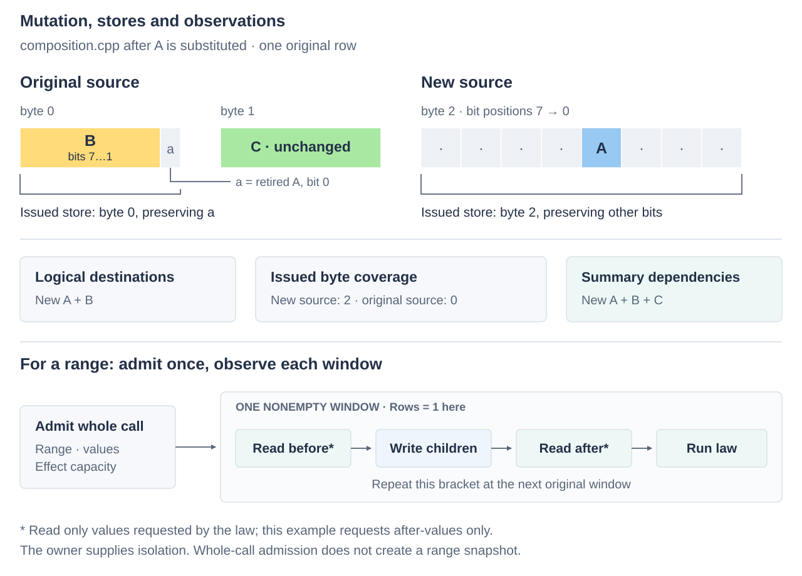

# Composing and extending TuplePack

Composition lets a parent keep its logical operation while children change
storage or execution. The executable
[composition example](../../examples/tuplepack/composition.cpp) writes A and B
and recomputes a signature that also depends on untouched C. It illustrates
two independent choices: where writes go, and what maintenance must read.

## Substitute storage under a parent

The example moves A's role from a one-bit code in the original unit to a one-bit
code at another offset in a different owner's unit. B keeps its source:

```cpp
auto old_parent = tp::composition::bind_group(old_a, b);
auto new_parent = tp::composition::bind_group(new_a, b);
```

Both parents accept the same logical input type. A valid substitution also keeps
the parent's value meaning, original coordinates and operation guarantees;
matching C++ types alone does not establish that equivalence.
Mutation groups can themselves be children;
all children use the same original-row packet shape. Preparation checks actual
destination bits for overlap, and a checked invocation admits the complete group
before any child writes. Disjoint codes may share a byte because the children
preserve each other's bits in sequence.

The caller migrates storage and coordinates visibility. Old bindings still refer
to their old sources; retaining a data version requires owner versioning.

## Observe the dependencies of the summary

A signature of A, B and C needs C even when the command changes only A and B.
Build that dependency set separately from the mutation group:

```cpp
tp::composition::projection observe_row(a_read, b_read, c_read);
tp::observation maintenance(observe_row, law);
```



The example's law requests after-values only and recomputes the signature into
private state after all children in a window have written. Laws can instead
request before-values, both, or coordinates for invalidation. A range repeats
the bracket per window; the owner supplies isolation across the range.

Simply removing A's old hash bits could erase a witness also supplied by B or C.
The summary's law determines whether replacement needs complete recomputation,
witness counts, a contribution delta or invalidation. The
[maintenance review](../../../workbench/spikes/tuple-layout/maintenance-review.md)
explores these choices. The owner retains the projection's sources and reserves
any persistent summary writes separately from the data journal.

Bound constructors can join one-row mutation groups to initialize a larger
record after all inputs pass admission. Their writes include spare bits. Use
after-only observations or caller contributions when previous storage is
uninitialized. The [reference](reference.md#observation-windows) owns callback
signatures, packet matching and the exact observation boundary.

## Keep native payloads native

Ordinary plans can feed a fused register-valued consumer. `native_reader` and
`native_writer` infer packet width and Rows from bound operations:

```cpp
auto native_read = tp::native_reader(*read);
auto native_write = tp::native_writer(*write);
```

The reader separates checked `admit(first, active)` from register-valued
`get_unchecked`; one retained proof can cover repeated work. The writer offers
checked `set/replace` and trusted entries and can be a mutation-group leaf.
This retains whole-call admission, byte effects and observation around the
native body. The [word example](../../examples/tuplepack/words.cpp) carries two
four-byte rows in a `uint64_t`; the [packet example](../../examples/tuplepack/packets.cpp)
keeps a larger projection in ISA vectors.

Activity travels separately: `native::row_mask(plan, active)` expands original-row
bits into a byte mask in the plan's packet order. A consumer's contract includes
the map, groups, Rows and value interpretation; carrier types alone cannot prove
compatibility.

`native::compact_word` extracts the first eight bytes into a GPR; `expand_word`
zero-extends back to a vector. For a whole packet to cross widths unchanged,
both plans use the same map, groups and Rows and at most eight used bytes.
`native::word<I>` extracts another compile-time 64-bit piece. See the
[conversion bounds](reference.md#routes-and-native-execution) before using a
converted packet for writes.

The [grouped example](../../examples/tuplepack/groups.cpp) reads four A/B pairs
followed by C with groups `{2,1}`. A/B hold a 12-bit value in two byte slots;
`compact_word` collects the four pairs into a GPR. The body increments them
modulo 4096 and a `writer<8,4>` maps only A/B, preserving C. Compare complete
consumers when choosing widths and groups; the [width](../../../workbench/benchmarks/tuplepack/words.md)
and [grouping](../../../workbench/spikes/tuple-layout/batching/groups/README.md)
studies retain benefits and counterexamples.

## Normalize wiring before execution

A transform made of bit selection, shifts, masks and disjoint OR can be composed
with decoding before it runs. `author/routes.h` represents one source bit or
zero per output bit. Combine it with `decoding_routes(layout, map)` and call
`prepare_routes` once into caller-owned term storage.

`apply_routes` recognizes byte permutations and rotations; other supported wiring
uses the general lowering. This can remove an intermediate packet conversion.
Arithmetic and predicates require authored bodies. The
[route contract](reference.md#routes-and-native-execution) gives applicability
and storage limits. Test new lowerings against an independent bit reference and
exercise the fallback outside their applicability.

## Share bodies across execution styles

The same body can run inline or through `packet_chain<N, Slots, Mask>` stage
wrappers. A stage receives bindings, original row, activity, native values and
its ordinal, and returns updated values, activity and an early-completion flag.
`N=8` carries one GPR; `N=64` carries native vectors. `chain<Slots, Mask>` is the
64-byte shorthand used by the packet example.

Enter with `chain::run`, which bridges the caller's ABI to the stages. Early
completion returns to the driver; the owner can suspend there with retained
state. Keep shared bodies inlinable through their wrappers: an outlined lambda
capturing a vector aggregate can introduce memory handoff. Explicit ISA bodies
remain available under `author/native.h`.

Use the [benchmarks](../../../workbench/benchmarks/tuplepack/README.md) to choose
fusion and stage grain. The [source guide](../source.md#tuplepack-source-boundaries)
locates implementation and private ABI rules; the
[test guide](../../test/tuplepack/README.md) identifies checks for each change.
