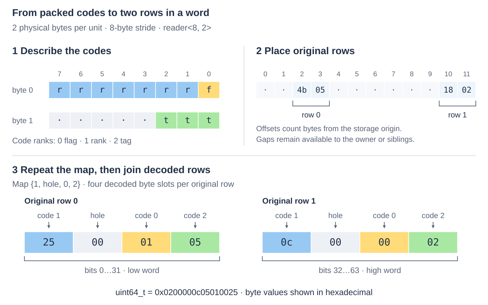

# Using TuplePack

TuplePack projects and replaces small unsigned codes packed into fixed-layout
units. Each code fits within one physical byte; a read expands each selected
code into a byte slot. The caller chooses which codes to expose and how many
original rows to carry in one packet. Storage layout and packet shape are
independent.

Link `ikea::tuplepack` and include `<ikea/tuplepack.h>`. The executable
[ordinary example](../../examples/tuplepack/ordinary.cpp) follows the layout below;
build it as `ikea_example_tuplepack_ordinary` using the
[Ikea build instructions](../../README.md#build-and-run). Field semantics and
layout-selection policy belong to Engine; callers currently supply descriptions
and maps manually. The [automatic layout analyser](../../../workbench/spikes/tuple-layout/analyser/README.md)
remains experimental.

## Describe bytes, then place them

Consider a flag, a seven-bit rank and a three-bit tag in a two-byte unit.
A `code` gives its physical byte offset, bit shift and width. Its index in the
description is its **code rank**; that index has no application meaning.
Here the field named rank has code rank 1.

```cpp
namespace tp = ikea::tuplepack;
std::array<tp::code, 3> codes{{{0, 0, 1}, {0, 1, 7}, {1, 0, 3}}};
auto format = tp::layout::make(2, codes);
// Check each expected result before dereferencing it.
auto placed = tp::view::bind(*format, bytes, 2, 8, 2);
```

The view places two original rows at storage offsets 2 and 10:
`offset + row × stride`, with an eight-byte stride and two-byte units. Only the
units belong to this operation. The gaps can hold sibling fields, and the last
row requires its two bytes rather than a complete final stride. `const_view`
provides read-only placement. Binding checks extents and arithmetic; the caller
must supply the layout that actually encoded those bytes.

To place these units in a larger record, change the stride and offset. To place
them separately, bind another buffer. Neither change requires a different code
map or packet shape. Rebinding describes existing storage; the caller performs
any migration. Engine can retain different descriptions across segments.

## Project codes into a packet

The example constructs rows `(flag=1, rank=37, tag=5)` and
`(flag=0, rank=12, tag=2)`. Read them in the order rank, hole, flag, tag:

```cpp
std::array<tp::byte, 4> map{1, tp::hole, 0, 2};
auto plan = tp::reader<8, 2>::make(*format, map);
auto read = tp::bind_reader(*plan, *placed);
auto result = read->get(0); // 0x0200000c05010025
```



*The map names code ranks. The result contains decoded byte slots: its low four
bytes belong to original row 0, its high four to row 1. Hexadecimal byte values
are shown from least- to most-significant slot.*

`reader<N, Rows>` chooses **N decoded packet bytes**, divided into `N/Rows`
slots per row. The same map applies to every row. A hole produces zero; a short
map leaves trailing slots zero; duplicate read ranks are allowed. These slots
do not describe physical byte positions.

With `reader<8>` the default `Rows=1` leaves four extra zero slots for this map.
With `reader<64, 16>` the same four-slot projection carries sixteen rows, even
if each physical unit is embedded in a much larger record. Ordinary eight-byte
packets are `uint64_t`; 64-byte packets are byte arrays. The
[reference](reference.md#packet-shape-and-coordinates) lists all supported shapes.

Choose enough slots for the projection and enough rows for the consumer. A few
rows feeding scalar logic can fit in a GPR; a scan can fill a vector packet.
Physical placement and code shifts also affect transfer cost, so a short
projection can still benefit from SIMD. Preparation selects transfer lowerings;
the [packet-width comparisons](../../../workbench/benchmarks/tuplepack/words.md)
explain the measured choices and counterexamples. Native callers can keep
payloads in registers through [composition](extending.md#keep-native-payloads-native).

## Construct and replace

Construction supplies every code in description order. Prepare a `constructor`
with `constructor::make(*format)`, bind it with `bind_constructor`, then call
`initialize(first, inputs, effects)`. Each `construction_input` initializes one
original row. Construction zeroes spare bits in the unit and preserves bytes
outside it. The ordinary example provides the full setup.

Replacement supplies only mapped codes. To change the first row's seven-bit rank:

```cpp
std::array<tp::byte, 1> rank_map{1};
auto write_plan = tp::writer<8>::make(*format, rank_map);
auto write = tp::bind_writer(*write_plan, *placed);
auto status = write->set(0, 99, effects);
```

The store preserves the flag sharing that byte, the tag and all spare bits.
Writers reject duplicate destination ranks during preparation and selected
out-of-width values during checked calls. Hole and unused input slots are ignored.
A rank of 128 fails before data or effect output changes.

Provide a preallocated `ikea::source_write_journal`. Its records identify the
actual view and issued byte spans relative to that view's storage. Here a rank
update writes the byte at offset 2, including the preserved flag. Reserve
`writer::effect_capacity()` records per active row, summed across children;
construction requires one per initialized row. Coalescing can reduce actual use.
The [integration guide](../integration.md#consume-effects-and-publish) explains
how owners consume coverage and coordinate visibility.

## Select rows and handle a tail

`get(first, active)` and `set(first, input, effects, active)` use bit `r` for
original row `first+r`. The default mask selects all `Rows`. For a two-row
packet with only its first row remaining, pass `active=1`. Inactive rows issue
no payload accesses; their read slots are zero and write slots are ignored.
Keep the mask alongside values: zero can also be a selected code's value.

Range calls `read(first, outputs, selection)` and
`replace(first, inputs, effects, selection)` advance `Rows` original rows per
span element. They handle a partial final packet automatically. Selections retain
original row coordinates; filtering never compacts the array. The
[word example](../../examples/tuplepack/words.cpp) demonstrates a native two-row
update and a one-row tail; the [packet example](../../examples/tuplepack/packets.cpp)
uses sparse rows in a wider carrier.

## Keep the binding valid

Named views and prepared plans remain alive at stable addresses while bound
operations borrow them. The bytes remain borrowed too. Preparation copies the
layout and map controls, so those original descriptions can expire. The
[borrowing reference](reference.md#borrowing-and-admission) records the precise
lifetimes and owner obligations.

Checked mutation rejects a bad range, selected value or capacity before changing
the whole call's data, effects or maintenance. Earlier successful calls remain
real. Use `tp::describe(error)` with the command and supplied extents to diagnose
a failure. Trusted `_unchecked` calls reuse established proofs; the bound write
entry retains byte coverage, while the plan's raw pointer entry emits no effects.
Isolation, suspension and publication belong to the owner.
