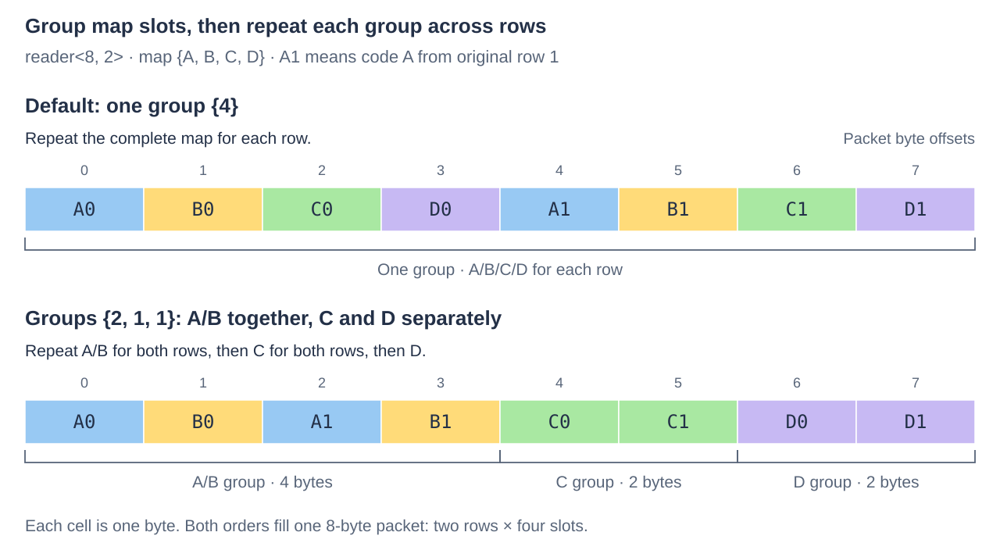

# Using TuplePack

TuplePack projects and replaces unsigned codes packed into fixed-layout units.
Each code fits within one physical byte and expands into one decoded byte slot.
The caller chooses storage placement, projected codes and packet grouping.

Link `ikea::tuplepack` and include `<ikea/tuplepack.h>`. The executable
[ordinary example](../../examples/tuplepack/ordinary.cpp) follows the layout below;
build it as `ikea_example_tuplepack_ordinary` using the
[Ikea build instructions](../../README.md#build-and-run). Callers supply layouts
and maps manually; Engine owns field semantics and layout selection. Its
[automatic analyser](../../../workbench/spikes/layout-analyser/README.md) is experimental.

## Describe bytes, then place them

Consider a flag, a seven-bit rank and a three-bit tag in a two-byte unit.
A `code` gives its physical byte offset, bit shift and width. Its index in the
description is its **code rank**; that index has no application meaning.
Here the field named rank has code rank 1.

```cpp
namespace tp = ikea::tuplepack;
std::array<tp::code, 3> codes{{{0, 0, 1}, {0, 1, 7}, {1, 0, 3}}};
auto format = tp::layout::make(2, codes);
// Check each expected result before dereferencing it.
auto placed = tp::view::bind(*format, bytes, 2, 8, 2);
```

The view places two original rows at storage offsets 2 and 10:
`offset + row × stride`, with an eight-byte stride and two-byte units. Only the
units belong to this operation. The gaps can hold sibling fields, and the last
row requires its two bytes rather than a complete final stride. `const_view`
provides read-only placement. Binding checks extents and arithmetic; the caller
must supply the layout that actually encoded those bytes.

Change stride and offset to embed units in larger records, or bind another
buffer for a separate plane. The caller performs any migration; rebinding only
describes storage. Different segments can retain different layouts.

Colocate codes used together to reduce cache lines touched. Dense planes favor
scans of a few codes; whole tuples favor access to most of a record. Count the
physical access envelope: even a short projection can fetch distant bytes.
Packet grouping arranges decoded slots independently of this storage choice.

## Project codes into a packet

The example constructs rows `(flag=1, rank=37, tag=5)` and
`(flag=0, rank=12, tag=2)`. Read them in the order rank, hole, flag, tag:

```cpp
std::array<tp::byte, 4> map{1, tp::hole, 0, 2};
auto plan = tp::reader<8, 2>::make(*format, map);
auto read = tp::bind_reader(*plan, *placed);
auto result = read->get(0); // 0x0200000c05010025
```


`reader<N, Rows>` chooses **N bytes of packet capacity** and repeats the same map
for every original row, with at most `N/Rows` slots per map. By default, rows
follow each other without padding; unused capacity trails as zeros. Holes produce
zero slots, and reads can repeat ranks. Here the low four bytes belong to row 0
and the high four to row 1.

`reader<8>` defaults to one row; `reader<64, 16>` carries sixteen four-slot rows.
Ordinary eight-byte packets are `uint64_t`; 64-byte packets are byte arrays. The
[reference](reference.md#packet-shape-and-coordinates) lists all supported shapes.

Small scalar consumers can fit in a GPR; scans can fill vector packets.
Placement and shifts also affect transfer cost, so compare the complete consumer
when choosing a width. The [packet-width study](../../../workbench/benchmarks/tuplepack/words.md)
gives examples. [Native composition](extending.md#keep-native-payloads-native)
keeps payloads in registers.

## Group slots for the consumer

A group keeps consecutive map slots together for each row. TuplePack emits that
group for all `Rows` before moving to the next group. Supply group lengths as
the optional third argument to the same `reader::make` or `writer::make` call.
Lengths count map slots, including holes; they must be positive and sum to
`map.size()`. Omitting them makes one group covering the whole map.

Two rows and a four-slot map labelled A, B, C, D fill an eight-byte packet.
Groups `{2,1,1}` keep each A/B pair adjacent, followed by separate runs of C and D:

```cpp
auto format4 = tp::layout::make(3, std::array<tp::code, 4>{{
    {0, 0, 8}, {1, 0, 4}, {1, 4, 4}, {2, 0, 8}}});
std::array<tp::byte, 4> grouped_map{0, 1, 2, 3}; // A, B, C, D
std::array groups{2u, 1u, 1u};
// After checking format4:
auto grouped = tp::reader<8, 2>::make(*format4, grouped_map, groups);
// After checking grouped:
auto byte = grouped->ordering().offset(1, 1); // B from row 1 is packet byte 3
```



A/B adjacency suits a consumer that combines those codes; their meaning and bit
order remain caller-owned. Writers consume the same order. `ordering()` locates
each row's map slot; the [reference](reference.md#packet-shape-and-coordinates)
defines the coordinates and bounds.
The executable [grouped example](../../examples/tuplepack/groups.cpp) uses the
three-slot variant `{2,1}` to process four 12-bit values and preserve neighboring C codes;
build it as `ikea_example_tuplepack_groups`.

## Construct and replace

Construction supplies every code in description order. Prepare a `constructor`
with `constructor::make(*format)`, bind it with `bind_constructor`, then call
`initialize(first, inputs, effects)`. Each `construction_input` initializes one
original row. Construction zeroes spare bits in the unit and preserves bytes
outside it. The ordinary example provides the full setup.

Replacement supplies only mapped codes. To change the first row's seven-bit rank:

```cpp
std::array<tp::byte, 1> rank_map{1};
auto write_plan = tp::writer<8>::make(*format, rank_map);
auto write = tp::bind_writer(*write_plan, *placed);
auto status = write->set(0, 99, effects);
```

The store preserves the flag, tag and spare bits. Writers reject duplicate
destinations and selected out-of-width values: 128 fails before data or effects
change. Hole and unused input slots are ignored.

Provide a preallocated `ikea::source_write_journal`. Its records identify the
actual view and issued byte spans relative to that view's storage. Here a rank
update writes the byte at offset 2, including the preserved flag. Reserve
`writer::effect_capacity()` records per active row, summed across children;
construction requires one per initialized row. Coalescing can reduce actual use.
The [integration guide](../integration.md#consume-effects-and-publish) explains
how owners consume coverage and coordinate visibility.

## Select rows and handle a tail

`get(first, active)` and `set(first, input, effects, active)` use bit `r` for
original row `first+r`. The default mask selects all `Rows`. For a two-row
packet with only its first row remaining, pass `active=1`. Inactive rows issue
no payload accesses; their read slots are zero and write slots are ignored.
Keep the mask alongside values: zero can also be a selected code's value.

Range calls `read(first, outputs, selection)` and
`replace(first, inputs, effects, selection)` advance `Rows` original rows per
span element. They handle a partial final packet automatically. Selections retain
original row coordinates; filtering never compacts the array. The
[word example](../../examples/tuplepack/words.cpp) demonstrates a native two-row
update and a one-row tail; the [packet example](../../examples/tuplepack/packets.cpp)
uses sparse rows in a wider carrier.

## Keep the binding valid

Keep borrowed storage live and named views and plans at stable addresses.
Preparation copies layout, map and groups; those descriptions can then expire.
The [reference](reference.md#borrowing-and-admission) lists all borrowing obligations.

Checked rejection leaves that call's data, effects and maintenance unchanged.
Use `tp::describe(error)` with the command and extents to diagnose it. Trusted
`_unchecked` calls require proofs established in advance. Bound writes retain
byte coverage; raw plan writes emit no effects. The owner supplies isolation,
suspension and publication.
