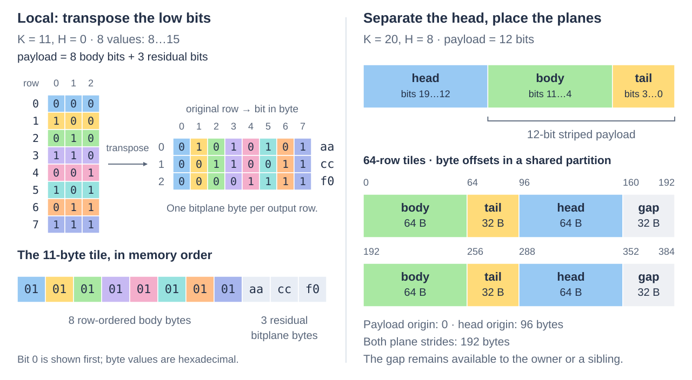

# Physical representation

A value has **K** logical bits. **H** head bits separate its highest one or two
bytes into row-ordered planes; H is 0 (no head), 8 or 16 and cannot exceed K.
The remaining **payload** has K−H bits. Its **body** holds the upper whole bytes,
and its **residual** holds the lowest `k_tail = R = (K−H) % 8` bits of every value.
R=0 means there are no residual bits. A 20-bit value with an eight-bit head has a 12-bit payload:
one body byte and four residual bits. Here “tail” means residual bits, not a
partially occupied final tile.

Local and striped formats arrange these payload pieces into physical tiles.
The owner supplies each present plane's origin and tile stride in bytes, so
payload and heads can occupy separate buffers or interleave with other fields.
Neither placement nor the byte law selects an ISA or an execution style.

## Byte-layout tour

Local uses eight-row tiles. For payload width 11, values 8..15 have body byte 1
and residuals 0..7. Transposing their low three bits produces residual bytes
`aa cc f0` after the eight body bytes. In residual byte b, bit j holds bit b of
original tile row j; body bytes are little-endian per row.

The right pane follows [ordinary.cpp](../examples/seriespack/ordinary.cpp).
Interleaving the planes and reserving a sibling gap are owner placement choices
within the same physical format.

## Striped residuals

A stripe contains 32 bytes. At lane j, its byte carries residual bits from rows
j, j+32, and so on within the physical tile. The figure shows one lane; the same
mapping repeats independently at byte offsets 0..31 of each stripe. Its labels
identify the source row group and residual bit, including the deliberately
nonlinear R=3 and R=6 mappings.

For a tail-only payload, K−H=R with R=1..7 and there are no body bytes. Each tile holds
`G = 8/gcd(R,8)` groups of 32 rows in `S = R/gcd(R,8)` stripes: **32G rows and
32S payload bytes**. For example, R=3 holds 256 rows in three stripes, or 96 bytes.
Any separated head planes add their own storage. Mixed payloads such as the
12-bit example retain this residual mapping while placing body bytes alongside
the stripes; their offsets are part of the versioned law below.

Allocate the full occupied storage for the last tile even when only some rows
are logical values. Construction zeroes unused final-tile positions in owned
fields and preserves unowned stride gaps.

## Preset policy

Presets are a small set of construction policies that can change after
measurement. They do not identify persisted formats or promise that one layout
always wins. Head separation is independent of the payload policy and defaults
to zero: `preset_format<20, preset::bulk_x86, 8>` requests the physical tour's
eight-bit head and x86 bulk choice for its 12-bit payload.

| Preset | Striped remaining widths K−H | Intended starting point |
| --- | --- | --- |
| `compact` | None | Uniform Local wire family; point access, small objects and simple composition |
| `bulk_x86` | 1..7, 12, 20 | Curated width-dependent scan recipe |
| `bulk_arm` | 1..7, 10, 12, 14, 15, 20 | ARM-oriented selection including additional mixed stripes |

All other remaining widths use Local. ARM-oriented bytes can be read on x86;
ISA dispatch and execution grain are independent of these choices.
`describe_preset<F>(count, tile_spacing::tight)` suggests minimal independent
plane strides; `cacheline` rounds each present plane's tile stride to 64 bytes.
Owners can instead supply strides and offsets for interleaving. No preset chooses
a buffer pool, partition size, record schema or segment migration policy.

The implementation retains 76 headless formats / 206 placements for explicit selection
and validation, but does not expose 206 named recipes. Borderline choices:

- Striped10/14/15 remain explicit and in ARM-oriented recipes. They do not earn
  an unconditional x86 default merely by winning isolated primitive cases.
- Cacheline spacing remains an explicit placement choice. Its locality benefit
  depends on siblings and access patterns; padding every object by default costs
  space and can hurt scans.
- One-bit extraction, complete-stripe writing, exact-width native stores and
  whole-body AVX-512 permutation earned inclusion through family-level gains.
- A separate named ScanPack/LocalPack facade, per-width threshold dispatches,
  additional tail dialects and automatic layout tuning are excluded from this
  initial surface. Explicit formats and the same native functions remain usable.
- AVX2 bit-mask packing earned a place for one/two-bit residuals. Four-bit
  packing did not benefit from the same treatment; a full native transpose
  remains the simpler basis. Measurements decide whether larger grouping helps.
- CPS is an execution choice, never a different container or physical format.

## Recovery and descriptor v1

[representation.h](../include/ikea/seriespack/representation.h) supplies a 40-byte,
little-endian descriptor and checked parsing. It records the resolved physical
choice, not a preset name. Unknown versions, tags and reserved fields fail closed.

| Bytes | Meaning |
| --- | --- |
| 0..1 | ASCII `SP` |
| 2 | Descriptor/wire-law version, currently 1 |
| 3 | Physical family: 0 Local, 1 striped |
| 4, 5 | K and H in bits |
| 6..7 | Reserved, zero |
| 8..15 | Logical count, unsigned little-endian u64 |
| 16..39 | Payload, head0, head1 tile strides, three little-endian u64 values; absent planes have stride zero |

The owner must retain each plane's partition/object identity and offset alongside
the descriptor, plus expression-node identities, transform semantics and edges for
compound containers. Their persistence schema belongs to Engine's integration
design. Neither raw pointers nor the in-process recorder's source addresses
are a persistence format. Different segments in one collection
may retain different descriptors indefinitely. Recovery resolves their actual
descriptions and owner mappings; it must never rerun a current preset to guess
old bytes.

`attach_representation<F>` checks an exact physical match before admitting the
supplied plane spans. The descriptor identifies representation; actual residency,
accessible extent, base alignment and overlap still require view admission.
A runtime owner can choose a compiled typed binding or use the compiled dense
headless binder. This does not instantiate an erased mutation table for every
possible composition.

Version 1's byte law is executable in [wire.h](../include/ikea/seriespack/detail/wire.h)
and [point.h](../include/ikea/seriespack/detail/point.h), with independent prior-wire
tests. The layouts above, including head order, body endianness and slack policy,
belong to that law. Changes need a new physical version, regardless of unchanged
preset names.

For exact striped recovery, let g = floor(row/32) and lane = row modulo 32
within a physical tile. Residual bit b is stored at
`stripe_offset(floor(tail_bit<R>(g,b)/8)) + lane`, at bit
`tail_bit<R>(g,b) modulo 8`. Body bytes use `body_offset(row)` and little-endian
row values shifted right by R. The executable mapping includes the intentionally
nonlinear R=3 and R=6 cases; the [frozen independent fixture](../test/seriespack/reference/README.md)
retains the same law with different implementation.
