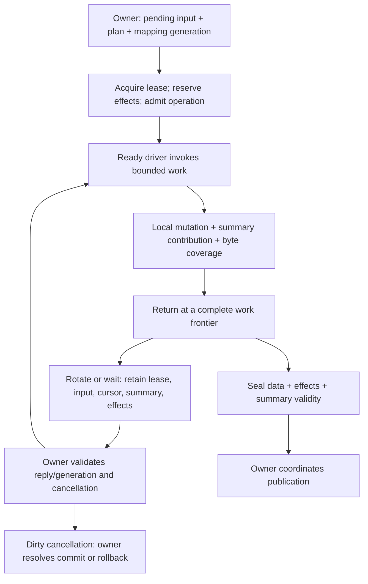

# Integrating with owners

Ikea's containers and kernels operate within owner-supplied lifetime and visibility
rules. This guide explains that boundary using SeriesPack, the first implemented
component. The responsibilities apply beyond packed arrays; the concrete journal,
summary and operation types here are SeriesPack's current realization.

[examples/integration.cpp](examples/integration.cpp) is a small executable adapter
for an in-place mutation with a retained lease. It teaches local obligations;
[test/integration/ownership.cpp](test/integration/ownership.cpp) separately checks
acquisition waits, stale replies, rotation, clean/dirty cancellation, sealing,
conflicts and coordinated visibility. Neither implements Loom, Engine or Orbital.

## Who owns what

| Owner | Responsibility |
| --- | --- |
| Engine | Field semantics; collection/segment schema; representation choices; plans and evidence interpretation; summary validity; publication policy |
| Loom | Buffer leases, queueing, prefetch scheduling, task cancellation/rotation and retained work |
| Orbital | OS-facing services, including the intended UFFD page-COW version mechanism |
| Ikea | Admitted operations over borrowed storage; native contributions and issued-byte coverage; composition and physical descriptions |

SeriesPack does not prescribe immutable buffers or MVCC beforeimages. Orbital can
preserve page versions through UFFD COW while an admitted operation writes in
place. Current old values may still be needed for summary deltas. Private-copy
mutation is another owner policy and may win in some situations. Version retention
and visibility/isolation are separate obligations.

## Bind once, invoke bounded work

The example moves the only readable buffer lease into a stable-address work
object. This models caller-owned exclusion. The work object holds the named view,
prepared operation, erased endpoint, input, journal, summary state and next row.
One step invokes a complete 64-row range and returns. Its kernels do not allocate,
wait, format errors or call the scheduler. Chunk size is an owner scheduling
choice, independent of the physical tile and native instruction grain.

Before invocation, the owner supplies writable/readable extents, stable placement,
input/selection/effect disjointness, sufficient effect capacity, exclusion and a
maintenance policy. Checked endpoints add command validation; trusted endpoints
reuse established proofs. Neither establishes transaction isolation.

Empty prefilters can skip work. Predicates or signatures may return conservative
evidence for the engine to combine at its chosen granularity. SeriesPack's current
execution mask means “selected original rows”; it does not itself encode unknown,
impossible or definitely-true evidence, nor does it implement planner probes.

## Retain live state across suspension

Explicit suspension happens after returning to the driver, at a frontier where
all local writes and effects for completed work are recorded. Retain the lease,
source-view identities, mapping/version generation, input and selection, next
coordinates, native partial summaries when unfinished, journal and plan. Do not
retain a pointer into a terminated CPS stage's stack.

A prefetch hint identifies an access and its geometry; it is not a lease or a
readiness guarantee. The owner decides when to submit hints, interleave other work
and resume. On an asynchronous reply, validate generation/mapping before rebinding
or continuing. A stale reply still carries resources that must be released by the
owner. An OS write-protection fault preserves machine state through the OS; it is
distinct from an explicit Loom stop and restart frontier.

## Consume effects and publish

Effects identify actual substituted source views and plane-relative **issued
byte spans**. Resolve them into stable owner/partition coordinates before destroying
those views. Coverage can include neighboring values preserved by a wider store;
it need not be a minimal byte difference. Low-level coverage hooks execute before
their associated local write group. A bulk call can contain multiple such groups;
it is not a transaction-wide pre-notification barrier. Reserve resources before
entry. Coverage and maintenance hooks must neither fail nor suspend mid-group.

`sum_change` describes modulo-u64 replacement contributions; it is one optional
law. Other aggregates, row signatures and summaries can use native contributions,
explicit invalidation or a repair obligation. Before data becomes visible, readers
must see exact summaries, compatible corrections, conservative evidence or a
valid bypass. Merely queueing an ephemeral repair does not ensure integrity.

The example's owner consumes mapped coverage, applies the delta and returns the
lease to readers at one serialized boundary. A real owner must coordinate this
under its concurrency, durability, recovery and multi-participant rules. The
exhaustive adapter checks publication conflict and cancellation-after-submission
separately from local writes. Submission cancellation may still produce a committed
transaction outcome.

## Cancellation and failures

Before any mutation, cancellation can return an unused lease. After an in-place
write, cancellation retains dirty state and asks the owner to resolve commit,
rollback or another admitted continuation. Dropping the lease does not undo data
or contributions. The teaching example explicitly elects to finish the operation.
A private candidate can instead be discarded before publication under its own
ownership rules.

A returned checked-call error leaves that call's data, summary and effects
unchanged. Prior successful chunks remain real. Use the error description,
original range, effect capacity and optional binding diagnostic to identify the
bad command or mapping. Keep those diagnostics outside hot kernels. Allocation,
queue failures, stale mappings and publication conflicts belong to the driver or
owner; do not disguise them as codec errors.
