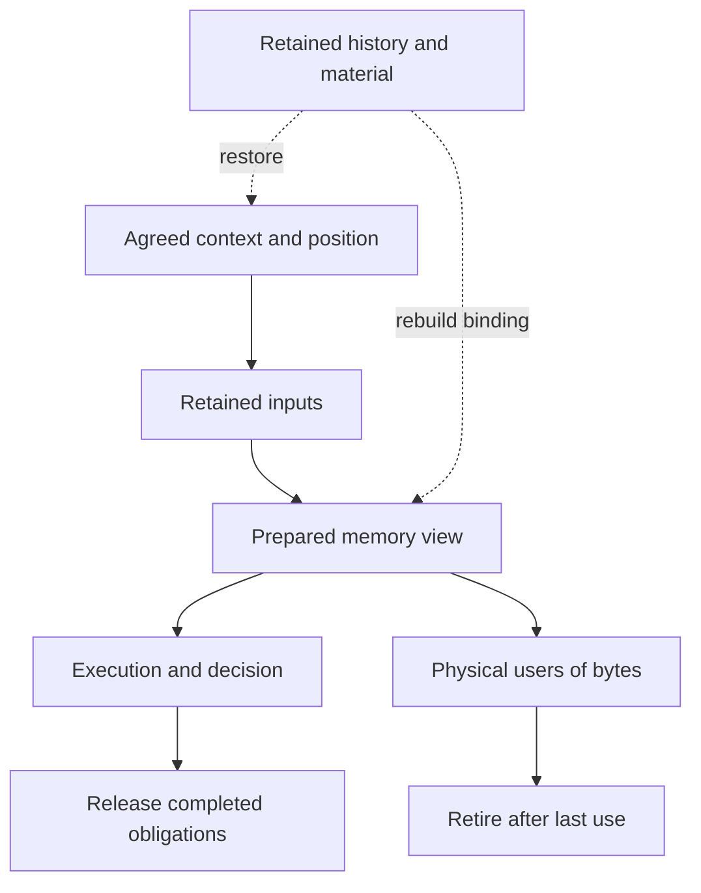

# Orbital architecture

Orbital makes durable, transactional state available to ordinary programs and
keeps their unfinished work recoverable. [BRIEF](BRIEF.md) defines the intended
behavior; [PHYSICAL](PHYSICAL.md) develops the memory and OS boundary. This
account connects those commitments to a provisional implementation structure.
The divisions and type names below are candidates to test with Engine and Loom,
not a selected ABI or an implemented runtime.

The architecture separates agreed obligations, replaceable execution and physical
resource use. A coordinator can disappear without removing its obligations, and a
submitted operation can outlive the worker that created it.

## Responsibilities

| Concern | Owner |
| --- | --- |
| Object meaning, conflict and read-dependency scopes, reconstruction operations, legal plans and atomic visibility | Engine, or another application using Orbital |
| Admission, authority, transaction ordering, retained history, delivery obligations and verification gates | Orbital |
| Binding legal work to resources, scheduling, task placement, preparation, residency and allocation policy | Loom |
| Backing, mappings, protection, threads, endpoints, asynchronous I/O and actual resource retirement | Orbital machine services |
| Extension ecosystem, registry, connectors and external formats | Shore |

An object has a stable identity and application-defined versions. Its boundaries
need not match pages, transactions or shards. A scope can describe a row, byte
range or set; Orbital uses the supplied overlap and invalidation rules without
interpreting those items. The same interfaces must support an application with
entirely different data structures.

A logical owner is the authority whose agreed history determines a protocol's
state. A coordinator drives that protocol and can be replaced. A holder retains
material; it need not be a witness or have authority to decide an outcome.
These roles can share a process or machine without acquiring the same lifetime.

## Following a durable-object operation

Consider an application that reads object A, computes a result and updates B.
An earlier writer may still owe part of A's state. The example can involve one
shard or several; it uses the same transaction and retention rules in either case.

These are dependencies, not mandatory calls or journal steps. Logical release
and physical retirement have separate conditions; neither alone permits reclaiming
material still needed by the other.

### Establish the context and position

The application supplies the possible output scopes, read-dependency rules,
program and interpretation versions. Loom can choose among legal physical plans.
The durable context identifies what must be reproducible; local addresses,
compiled entry points and worker assignments belong to a replaceable binding.
Changing a binding must preserve the context, including any exact-byte extension
interface required by its execution profile.

The producer persists the input and obtains the independent material evidence
needed for admission. Witnesses agree its place in the shard's history. Data
protection and journal agreement have separate evidence: a healthy witness quorum
does not prove that the input or its interpreter still survives.

The transaction reserves B's declared output scopes in a common shard order.
Eligible younger requests can pass a broad waiter while older conflicts remain;
after those conflicts release, the waiter protects its place while already-held
younger conflicts drain. Actual holders remain exclusive.

This confines the original broad-waiter convoy, but it does not guarantee complete
locality: a younger WAN holder admitted during bypass can prolong the later drain.
Broad held reservations and shared physical resources can still spread delays.
Progress depends on finite older conflicts, eventual release and fair service.
The [policy comparison](../workbench/spikes/orbital-reservation-policy/README.md)
retains the alternatives and that accepted tradeoff.

The coordinator drives recording one immutable position in the owner's journal.
Each participant durably fixes it and releases its own reservation; computation
starts after every participant acknowledges. Reading A retains no reservation on
A's writers. Position assignment and subsequent computation have separate progress
paths, even when a short local transaction completes both within one epoch.

### Preserve the intended input

Before reading or waiting, the transaction registers its position on A's declared
dependency scopes. Later overlapping effects receive later positions. The retained
input must cover the fallback state and any earlier pending writer's eventual
result, including a no-effect result. Retaining only today's bytes would allow
recovery or reclamation to lose the answer the reader is waiting for.

Once the required observations are resolved, a reconstruction recipe identifies
the necessary bytes, admitted operations or accepted results, and interpretation
dependencies such as code and dictionaries. A newly discovered source must still
supply the same position. If that history no longer exists, the transaction can
reach an agreed failure; it cannot substitute current data. Broader advance
retention can improve this success guarantee at a capacity cost.

Retention belongs to an agreed owner record. When an existing operation and its
retained prefix fully define the obligation under that same owner, both ordinary
folding and replay can derive it without a separate acquisition-start append.
The demonstrated shortcut covers complete prepared acquisitions; later recipe
or holder choices still need recoverable ownership. Success and abandonment
remain distinct recoverable outcomes. The
[prepared-retention comparison](../workbench/spikes/orbital-root-fusion/README.md)
establishes this narrow record saving, not a measured latency reduction.

### Bind and execute a memory view

Loom prepares a complete view, a bounded window or a view with first-touch loading.
Orbital supplies backing and mappings for the intended version, access rights and
lifetime. The program then uses ordinary memory. Page faults supply missing bytes;
the application's declared dependencies determine logical consistency.

Prepared native regions can run directly. Known long waits retain sufficient
continuation state and release execution capacity. An arbitrary faulting load may
park its OS thread, so its resolver needs independently runnable capacity and must
not need a latch held by that thread. Local resource pressure may delay execution
or request an agreed failure; it cannot privately change a replicated result.

Writable views keep tentative effects separate from publication. Existing storage
may be reused without COW only when no reader, checker, hash, send or write still
needs its bytes and retained state can recover required versions. New users must
not race that choice. A late old reader can receive a separately reconstructed
view. Writers sharing a physical page need separate working representations or
application-defined compatible effect application; whole-page installation or
undo must not erase another writer's changes.

Execution captures the declared logical inputs, excluding this transaction's
already-installed result if it is being replayed. Its own tentative effects form
a separate overlay. Unrelated physical installations cannot choose the captured
input or change a consumer's logical output.

### Publish and deliver the result

Consumers fold agreed epochs to the same logical state, ordering metadata,
continuations and outputs. A remote fact absent from agreed input may leave a
continuation for a later epoch while independent work completes. Physical slowness
alone cannot let one consumer choose a different epoch result.

Extension execution uses the journaled code, runtime profile and policy. Hardened
WASM and approved native programs supply trusted deterministic execution. Other
native programs require agreement on the complete interaction and outcome across
every required execution, including the selected main result. Their private
queries use pre-established bounds, and later agreed evidence resumes the parent
transaction. The initial checked-native scope remains one shard. Required checks
gate the transaction's commitment and publication, including read-only results.

The owner records the durable outcome and one decision. Participants may install
at different times while preserving the application's atomic visibility. An abort
or no-effect outcome resolves only this transaction's pending outputs. Installation
order cannot change logical version order. A declared complete replacement can
let later reads skip covered predecessors after the replacement is committed and
visible at their position.

If the result must be delivered elsewhere, its logical identity and recipient
obligations survive route changes. Relays may share transmission or run an
application-supplied transform without changing the contribution's meaning.
Recipient enrollment defines the starting cut and subsequent contributions owed;
changing membership does not rewrite prior completion.
Transport receipt, custody and application completion discharge different duties.
External writes use committed intents; a sink without deduplication may leave an
unknown outcome after a lost reply. Approved native execution may be audited
asynchronously, but a detected mismatch is an integrity incident, not a retroactive
abort or a way to determine which published result was correct.

### Recover and retire

Journal and evidence access must work before ordinary admission and transactional
object services are available. Bootstrap starts from known authority roots and
uses bounded underlying storage and transport operations to discover and validate
further state. Those operations need service capacity even when ordinary workers
or working memory are occupied. Recovery cannot depend on opening the very
transactional objects whose authority it is reconstructing.

After coordinator or owner-process loss, recovery reconstructs the context,
decisions and unfinished work from agreed history. It does not preserve fictitious
volatile replies or reset the state of surviving peers. Ordinary requests carry
stable identities and current recovery correlation. Holders suppress duplicate
effects while answering repeated valid requests from retained state. A recorded
successful acquisition can use any surviving complete valid copy without first
recollecting every original acknowledgement.

Recovery preserves terminal decisions, so delayed acquisition, reservation or
delivery requests cannot recreate completed obligations. Discovery revisits changing
inventories and resumes interrupted copies. When retention responsibility moves,
the successor inherits both the fallback and responsibility for pending results.
A complete authoritative result
for an immutable source supersedes earlier pending notices; delayed notices cannot
make it pending again. Planned authority relocation
additionally closes old admission at a certified prefix and names its successor.
Ordinary leader recovery within a witness configuration uses its quorum recovery
protocol. Moving bytes or changing a route alone grants neither form of authority.
Normal recovery preserves history. Explicit point-in-time restoration requires a fenced
lineage and a transaction-consistent cut, retaining external-effect identities
and uncertainty. Restored decision and abandonment context must be installed before
external dispatch resumes. Readability, write authority and restored redundancy are separate
milestones.

Completion or authorized cancellation permits release of that specific obligation;
publication may leave other reader, replay, audit or delivery obligations outstanding.
It does not retire a send, write or worker still borrowing bytes. Incarnation-aware
completion handling releases those old resources without resuming replacement
work. Cancellation likewise stops interest before all physical use necessarily
ends. Reclamation requires both the logical authority to release material and
the retirement of its physical users.

## Provisional code boundaries

The following grouping would make that path implementable without adding a
scheduler below Loom. Names indicate responsibilities, not committed directories,
classes or one translation unit per row.

| Component | Useful interface and likely implementation separation |
| --- | --- |
| History and authority | Ordered records and certified recovery state; producer/admission, witness agreement and log storage/recovery can have separate implementations. |
| Transaction transitions | Opaque scopes, positions, bounds, continuations and decisions; ordering/fold logic separate from replaceable progress drivers. |
| Objects and retained history | Object/version context and reconstruction obligations; retention/custody usable independently of view preparation and mapping. |
| Delivery | Stable contributions and recipient completion; protocol state separate from relay/transport execution and external sink adapters. |
| Extension execution | Versioned invocation context and verification evidence; runtime-specific embeddings behind the common transaction and capability boundary. |
| Machine services | Backing, protected views, physical-operation handles and completion; memory, storage, transport and platform implementations share lifetime/accounting primitives. |

A shared ordered-owner adapter can deliver chosen records, restore cursors and
checkpoints, correlate recovery and reproduce replies. Each domain supplies its
own fold and the meaning of completion. Related folds may share an owner and one
record when their obligations coincide. The choice of which responsibilities
share authority deserves explicit design attention: it determines coordination
cost, record fusion and what authority movement must preserve. The object-facing
facade can join retention with views while delivery and recovery use retention
without opening a memory mapping.

Useful type distinctions include owner/lineage and process/storage incarnation;
command identity and transaction position; object version and physical-copy
identity; logical retention and resident-view lifetime; delivery completion and
backend retirement. These need typed interfaces where confusing them is harmful,
without requiring every request to carry one universal context. Durable formats
must preserve the interpretation required by old records. Local bindings and
prepared pointers can be rebuilt.

Narrow public headers can expose these values, handles and legal operations.
Protocol transitions, record encoding/decoding and platform bodies can live in
ordinary independently compiled translation units. Prepared calls can still use
small inlined kernels where useful; this arrangement needs no universal actor API
or template framework. Real Engine and Loom callers should test both the usability
of each boundary and its execution and compilation costs before the interfaces
settle.

One possible execution arrangement gives each local owner replica one active
mutator of its protocol metadata, multiplexed onto Loom workers, while prepared
computation runs in parallel. After each agreed local command, queue grants reach
their canonical closure before later commands can change the choice. Replay uses
that same transition, including replies or grants enabled for other transactions.
Loom chooses when it executes, preserving those logical closure points.
Small local transitions can call each other directly; a semantic
boundary need not add a queue hop, allocation or virtual call. State can mutate
in place. The physical-operation registry can use local or partitioned storage;
its shared contract does not require a central lock or global table.

Machine services create resources and expose their capabilities. Loom owns worker
roles, affinity, queues, polling, batching and when I/O begins. Scratch and eligible
object storage can share backing/accounting and advisory cache-residence hints;
durable allocation identity remains application-owned. The location and survival
of physical-operation ownership across process death still need a concrete
platform design. UFFD/COW, protection and kernel I/O also need composed native
tests; the existing probes establish individual mechanisms.

Delivery protocols should expose legal route and placement changes without fixing
the networking optimizer's eventual home. Local scheduling belongs to Loom;
cluster placement, arborescence optimization and transport policy remain open.
The early pre-persistence path stays a separate, explicitly lossy capability. Its
candidate dispatch-range machinery shares identity and owner services, but its
at-most-once promise and possible missed effects differ from committed outbox work.

## Connection to the reference models

The [formal assessment](spec/RESULTS.md) owns coverage and qualifications; the
[verification obligations](spec/PLAN.md) own guarantees, assumptions and model
bindings. Finite model checks and authored composition histories support these
boundaries but are not a proof of an arbitrary implementation or deployment.
Model conveniences are not production contracts.

The [simulator model guide](../workbench/simulator/models/README.md) states the
narrower native coverage. It incorporates the queue policy and local reservation
release, but its prepared witness path and local coordinator journal do not
implement the full replicated-owner recovery design. Retention fixtures and the
physical resource model also retain explicit limits. Sharing that code unchanged
would preserve those limits.

As implementation develops, actual record decoding, protocol transitions,
recovery correlation and lifetime checks can run against both real and simulated
services. The simulator supplies controlled I/O, time and faults; production uses
prepared native resources. Its current actor interface and diagnostic formats need
not become production ABIs. Independent observers must remain independent, and
native tests must exercise races and hardware behavior hidden by atomic simulated
handlers. No performance claim follows from copying a model's fixed CPU cost into
an implementation estimate.

An initial object path through retained version identity, reconstruction, prepared
access and actual retirement would let Engine and Loom challenge these boundaries
with useful work. It is a candidate starting slice, not a requirement to implement
all protocols or freeze all interfaces before the modules develop together.
