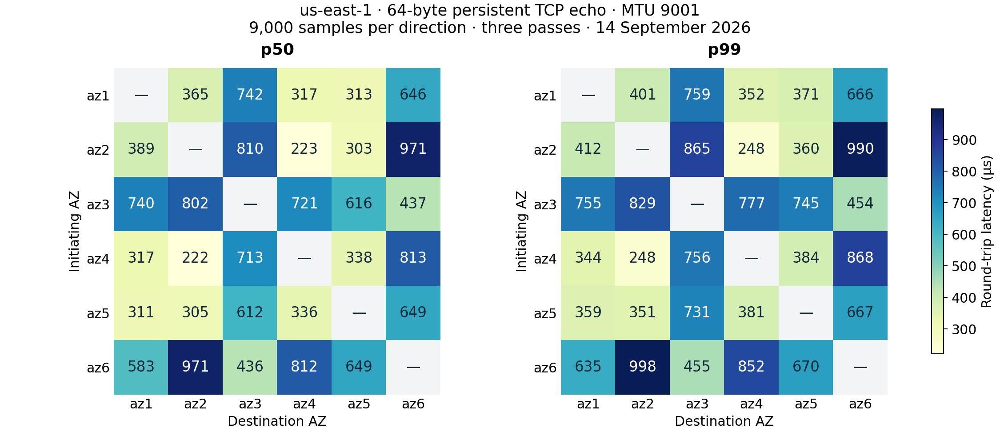
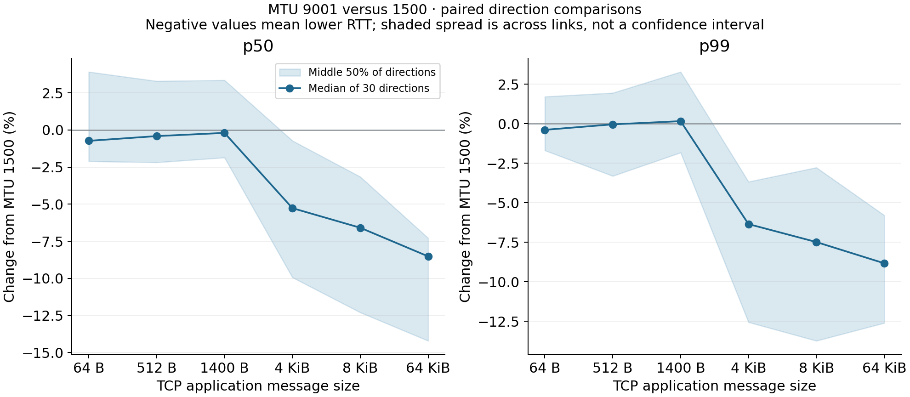

# us-east-1 AZ latency and CFT consensus implications

Measured on **14 September 2026, 15:23:46–15:34:27 UTC**. Six identical
`i4i.xlarge` instances, one per AZ, produced **3.24 million TCP RTTs** and
**540,000 successful ICMP replies**. Every pair was tested in both initiating
directions, with MTUs 1500/9001 and three repetitions. All six worker archives
were verified; all six instances terminated and the temporary security group
was deleted. [Method and reproduction](README.md), [retained evidence](evidence/20260914/README.md).
The archived raw data was subsequently fetched again and all retained statistics
and consensus-model values were successfully regenerated and compared.

**AZ selection dominates small-message latency.** In this cohort, the fastest
64-byte pair had p50/p99 **0.223/0.248 ms**, versus **0.971/0.997 ms** for the
slowest at MTU 9001. For a three-voter CFT group, a good placement and leader
reduce the modeled healthy network p99 from **0.827–0.855 ms to 0.248 ms**:
about **3.3–3.5× faster**, or **0.58–0.61 ms saved per quorum round**. This is a
network-only inference from measured links, not a measured durable commit.

Jumbo frames give essentially no consistent small-message advantage; they
reduce the median paired p99 by **6.4%, 7.5% and 8.8%** for 4, 8 and 64 KiB
TCP echo messages. Placement and MTU effects should not be conflated.

## All 15 AZ pairs

These are **round trips**, not one-way propagation. The table pools both
initiating directions: 18,000 samples per row, **64-byte request and 64-byte
reply, persistent TCP, MTU 9001**. All values below are **milliseconds**.
Directional asymmetry and all other sizes/MTUs remain in
[directed.csv](evidence/20260914/directed.csv) and
[pairs.csv](evidence/20260914/pairs.csv).

| AZ IDs (`use1-` prefix) | This account | p50 | p99 | p99.9 | Mean | Maximum |
|---|---|---:|---:|---:|---:|---:|
| az1–az2 | c–d | 0.371 | 0.409 | 0.431 | 0.377 | 2.568 |
| az1–az3 | c–e | 0.741 | 0.757 | 0.777 | 0.739 | 2.347 |
| az1–az4 | c–a | 0.317 | 0.348 | 0.394 | 0.319 | 6.247 |
| az1–az5 | c–f | 0.312 | 0.366 | 0.385 | 0.308 | 1.986 |
| az1–az6 | c–b | 0.612 | 0.664 | 0.687 | 0.612 | 2.535 |
| az2–az3 | d–e | 0.806 | 0.863 | 0.870 | 0.803 | 2.784 |
| az2–az4 | d–a | 0.223 | 0.248 | 0.284 | 0.224 | 2.251 |
| az2–az5 | d–f | 0.304 | 0.355 | 0.385 | 0.310 | 2.502 |
| az2–az6 | d–b | 0.971 | 0.997 | 1.007 | 0.901 | 3.477 |
| az3–az4 | e–a | 0.715 | 0.772 | 0.819 | 0.724 | 2.534 |
| az3–az5 | e–f | 0.615 | 0.740 | 0.759 | 0.614 | 2.494 |
| az3–az6 | e–b | 0.436 | 0.455 | 0.472 | 0.433 | 2.318 |
| az4–az5 | a–f | 0.337 | 0.382 | 0.517 | 0.344 | 2.232 |
| az4–az6 | a–b | 0.812 | 0.864 | 0.902 | 0.808 | 2.128 |
| az5–az6 | f–b | 0.649 | 0.669 | 0.692 | 0.650 | 2.351 |

Account mapping: `az1=c`, `az2=d`, `az3=e`, `az4=a`, `az5=f`, `az6=b`, where
letters abbreviate `us-east-1…`. Use AZ IDs for portable placement;
[AWS documents their consistent physical identity across accounts](https://docs.aws.amazon.com/global-infrastructure/latest/regions/az-ids.html).

The compact CSVs also retain minimum, standard deviation, p1/p5/p25/p75/p90/p95,
threshold exceedances, loss/retransmissions and per-repetition p50/p99 ranges.
Successful TCP request counts do not measure packet-loss rates. Across the
entire sweep there were **five measured TCP retransmissions**, **zero missing
ICMP replies** among fitting packets, and no increases in recorded ENA
allowance-exceeded/drop/error counters. Average aggregate CPU busy time over an
epoch was 9.1–15.7%; this is not a per-case saturation test. The largest TCP
outlier anywhere in the sweep was **9.464 ms**. Maxima and p99.9 describe this
short observation window, not safe timeout thresholds.

## MTU and message size

Each value is the median percentage change over the **same 30 directions**,
comparing MTU 9001 with 1500 after pooling repetitions. Negative means faster.
The shaded plot spread is variation across links, not a confidence interval.

| TCP request and reply size | p50 change | p99 change | p99.9 change |
|---|---:|---:|---:|
| 64 bytes | -0.73% | -0.39% | -0.21% |
| 512 bytes | -0.41% | -0.05% | +1.62% |
| 1,400 bytes | -0.20% | +0.16% | +1.27% |
| 4,096 bytes | -5.26% | -6.35% | -4.68% |
| 8,192 bytes | -6.59% | -7.49% | -6.27% |
| 65,536 bytes | -8.51% | -8.83% | -8.45% |

The larger-message result recurs across passes: median paired p99 changes for
64 KiB were **−10.17%, −6.45%, −11.32%**. For 64 bytes they were
**+1.34%, −1.38%, −0.35%**. Small-message differences do not support a general
claim that jumbo frames lower RTT.

The IPv4 DF checks verified the expected boundaries in all directions and
repetitions: 1472-byte ICMP payloads fit MTU 1500; 1473 do not. At MTU 9001,
8973-byte payloads fit and 8974 do not. All **360 oversize rejection cases**
failed locally as expected; these are distinct from network losses. Every TCP
case reported the configured PMTU. [AWS's MTU guidance](https://docs.aws.amazon.com/AWSEC2/latest/UserGuide/network_mtu.html)
explains the packet/MTU distinction and VPC versus internet paths.

These large TCP messages were echoed in full. A replication request with a
small acknowledgment transfers fewer response bytes, so its precise jumbo-frame
benefit is **not measured here**. `TCP_NODELAY` was enabled throughout. Offloads,
IRQ placement, socket buffers, congestion control, UDP, TLS and Nagle on/off
were not swept; no benefit is claimed for changing them.

## All 20 three-AZ choices

Score: the **largest directional p99 among all six directed edges**, for
64-byte TCP. This is useful when any node may become leader or a fast follower
may disappear. It is **not healthy-quorum p99**. MTU 9001 ranks are shown below;
[triples.csv](evidence/20260914/triples.csv) has every message size and both MTUs.

| Rank at MTU 9001 | AZ IDs (`use1-az` numbers) | Worst edge p99, MTU 9001 (ms) | MTU 1500 (ms) |
|---:|---|---:|---:|
| 1 | 2, 4, 5 | 0.384 | 0.475 |
| 2 | 1, 4, 5 | 0.384 | 0.388 |
| 3 | 1, 2, 4 | 0.412 | 0.455 |
| 4 | 1, 2, 5 | 0.412 | 0.475 |
| 5 | 1, 5, 6 | 0.670 | 0.681 |
| 6 | 3, 5, 6 | 0.745 | 0.733 |
| 7 | 1, 3, 5 | 0.759 | 0.759 |
| 8 | 1, 3, 6 | 0.759 | 0.759 |
| 9 | 3, 4, 5 | 0.777 | 0.749 |
| 10 | 1, 3, 4 | 0.777 | 0.759 |
| 11 | 2, 3, 5 | 0.865 | 0.891 |
| 12 | 2, 3, 4 | 0.865 | 0.891 |
| 13 | 1, 2, 3 | 0.865 | 0.891 |
| 14 | 1, 4, 6 | 0.868 | 0.867 |
| 15 | 4, 5, 6 | 0.868 | 0.867 |
| 16 | 3, 4, 6 | 0.868 | 0.867 |
| 17 | 2, 5, 6 | 0.998 | 1.272 |
| 18 | 1, 2, 6 | 0.998 | 1.272 |
| 19 | 2, 4, 6 | 0.998 | 1.272 |
| 20 | 2, 3, 6 | 0.998 | 1.272 |

**{2,4,5} and {1,4,5} tie at 0.384 ms worst-edge p99** under MTU 9001;
{2,4,5} wins the mean-link-median tie-break (0.288 versus 0.322 ms).
At MTU 1500, {1,4,5} ranks first. Treat these as promising candidate placements,
not a permanent exact ordering. The worst MTU-9001 sets include {2,3,6}, whose
worst edge is 0.998 ms; its MTU-1500 value reaches 1.272 ms.

There is substantial connection/pass variation on some links. For example,
`az2→az6`, 64 bytes, MTU 1500 had per-pass p50 **0.747–1.260 ms** and p99
**0.762–1.277 ms**. The same link at MTU 9001 had p50 **0.748–0.974 ms**.
These observations cannot identify routing, placement or host scheduling as the
cause. They do show why the large change on one link should not be attributed
to MTU alone. Three passes and one host per AZ do not establish region-wide or
long-term rankings; the cohort's host/rack/path variation remains unmeasured.

## Good versus bad tuning for three-voter CFT consensus

For a stable-leader Raft/Multi-Paxos-style group, the leader already supplies
one vote and needs **one of two follower acknowledgments**. Its healthy network
term is therefore `min(RTT_to_follower_1, RTT_to_follower_2)`. A three-node
majority does not normally wait for both followers. Raft's normal log replication
uses one RPC round to a majority; slower minority members need not delay it.
See the [Raft paper, §5.3](https://raft.github.io/raft.pdf).

Consider these concrete configurations, chosen from the measured cohort:

- **Good:** `use1-az2, use1-az4, use1-az5` (this account: d/a/f), leader in
  `use1-az4` (a), MTU 9001. This combines the fast az4–az2 link with a relatively
  fast alternative and ties for the best worst-edge score.
- **Bad:** `use1-az2, use1-az3, use1-az6` (d/e/b), leader in `use1-az2` (d),
  MTU 1500. Both follower paths are substantially longer in this cohort.

For 64-byte echo-sized messages:

| Network contribution / condition | Good (ms) | Bad (ms) | Advantage |
|---|---:|---:|---|
| Healthy majority p50, marginal-coupling bounds | 0.222 | 0.797–0.824 | 3.6–3.7× |
| Healthy majority p99, marginal-coupling bounds | 0.248 | 0.827–0.855 | 3.3–3.5× |
| Healthy majority p99, independent-links scenario | 0.248 | 0.854 | 3.4× |
| Fast follower unavailable, remaining-link p50 | 0.338 | 0.885 | 2.6× |
| Fast follower unavailable, remaining-link p99 | 0.384 | 1.272 | 3.3× |

**How these numbers were obtained:** follower links were measured separately,
so their joint RTT distribution under simultaneous fan-out is unknown. For the
healthy cases, `consensus.py` uses the two empirical CDFs. If they are `F1` and
`F2`, the CDF of their minimum is bounded by `max(F1,F2)` and
`min(1,F1+F2)`. Inverting those bounds gives the ranges above without assuming
independent delays. These are bounds for the **measured empirical marginals**,
not statistical confidence intervals or guaranteed production bounds. The
independence scenario instead uses `1−(1−F1)(1−F2)` and is labeled separately.
Do not compute quorum p99 by simply taking the smaller of two link p99s.

After one follower fails, the remaining leader/follower link supplies the
necessary majority. Those table entries use its directly measured RTT
percentiles, under the original measurement traffic conditions. No failure,
leader election or actual failover was injected. A healthy leader in az2 can
benefit from az4 even if its third replica is far away; that placement exposes
the longer path when az4 is unavailable. Leader placement and fallback paths
therefore deserve separate attention.

For the same good/bad configurations with **64 KiB full echoes**, the modeled
healthy network p99 bounds are **0.371–0.396 ms versus 0.985–1.058 ms**.
That is a transfer-size sensitivity example, not measured 64 KiB WAL replication
latency: real follower acknowledgments are usually much smaller than the echo
reply used here. All 720 leader/placement/MTU/size scenarios, including p99.9,
are in [consensus-scenarios.csv](evidence/20260914/consensus-scenarios.csv).

The small-message improvement comes mainly from **AZ and leader selection**;
MTU is a secondary batching optimization. Among the six MTU/size comparisons,
the most repeatable network-parameter gains appear once messages span multiple
1500-byte packets. The data supports testing jumbo frames for those private-VPC
replication messages while retaining a compact, fast fallback AZ set.

### What carries through to durable commit latency

A useful critical-path model, when leader persistence overlaps replication, is
`max(leader_durability, min(network_RTT_j + follower_durability_j))`, plus
admission, scheduling, protocol processing and client routing. Implementations
which serialize persistence add more work. Real durability and network delays
may be correlated, so their p99s cannot simply be added.

This experiment contains **no fsync/WAL, consensus implementation, client hop,
queueing load, election or failure-recovery measurement**. The network component
saves roughly 0.6 ms in the chosen healthy comparison, but the whole operation
will not necessarily improve 3.4×. As a deliberately hypothetical sensitivity:
adding a fixed 1 ms of identical critical-path work changes the comparison to
about **1.248 versus 1.827–1.855 ms**, only **1.46–1.49×**. With a fixed 5 ms it
is about **1.11–1.12×**. These are arithmetic scenarios, not observed disk times.
[etcd's performance guide](https://etcd.io/docs/v3.7/op-guide/performance/)
also identifies both network and disk latency as consensus constraints.

For SixDB, the useful conclusion is to retain **{2,4,5} and {1,4,5} as candidate
three-AZ placements**, prefer the fast az2–az4 path when the selected set includes
it, and validate jumbo frames with the actual request/small-ack/WAL path. The
current evidence establishes the scale of the network opportunity and its
single-follower-loss sensitivity; it does not establish durable throughput,
election-timeout settings, or additional availability from geographically
closer/farther AZ IDs.
