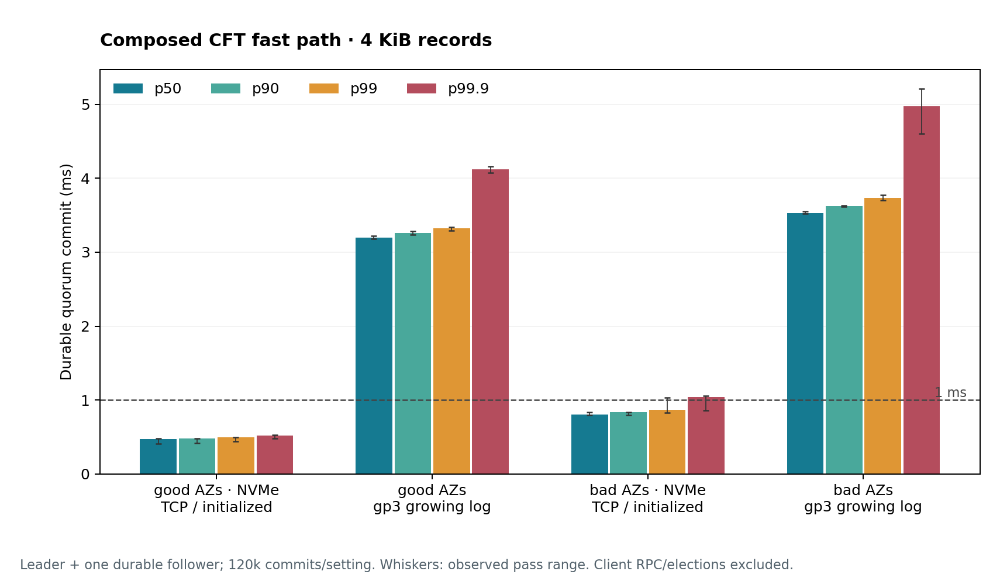

# Durable commit latency and operating choices

**Prepared NVMe logs achieved sub-millisecond p99.9 one-record commits in the
selected good placement.** Under scheduled 4 KiB arrivals, the highest measured
rate with pooled p99 below 1 ms was **231,309 commits/s using ENA Express**.
Requiring pooled p99.9 below 1 ms selected **129,537/s**. Both selected percentiles
also stayed below 1 ms in each of their three passes. Throughput, the requested
percentile and variation between passes all change the operating choice.

All times below are actual joint durable commits in **milliseconds**. Commit
requires the leader's own durable completion plus one durable follower
acknowledgment. The [commit guide](commit/README.md) explains that boundary and
how batches, windows and queueing change the path under load.

The one-record experiments prepare payloads before timing, then drain both
followers before issuing another record. The later arrival-driven pipeline
includes preparation and waiting from the scheduled arrival. Those experiments
answer different questions; their latency values do not share an identical clock.

## A useful starting configuration

The two measured placements use i8g.large instances:

- **Good:** leader `use1-az4`, followers `use1-az2` and `use1-az1`.
- **Bad:** leader `use1-az6`, followers `use1-az4` and `use1-az2`.

The names identify this comparison, rather than permanent properties of the AZs.
These **4 KiB** rows each pool 120,000 commits from three passes.

| Placement / log path | TCP MTU | p50 | p90 | p99 | p99.9 |
| --- | ---: | ---: | ---: | ---: | ---: |
| Good / initialized NVMe | 9001 | 0.474 | 0.480 | 0.493 | 0.520 |
| Bad / initialized NVMe | 9001 | 0.801 | 0.837 | 0.870 | 1.045 |
| Good / growing gp3 | 1500 | 3.197 | 3.264 | 3.324 | 4.119 |
| Bad / growing gp3 | 1500 | 3.533 | 3.622 | 3.736 | 4.978 |

Moving from the bad-placement growing-gp3 policy to the good-placement
initialized-NVMe policy reduced p99 by **86.8%**, from **3.736 to 0.493 ms**
(a **7.58×** latency ratio).

Whiskers show the range across the three measured passes. They are not confidence
intervals. [Exact cases and repetitions](evidence.md) retain the settings behind
the comparison.

Initialized NVMe uses direct `O_DSYNC` writes on tuned ordered ext4. Growing gp3
uses buffered writes followed by `fdatasync` on ordinary ordered ext4. The latter
is a complete baseline log policy: the difference includes storage, preparation,
I/O path and MTU. It cannot all be assigned to the medium. Both paths request
[power-safe completion](persistence/README.md#what-makes-completion-durable).

The good initialized-NVMe TCP row placed **99.99917% of observed commits below
1 ms**; its per-pass p99.9 ranged **0.479–0.525 ms**. The bad placement's p99
remained below 1 ms while its pooled p99.9 exceeded it. A deployment preference
therefore needs to name the percentile, as well as its latency budget.

## How much throughput does the latency preference cost?

The completed pipeline cohorts use **4 KiB records, raw NVMe, direct `O_DSYNC`
and the good placement**. These are the highest-goodput candidates stable in all
three repeated passes. Latency is measured from scheduled arrival, in milliseconds:

| Instance / network | Commits/s | p50 | p90 | p99 | p99.9 | Pass p99.9 range |
| --- | ---: | ---: | ---: | ---: | ---: | ---: |
| i8g.large / standard ENA | 52,693 | 0.602 | 0.708 | 0.790 | 0.834 | 0.766–0.845 |
| i8g.8xlarge / standard ENA | 128,881 | 0.755 | 0.842 | 0.919 | 0.987 | 0.894–1.019 |
| i8g.8xlarge / ENA Express | 322,317 | 0.850 | 1.167 | 27.914 | 48.861 | 1.477–50.567 |

The small candidate uses TCP with 16 retained batches, up to 16 records/batch,
50 µs maximum fill wait and 52,700 offered records/s. Larger standard ENA uses TCP with
16 batches, up to 64 records/batch, the same wait and 128,800 offered/s. Express
uses the latter batch/window/wait policy at 320,900 offered/s. Actual batches can
be smaller. The three measured populations are **2.37, 5.61 and 5.04 million
post-warmup records over about 45, 44 and 16 seconds total**, respectively, across
three passes. Goodput counts unique durable commits/s without a deadline filter.

**Larger standard ENA has little margin at p99.9:** its pooled 0.987 ms satisfies
the report's 1 ms preference, while one pass reaches 1.019 ms. Its three p99
values remain below 1 ms, at 0.871–0.956 ms. A percentile and a pooled-versus-pass
requirement therefore change the interpretation of the same operating point.

**Express's fastest stable point has costly tails:** only 74.814% of its commits
completed below 1 ms. A **p99 budget of 1 ms** instead selects UDP at **231,309/s**,
with p50/p90/p99/p99.9 **0.686/0.812/0.945/1.055 ms**. Its pass p99 range is
**0.932–0.955 ms**; every pass's p99.9 exceeds 1 ms. A **p99.9 budget of 1 ms**
selects TCP at **129,537/s**, with **0.687/0.806/0.882/0.923 ms** percentiles and
**0.816–0.930 ms** pass p99.9. The sacrifices are **28.2% and 59.8%** of Express's
largest observed stable goodput. Their post-warmup windows total about 23 and
43 seconds across three passes. The two-million-record cap shortens high-rate
passes; these are finite observations, not sustained-capacity trials.

Staying within **25% of the best pooled p99.9** selects 52,693/s on the small
cohort, 7,501/s on larger standard ENA, and 3,996/s on Express. The respective
sacrifices are **0%, 94.2% and 98.8%** of each cohort's largest observed stable
goodput. These large changes partly reflect sparse sampling: the larger standard
cohort has no repeated rates between 7,500 and about 128,000/s, and Express none
between 4,000 and 129,600/s. They do not establish universal knees.

Short screens can give a materially different answer. At 104,400 offered/s on
the small cohort, a TCP W64/B4/wait 50 µs policy gave **0.689 ms p99** in a
six-second post-warmup screen, then **82.805–92.780 ms p99** across three
15-second repetitions. Median latency stayed below 0.709 ms and goodput stayed
near 104,000/s, concealing the queue growth and slow population. All four repeated
small-cohort policies near that rate were unstable. The untested repeated gap
between about 53,000 and 104,000/s leaves its true boundary unresolved.

The [throughput findings](commit/throughput.md) give the full percentile choices,
failed-screen comparison, pass variation and network explanation. The larger
platform changes hardware and tuning as well as bandwidth; **25 Gbps instance
bandwidth is not a per-flow entitlement**. Standard ENA's 5 Gbit/s flow limit
predicts about 153,000 4 KiB records/s per follower before overhead, consistent
with its short screens. Express exceeds that constraint. Its comparison uses
matching settings on fresh cohorts, rather than a same-host crossover.

## Which changes earned their place?

**Prepare the log ahead of demand.** In the matched storage screen, keeping
buffered-fdatasync and ordered ext4 fixed, initialization reduced i8g median write
completion from 62.5 to 17.4 µs; preallocation alone gave 54.6 µs. The
[persistence findings](persistence/FINDINGS.md) compare all device classes and
explain the FUA/flush diagnostic. Preparation has been paid before timing and
must be supplied by a real log's segment policy.

**Choose the leader and its alternatives together.** The
[network study](az-findings.md) covers all 15 pairs and 20 triples. Its best
worst-edge sets were {az2, az4, az5} and {az1, az4, az5} at MTU 9001. The durable
cohort instead used {az1, az2, az4} for its good placement because i8g.large was
unavailable in az5. Network-only rankings shortlist feasible choices; hardware
availability and actual durable rounds complete the comparison.

**Raw I/O did not improve the good one-record median.** At 4 KiB, TCP and MTU
9001, raw NVMe gave p50/p90/p99/p99.9 **0.489/0.497/0.505/0.517 ms** versus
**0.474/0.480/0.493/0.520 ms** for the initialized file. Raw was slightly lower at
the pooled p99.9, with overlapping pass ranges. This comparison offers no broad
latency reason to take on raw-region management; throughput may change that choice.

## Prepared EBS offers another candidate

Growing gp3 is only one EBS policy. The short joint-commit screen also tested
initialized extents with direct `O_DSYNC`. These rows use the **good placement,
tuned ordered ext4 and MTU 9001**, selecting the lowest p99 within each
device/record-size screen. The transport is part of that selection.

| Device / record / transport | p50 | p90 | p99 | p99.9 |
| --- | ---: | ---: | ---: | ---: |
| gp3 / 4 KiB / UDP | 1.303 | 1.343 | 1.372 | 1.404 |
| io2 / 4 KiB / UDP | 0.720 | 0.768 | 0.823 | 0.896 |
| gp3 / 64 KiB / TCP | 1.864 | 2.004 | 2.060 | 2.170 |
| io2 / 64 KiB / UDP | 0.970 | 1.036 | 1.112 | 1.199 |

**These are screening results: 6,000 commits in three passes per row.** They
support investigating initialized io2 for a sub-millisecond 4 KiB p99, while
initialized gp3 remained above that budget here. Selection used these same
observations, and only about six pooled observations lie beyond p99.9. The
displayed short-screen tails carry less evidence than the longer NVMe runs;
they do not establish an equally well-tested tail preference.
The [complete commit table](evidence/20260914-durable/commits.csv) retains all
screened paths and their separate per-pass ranges.

## Transport and message size change the comparison

The following rows hold the **good placement, initialized NVMe and MTU 9001**
constant. There are three passes per row: 120,000 commits at 4 KiB and 36,000 at
64 KiB. These are record sizes, not the later pipeline's batch sizes.

| Record / transport | p50 | p90 | p99 | p99.9 |
| --- | ---: | ---: | ---: | ---: |
| 4 KiB / TCP | 0.474 | 0.480 | 0.493 | 0.520 |
| 4 KiB / UDP | 0.477 | 0.485 | 0.511 | 0.523 |
| 64 KiB / TCP | 0.639 | 0.738 | 0.805 | 0.874 |
| 64 KiB / UDP | 0.623 | 0.665 | 0.688 | 0.713 |

The 4 KiB distributions are close; the larger record gives UDP a more useful
tail advantage in this implementation. All 36,000 good 64 KiB UDP commits were
below 1 ms. This observed fraction is not a guarantee for unseen traffic.

MTU also needs a percentile-specific reading. In the **bad placement**, initialized
NVMe TCP at MTU 1500 gave **0.844/0.917/0.941/0.964 ms**, compared with
**0.801/0.837/0.870/1.045 ms** at MTU 9001. Jumbo frames improved the pooled
median and p99 while p99.9 worsened in these passes. The complete data and pass
variation matter more than assigning a universal winner to TCP, UDP or jumbo frames.

## A healthy quorum can conceal a costly fallback

These **4 KiB raw-NVMe, MTU 9001** comparisons remove the normally faster follower
from an otherwise matching case. That follower is already known unavailable;
the measurements exclude failure detection and election time. Each row contains
120,000 commits in three passes.

| Placement / transport / followers | p50 | p90 | p99 | p99.9 |
| --- | ---: | ---: | ---: | ---: |
| Good / TCP / both available | 0.489 | 0.497 | 0.505 | 0.517 |
| Good / TCP / fast follower absent | 0.479 | 0.491 | 0.508 | 0.549 |
| Bad / UDP / both available | 0.807 | 0.830 | 0.843 | 0.932 |
| Bad / UDP / fast follower absent | 1.017 | 1.037 | 1.048 | 1.080 |

The good placement retains a fast alternative in these observations. The bad
placement's tail crosses 1 ms when the fast follower is unavailable. Compare
healthy and absent rows within each transport; this table does not isolate a
TCP-versus-UDP effect. It also does not establish the bounded pipeline's behavior
after a follower disappears: that pipeline retains slots until both acknowledge.

## Evidence and what it establishes

The completed durable commit campaign contains **114 configurations, 336 passes
and 2,160,300 commits**, including 19 longer tail configurations. All 336 passes
readback-verified participating nodes in a new process. These checks establish
record content and ordering under the test; durability relies on the recorded
OS/device/AWS completion contracts. They do not physically test a power cut.

The storage and initial network studies have their own measured populations and
controls. They help explain the result, while the actual commit distributions
come from simultaneous leader/follower work. [Retained evidence and recovery](evidence.md)
cover the completed network, storage, D3 diagnostic and commit studies. The eleven
storage/D3/commit worker archives were independently fetched and reanalyzed;
all selected CSVs reproduced byte for byte. All three
throughput cohorts also reproduced their seven reconstructed numeric/context outputs
byte for byte; each has a separate retained bundle.
