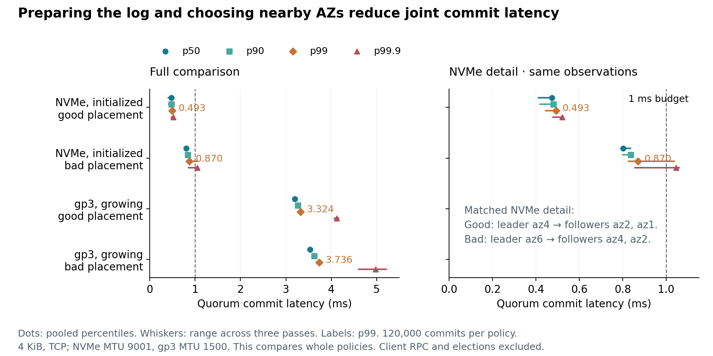
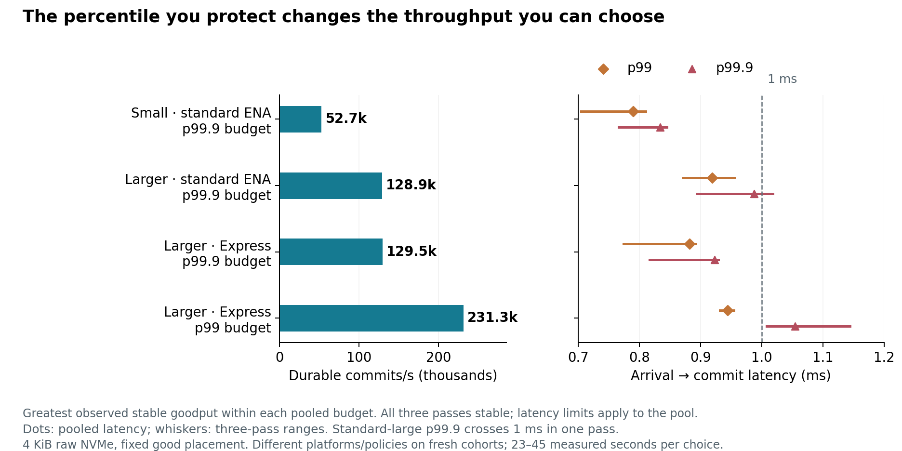

# Durable commit latency and operating choices

**Preparing the log and choosing its replica placement made sub-millisecond
commits possible. Keeping that latency under load is a separate choice.** In the
measured ENA Express cohort, a 1 ms p99 budget admitted **231,309 commits/s**;
a 1 ms p99.9 budget selected **129,537/s**. The highest observed goodput was
322,317/s, but its p99.9 was nearly 49 ms.

The [study overview](README.md) maps the supporting guides. This report follows
the decision from the low-load path to an operating point, then explains where
the evidence leaves room for a different choice. Measurements are from
14 September 2026 in AWS us-east-1.

## Know which latency is being measured

A record commits after the leader and one follower have made it durable. Local
persistence and both replications overlap; the slower third replica can finish
after commit. The [commit path](commit/README.md) explains how durable prefixes
preserve order and how a lagging replica can still delay later admissions.

| Experiment | Timer and arrival boundary | What it establishes |
| --- | --- | --- |
| One outstanding record | Payload prepared before timing; both followers finish before the next record starts | The joint durable path with a comparable starting state |
| Arrival-driven pipeline | Scheduled arrival to commit, including preparation, batch formation and queueing | Latency at an offered rate, including waiting before admission |

The commit tables and plots use measured joint rounds, with latency in **milliseconds**.
P99 describes the observed 99th percentile, p99.9 the 99.9th. **Pooled** means
combining the raw observations from three passes before computing the percentile.
The range of those passes' percentiles shows variation that pooling can conceal.
The 1 ms reference is a budget for this commit path, excluding client RPC and
failure detection or election time.

## Remove avoidable write and placement cost first

The storage comparison uses host-local NVMe instance store and gp3, an AWS
Elastic Block Store (EBS) volume type. An initialized log region has already been
written and synchronized before records arrive.

For 4 KiB records, moving from a growing-gp3 log in the worse measured placement
to initialized NVMe in the better placement reduced p99 from **3.736 to
0.493 ms**, an **86.8% reduction**. The latter's p99.9 was **0.520 ms**, with
pass values of **0.479–0.525 ms**. Each policy below pools 120,000 commits across
three passes on i8g.large.

“Good” and “bad” identify the two measured placements. The good leader is in
`use1-az4`, with followers in az2 and az1; the bad leader is in az6, with
followers in az4 and az2. These labels are not permanent AZ properties.
Initialized NVMe uses direct `O_DSYNC` writes on tuned ordered ext4; growing gp3
uses buffered writes followed by `fdatasync`, with a different MTU. The complete
policy comparison changes several things, so its entire gain cannot be assigned
to the storage medium. The [one-record findings](commit/latency.md) give the exact
rows and the narrower comparisons:

- **Prepare before demand.** Holding buffered-fdatasync and ordered ext4 fixed,
  initializing the destination reduced i8g median write completion from 62.5 to
  17.4 µs; preallocation alone gave 54.6 µs. A real log must pay that preparation
  ahead of use. [Persistence findings](persistence/FINDINGS.md) explain the paths.
- **Choose the leader and its fallback together.** The
  [network study](az-findings.md) identifies fast links and slower alternatives.
  Actual commit tests show what remains when the normally faster follower is
  already known unavailable. Healthy latency alone does not price that fallback.
- **Keep nearby alternatives in view.** Prepared raw NVMe did not improve the
  good one-record median over a prepared file. Initialized io2 was a promising
  EBS alternative in a shorter screen. UDP helped the larger 64 KiB record more
  than the 4 KiB record. Each conclusion has its own population and controls in
  the [one-record comparison](commit/latency.md).

## Choose a rate for the percentile that matters

The pipeline uses **4 KiB records, raw NVMe and direct `O_DSYNC`**, with the good
placement and one pinned application CPU per voter. **Goodput** counts unique
durable commits/s without a deadline filter. A candidate must keep up and drain its work in **all three passes** under the
[finite-run stability rule](commit/README.md#count-waiting-from-the-arrival-schedule).
Among those candidates, the following are the highest-goodput choices for the
named **pooled** 1 ms budget. ENA (Elastic Network Adapter) is the AWS network
interface; Express is its alternative network path. The cohorts compare small
and larger instances, then the two network modes on the larger size:

| Cohort / budget | Commits/s | p50 | p90 | p99 | p99.9 |
| --- | ---: | ---: | ---: | ---: | ---: |
| i8g.large, standard ENA / p99.9 | 52,693 | 0.602 | 0.708 | 0.790 | 0.834 |
| i8g.8xlarge, standard ENA / p99.9 | 128,881 | 0.755 | 0.842 | 0.919 | 0.987 |
| i8g.8xlarge, ENA Express / p99.9 | 129,537 | 0.687 | 0.806 | 0.882 | 0.923 |
| i8g.8xlarge, ENA Express / p99 | 231,309 | 0.686 | 0.812 | 0.945 | 1.055 |

The larger standard-ENA point has little p99.9 margin: its pass range is
**0.894–1.019 ms**, so one pass exceeds the pooled budget. Express's p99 choice
stayed below 1 ms at p99 in all passes (**0.932–0.955 ms**), while every pass's
p99.9 exceeded it. Its p99.9 choice stayed at **0.816–0.930 ms** across passes.
The [throughput findings](commit/throughput.md) retain the policies, offered rates,
all four percentile preferences and their alternatives.

Express's fastest stable point, **322,317/s**, completed only **74.814%** of its arrival
cohort below 1 ms, with **48.861 ms p99.9**. Choosing its 1 ms p99 or p99.9 point
therefore gives up **28.2% or 59.8%** of the largest observed stable goodput.
Stable admission and acceptable latency are separate requirements.

These are short observations. The table's rows contain about **45, 44, 43 and
23 post-warmup seconds total** across three passes. A two-million-record cap
shortens high-rate passes; the 322,317/s candidate has only about **5.2 seconds
per pass**. These measurements do not establish long-term capacity.

## Use the surrounding evidence to judge a boundary

Three details materially change how the selected points should be used:

- **A short screen can miss accumulating work.** On the small cohort, one
  104,400 offered/s policy had **0.689 ms p99** in a six-second screen, then
  **82.805–92.780 ms** in three 15-second repeats. Goodput stayed near 104,000/s
  and the median below 0.709 ms. [Queue growth](commit/throughput.md#why-the-104000s-screen-is-not-the-recommendation)
  explains why that point was rejected.
- **Sparse choices do not resolve a knee.** Express has no repeated rates
  between 4,000 and 129,600/s. Staying within 25% of its best latency selects
  about 4,000/s and sacrifices 98.8% of observed stable goodput, but the gap
  leaves intermediate possibilities unresolved. On standard ENA, a candidate
  misses a relative median limit by just **1 µs**, much less than pass variation.
- **The exact rate maximum may be a poor bargain.** One Express fill-wait
  setting gains only **0.18% goodput** while worsening p99.9 from **1.500 to
  19.216 ms**. The [full distribution and nearby policy](commit/throughput.md#ena-express-removing-the-per-flow-constraint)
  give an engineer reason to choose the slightly lower rate.

The network model also helps predict which change could matter. Standard ENA's
5 Gbit/s flow ceiling permits about **153,000 4 KiB records/s per follower** before
overhead, consistent with its short screens. More aggregate instance bandwidth
alone cannot remove that constraint; Express does. The larger-host comparison
also changes platform resources and tuning, and standard versus Express uses
fresh cohorts rather than a same-host crossover. The
[network controls and measured ceilings](commit/throughput.md#what-the-network-ceiling-explains)
bound that interpretation.

## Carry the result into a system

A deployment still has to supply prepared log space, admission/backpressure and
replica recovery. This bounded pipeline retains slots until both followers
acknowledge, so it does not sustain admission after a follower disappears. The
known-absent-follower tests belong to the separate one-record experiment.

[Memory characterisation](../memory-characterisation/README.md) supplies the other
half of this hardware picture: within-host concurrency, cache sharing and
placement. Its findings show why CPU identity or NUMA-node identity alone can
miss a relevant cost. Neither spike turns a local optimum into a universal
tuning constant; the consuming workload and its actual environment matter.

All measured paths request [power-safe completion](persistence/README.md#what-makes-completion-durable).
Readback checks content and ordering; it is not a physical power-cut test.
The [evidence guide](evidence.md) collects exact cases, populations, captured
sources and recovery commands. All retained studies were independently recovered
and their numerical results reproduced.
