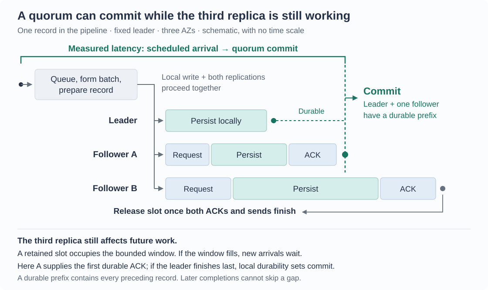

# How the durable commit experiments work

A leader receives an ordered stream of log records and replicates them to two
followers in different availability zones (AZs). A record commits once the leader
and at least one follower have made it durable. This is the fixed-leader fast
path of a crash-fault-tolerant (CFT) log. Client RPC, elections, competing leaders
and membership changes are outside the experiment. The [study overview](../README.md)
connects these measurements to storage and placement choices; the
[throughput findings](throughput.md) compare the measured arrival-driven policies.

## Follow one record

The leader starts its local write and both replications together. Each follower
checks the record and acknowledges only after its synchronized write completes.
The leader's completion and the first durable follower acknowledgment establish
the required two copies.

If L, A and B are the leader's observed times for local durability and the two
durable acknowledgments, measured from one origin, quorum readiness for a record
is `max(L, min(A, B))`. The commit percentiles come from actual joint rounds.
Separate link or device p99 values cannot be combined to recover this p99.
The CSV's `remote1_*` and `remote2_*` fields contain follower write durations,
not the leader's observation times for their acknowledgments.

Multiple writes can finish out of order. Each node therefore tracks a **durable
prefix**: the consecutive records durable from the beginning, with no gap. The
leader commits the intersection of its own prefix and the furthest follower
prefix. Finishing a later write cannot acknowledge past an unfinished predecessor.

## Three experiments answer different questions

| Experiment | How work arrives | What it tells us |
| --- | --- | --- |
| One outstanding record | Start a record, record quorum completion, then drain the other follower before starting another | Joint commit latency with a comparable starting state; all-follower time reveals the additional pacing cost |
| Closed-loop pipeline | Issue more work as slots become available | Screen batch/window policies for attainable throughput in this implementation |
| Open-loop pipeline | Schedule individual arrivals independently of completions | Measure latency and queue behavior at a specified offered rate, including waiting before admission |

The one-record probe prepares the payload before starting its timer. Pipeline
record generation and preparation happen after arrival and count toward primary
latency, so the two measurements have different preparation boundaries.

The one-record surviving-majority cases start with one follower already known
unavailable. They measure the remaining durable path, excluding failure detection
and election time. The current bounded pipeline waits for both followers to
release slots, so it does not sustain admission after a follower disappears.

## Batches buy amortization; windows buy overlap

The pipeline writes 4 KiB records. A **batch** groups consecutive records into one
direct `O_DSYNC` write. Its size cap limits how many records can share that write;
a maximum fill wait limits how long formation can wait for more arrivals. A
larger batch can spread write and protocol costs over more records, while adding
formation delay. Actual batches can be smaller than the cap.

The **window** limits retained batches. More slots permit independent work to
overlap. A slot remains occupied until both followers acknowledge its batch and
all sends finish, bounding the third replica's lag. Quorum completion is recorded
earlier: a slow third replica can leave the current commit fast while delaying
future admissions. Batch cap and window size describe different controls.

Both transports use `io_uring`, the same record checks and application CPU
allocation within each cohort. TCP serializes outstanding stream sends
to preserve framing. UDP uses fragments fitting the configured IPv4 path MTU
with DF set, reassembles them out of order, and retries the oldest unacknowledged
batch per follower after 2 ms. Duplicate acknowledgments are rate-limited. These
results compare implementations with these policies; the protocol names alone
do not specify their performance.

### Network cohorts and controls

| Cohort | Network mode | MTU | Instance bandwidth: baseline / peak |
| --- | --- | ---: | ---: |
| i8g.large | Standard ENA | 9001 | 1.172 / 10 Gbps |
| i8g.8xlarge | Standard ENA | 8900 | 25 / 25 Gbps |
| i8g.8xlarge | ENA Express for TCP and UDP | 8900 | 25 / 25 Gbps |

The two larger cohorts use matching TCP output limits (4 MiB), disabled TCP
autocorking and the same byte queue limits, alongside the existing 32 MiB socket
buffer requests. Their UDP packets are 8,872 bytes including the 56-byte
application frame header, fitting MTU 8900 after IPv4/UDP headers. The smaller
cohort retains its earlier settings. Large versus small therefore compares a
whole platform and tuning choice. Standard ENA versus Express uses matching
settings on fresh cohorts, rather than a crossover on the same hosts.

[ENA Express](https://docs.aws.amazon.com/AWSEC2/latest/UserGuide/ena-express.html)
can use AWS Scalable Reliable Datagram (SRD) across AZs in us-east-1. Per-transport
preflight counters check actual SRD transmission and reception: enabling the
feature alone does not establish that the measured packets used it.
[AWS's settings checker](https://github.com/amzn/amzn-ec2-ena-utilities/blob/main/ena-express/check-ena-express-settings.sh)
requires the lower MTU for this path. Standard ENA also has a 5 Gbps single-flow
limit in this placement; the study uses one flow per follower and does not test
multichannel replication. Recorded hardware and setup receipts accompany results.

## Count waiting from the arrival schedule

The Poisson arrival schedule is generated from a recorded seed before the native
timer starts. The measured leader CPU consumes that schedule independently of
completions. Arrivals continue when the window is full and accumulate in the
queue. **Primary latency is scheduled arrival to quorum commit**, including
queueing, batch formation, record generation, preparation and retries.

`prepared_ns` records when a batch is ready to enqueue. It precedes kernel
submission, and the interval from preparation to commit still includes any delay
before the submission queue is sent to the kernel. Starting the timer there would
omit the record's earlier waiting.

After arrivals stop, the run drains every record. `throughput_summary.py` counts
unique durable commits during the offered-load interval as **goodput**. This
metric does not impose a latency deadline. Latency samples cover arrivals after
the first scheduled second, including their completions after arrivals stop.
Closed-loop results instead discard the first 10% of records. Queue/backlog
snapshots, drain time, retries, per-process CPU and per-pass percentiles accompany
the curves.

Open-loop screens target seven scheduled seconds and repeated tail passes target
sixteen, using a record count capped at 2,000,000 per pass. Faster selected rates
can therefore produce shorter intervals. Per-pass `measurement_seconds` records
the actual interval after warmup; pooled `measurement_seconds` sums those intervals.

The finite-run `stable_observed` criterion requires:

- goodput at least 98% of offered rate;
- quorum drain and all-follower drain each no more than
  max(20 ms, 1% of measured duration), counted from the last scheduled arrival;
- last-quarter mean queued arrivals no more than the first quarter plus
  max(10 records, 0.1% of offered records/s).

Quorum drain ends at the final quorum commit. All-follower drain continues until
both followers have acknowledged, pending sends have completed and the native
ring teardown has finished. This second boundary accounts for work retained
after quorum completion, beyond the slot-release condition alone.

This detects overload visible within these runs. Network burst credits, longer
traffic histories and different arrival patterns can change the result. Longer
selected points repeat three times in a fixed shuffled order. P50, p90, p99 and
p99.9 remain separate; per-pass spread describes run variation.
Every repeated pass must meet the stability criterion for a point to qualify.
The report's 10%/25% latency allowances and 1 ms budget apply to the pooled
percentile; the selected point's repetition count and percentile range show
whether each pass also met that latency limit.

## Completion and validation

Each run has a unique identity, fixed term/membership and ordered record IDs.
UDP headers additionally carry fragment position, payload length and checksum.
Duplicates are idempotent, gaps cannot receive durable votes, and retry time and
packet counts are retained. A bounded retry deadline records failure.

Failed traffic runs save a partial ledger with its observation cutoff and future,
queued, admitted and committed records. Successful-completion percentiles must
be read alongside that unfinished traffic. Successful runs reread expected
records on all three nodes through direct I/O in a new process, without an extra
sync after the run. This checks recorded content and ordering; the
[power-safe contract](../persistence/README.md#what-makes-completion-durable)
provides the persistence claim.

The probes are [bench.cpp](bench.cpp) and [throughput.cpp](throughput.cpp).
Their [one-record checks](check.py) and [pipeline checks](throughput_check.py)
exercise validation separately from measurement. Cloud launchers, node drivers
and analysis scripts live beside them; [worker groups](../../../tools/worker-groups.md)
own machine lifecycle. [Retained evidence](../evidence.md) supplies the exact measured settings
and captured source needed for reproduction.
