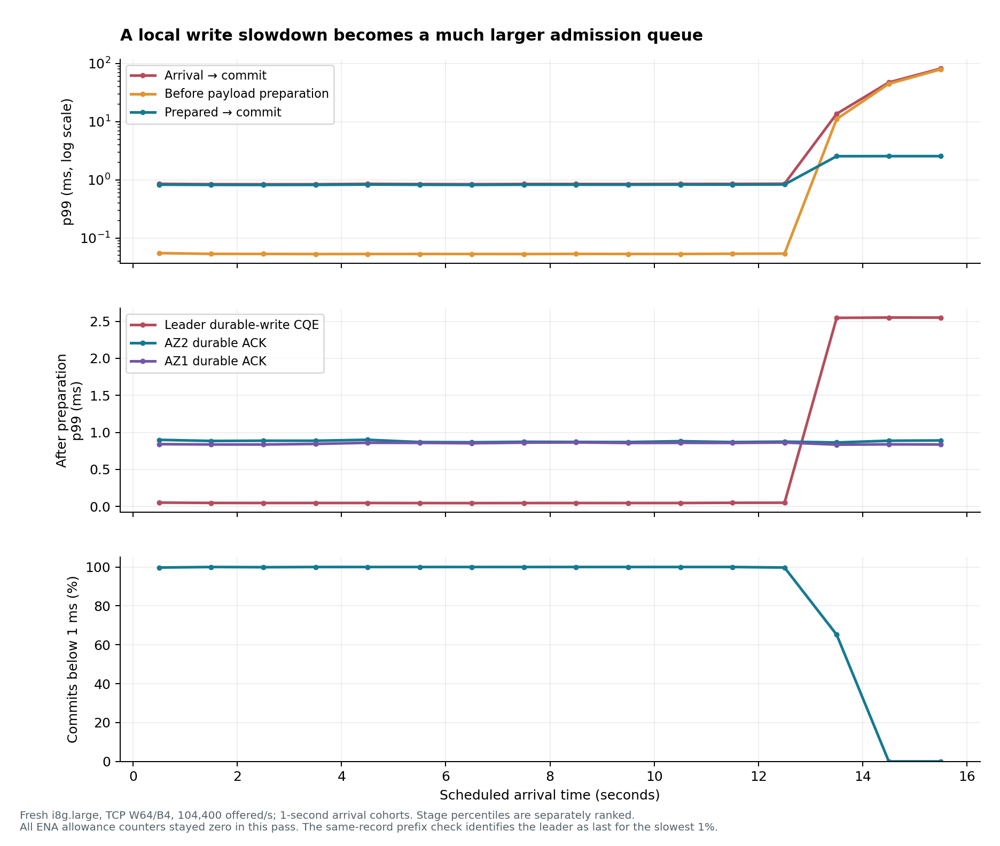
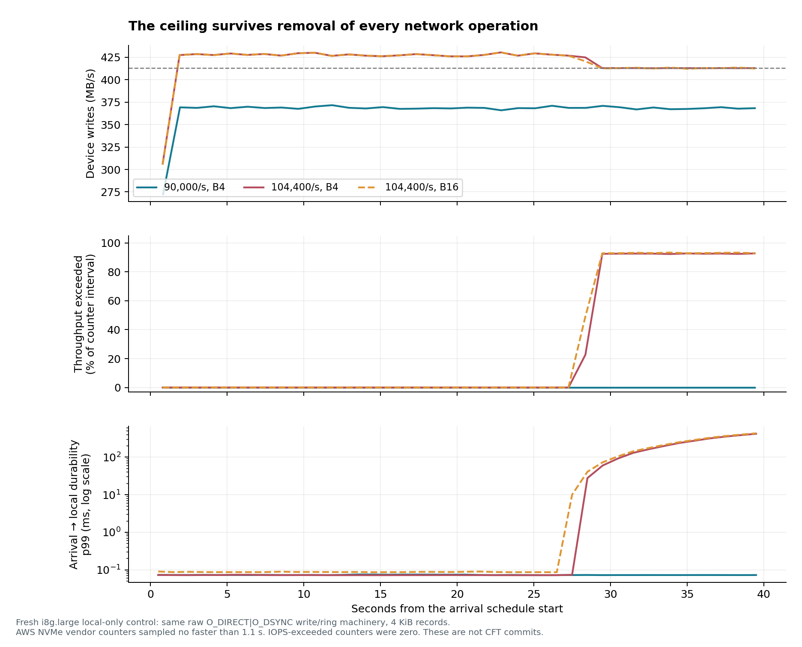
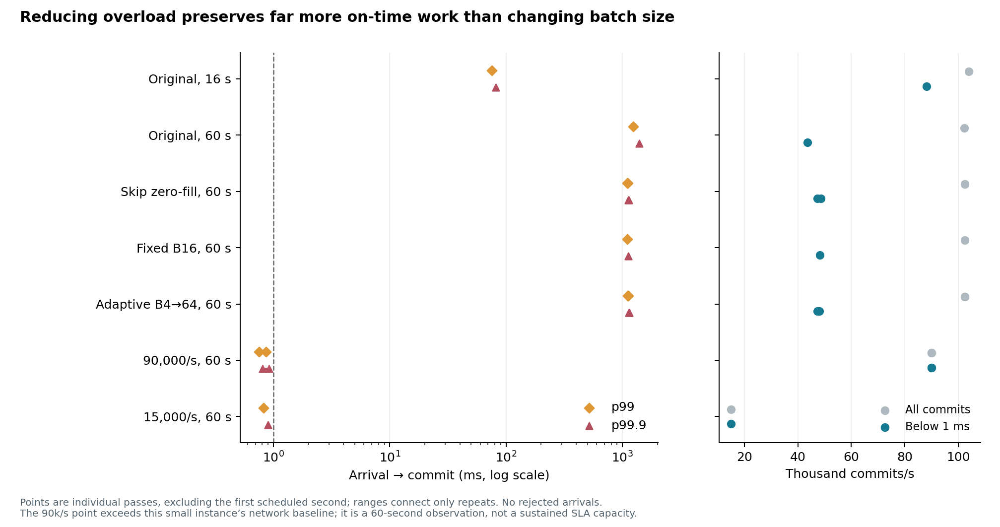
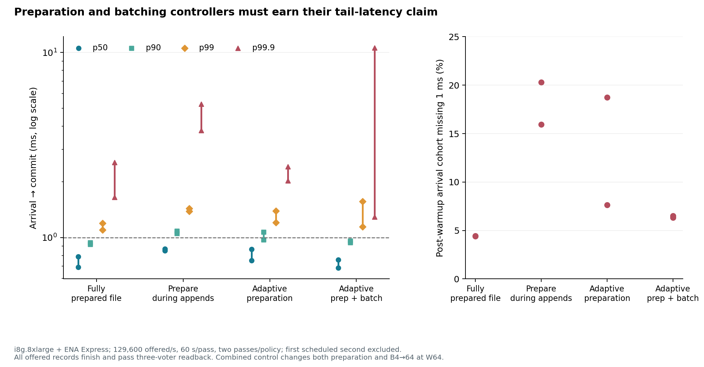

# The latency cliff: storage limits and live log preparation

**The small-instance cliff comes from storage throughput limiting. Larger
batches do not cure that limit.** On larger hosts, pausing background preparation
improved p99.9 in both repeated comparisons, but the tested controllers did not
establish sub-millisecond tails. Adding adaptive batching gave mixed results.

This follow-up traces the [original repeated-run reversal](throughput.md#why-the-104000s-screen-is-not-the-recommendation),
then tests actual background extent initialization and controller policies.
The [commit method](README.md) introduces quorum completion, batches, windows
and durable prefixes; the [main report](../RESULTS.md) connects these findings
to the earlier storage, placement and throughput choices.

## From slower service to queued arrivals

A resource slowdown and the resulting queue are different parts of the same
failure. A record waiting for a free slot has not yet reached the limiting
resource. Large arrival-to-preparation latency therefore does not establish
that preparation itself is slow.

Commit advances through consecutive durable records, without gaps: a **durable
prefix**. The leader needs its own prefix and one follower's prefix.
It releases a slot only after both followers acknowledge and its sends finish.
A slow third replica can delay later admissions even when the current commit
is fast. The new probe follows all three durable prefixes, commit, slot release
and the oldest queued arrival.

It also separates **payload preparation**—generating, checking and framing
records—from **file preparation**, which initializes their future destination.
Per-record timestamps distinguish waiting before admission, payload preparation,
local completion, durable acknowledgments and commit. Compare stages for the
same records: subtracting independently ranked p99 values does not recover a
stage's p99.

## Small instances: a storage ceiling becomes a much larger queue

On a fresh three-AZ i8g.large cohort, TCP with 64 retained batches (**W64**) and
a cap of four records per batch (**B4**) reproduced the cliff at 104,400 offered
records/s. A 16-second pass had **75.243 ms p99 and 81.728 ms p99.9**.
Extending the policy to 60 seconds gave **1,235.303 ms p99 and 1,390.833 ms
p99.9**. Its median also rose to 164.599 ms. Goodput was still 102,327 commits/s,
but only **41.668%** of its post-warmup arrival cohort committed within 1 ms.
All offered records eventually committed; their waiting remains in the latency.

In that 16-second pass, the leader's observed local completion p99 was 2.543 ms;
the two durable acknowledgment p99 values were 0.882 and 0.851 ms. The paired
record check places the local durable prefix last for **every record in the
slowest 1%** of post-warmup commits. All three hosts' network allowance counters
stayed zero for this case. This identifies the local durable boundary as the
limiting path in this reproduction; another voter can limit a later pass.

### Removing replication identifies the resource

A local-only control removed all replication and sockets while keeping the
arrival schedule, raw `O_DSYNC` writes and ring machinery. At 104,400 records/s
with B4, it still developed **408.903 ms p99** in 40 seconds. The NVMe vendor
counter reported time above the instance's storage throughput limit; its
operation-rate (**IOPS**) limit counter stayed zero. At 90,000/s neither counter increased and p99
was **0.073 ms**. B16 reduced write-operation count but left throughput limiting
and queueing in place.

These controls identify **storage throughput limiting** as the cause of the
reproduced small-instance cliff. The [NVMe statistics](https://docs.aws.amazon.com/AWSEC2/latest/UserGuide/nvme-detailed-performance-stats.html)
measure time above a resource limit over counter intervals; they are not a sum
of individual I/O latencies. The original twelve repeated traces converge on
an empirical late service rate of about **100,806 records/s**, or **413 MB/s**
of log payload. Extrapolating that rate gives an apparent initial surplus of
about 199–202 MB. This describes the measured service curve; it does not
establish a particular credit implementation.

### Batching cannot remove the bytes that must be written

Skipping eager raw-range initialization did not remove the 60-second cliff.
Neither fixed B16 nor adaptive B4-to-B64 kept up at the original offered rate
without severe queueing. Lowering demand to 90,000/s gave **0.809 and 0.911 ms
p99.9** in two 60-second passes. Their fractions below 1 ms were **99.988% and
99.958%**. The [exact cases](../evidence/20260914-cliff/small/cases.csv) retain
all percentiles and outstanding work at the cutoff.

Compared with the original 60-second policy, the 90,000/s choices sacrifice
about **12% of observed total goodput** while increasing under-1-ms deadline
goodput from **43,498 to 89,969–90,010 commits/s**, about **2.07×**. This compares
complete tested policies; the lower-rate cases also skip eager initialization.
The 90,000/s result is empirical headroom over these intervals, not a continuing
capacity guarantee. Sending two 4 KiB copies at that rate requires **5.898
Gbit/s of outbound payload**, above the recorded 1.172 Gbit/s network baseline.
[AWS's burst allowance](https://docs.aws.amazon.com/AWSEC2/latest/UserGuide/ec2-instance-network-bandwidth.html)
is a separate constraint, even though network shaping did not cause the first
reproduction. A single 60-second pass at 15,000/s, below that baseline in payload
bytes, delivered 15,005 commits/s with **0.898 ms p99.9**. It provides a lower-load
observation, not a measured production SLA.

## Preparing real future extents

The original pipeline initialized its raw destination before traffic, so
filesystem extent conversion was absent from its measured append path. A
file-backed log poses an additional question: what happens when preparing
future space competes with foreground writes?

The live-preparation cases use the **actual future append range of the same
ext4 file** on every voter. Each starts with 64 MiB initialized. A background
worker extends the prepared prefix in 1 MiB chunks using preallocation, zero
writes and `fdatasync`, then publishes the space as ready. Foreground direct
`O_DSYNC` writes wait for prepared destinations. The preparer never overwrites
space already admitted to foreground use.

The **preparation reserve** is:

`reserve = end of prepared prefix − end of admitted append range`

The worker pauses once the reserve reaches 64 MiB. Under pressure, the adaptive policy can
pause preparation, but an 8 MiB low-reserve threshold overrides that pause so
it can replenish space. Each future byte is written during initialization and
again as log data; both streams consume device resources. With preparation
paused, approximate reserve lifetime is `reserve bytes / append bytes per second`.

The measured controllers paid this cost. In every live-preparation case, every
voter prepared and consumed the full range, then passed direct readback. At
129,600/s that means **29.60 GiB of additional preparation per voter** beyond
the initial 64 MiB; the burst cases prepared another **20.54 GiB**. The
[preparation receipts](../evidence/20260914-cliff/express/preparation.csv) show
replenishment, not merely consumption of a free initial reserve. A continuing
log would also need to account for segment retirement and reuse.

## Controllers improve different parts of the distribution

The larger-host follow-up uses i8g.8xlarge with ENA Express. At **129,600 offered
records/s**, each file policy ran twice for 60 scheduled seconds, with about
59 seconds per pass after warmup. All delivered approximately 129,600 commits/s.
The same arrival seed was used across policies within a repetition; cases ran
sequentially on the same hosts, with the file-policy order reversed for the
second repetition. This is a small paired comparison, not independent sampling
of host histories.

### The longer runs change the original 1 ms choice

The original short-run choice near 130,000/s had **0.923 ms pooled p99.9**.
In this fresh cohort, the 60-second raw B4 control had **2.053 ms p99.9**.
Even fully initialized files exceeded 1 ms at p99 in both passes:

| File policy | p99, ms: pass 1 / pass 2 | p99.9, ms: pass 1 / pass 2 | Below 1 ms: pass 1 / pass 2 |
| --- | ---: | ---: | ---: |
| Fully initialized before arrivals, B4 | 1.097 / 1.194 | 1.648 / 2.544 | 95.607% / 95.542% |
| Prepare during appends, B4 | 1.433 / 1.388 | 5.267 / 3.788 | 79.718% / 84.067% |
| Adaptive preparation, B4 | 1.393 / 1.203 | 2.415 / 2.027 | 81.267% / 92.379% |
| Adaptive preparation and B4-to-B64 | 1.570 / 1.145 | 10.621 / 1.292 | 93.492% / 93.670% |

These are individual pass percentiles, not pooled values. The raw follow-up
also changes host cohort, instrumentation and eager-initialization policy, so
its difference from the original screen cannot be attributed to duration alone.
It does show why the original choice is insufficient evidence for a sustained
sub-millisecond objective. [Exact cases](../evidence/20260914-cliff/express/cases.csv)
retain the complete distributions and deadline goodput.

Preparation-only adaptation improved p99.9 in both matched repetitions relative
to preparing continuously: **5.267→2.415 ms** and **3.788→2.027 ms**. It also
improved the fraction below 1 ms in both. Adding batch adaptation had a less
consistent tail. In its first pass, p50/p90 improved from **0.869/1.083 ms**
to **0.685/0.937 ms**, while p99.9 worsened from **5.267 to 10.621 ms**. Its
second pass had a much better tail. The complete distribution and variation
between passes are part of the choice.

### What the policies actually change

Preparation pauses for 10 ms after observed pressure exceeds 200 µs, subject
to the low-reserve override. The leader uses the oldest queued arrival's age;
a follower uses the interval from queuing a write to observing its completion.
A pause does not cancel an in-progress preparation chunk.

Batch adaptation raises the cap from 4 to 64 when the oldest queued arrival
exceeds 200 µs, restoring 4 after 100 ms without that pressure. W stays at 64
batches, so the possible retained payload grows from **1 MiB to 16 MiB**, before
framing and copies. Actual batches can be smaller. There is **no matched
fixed-B64 live-preparation control**; the comparison cannot establish that
adaptation outperforms a larger fixed cap. These settings are experimental
policies, not production tuning constants.

### A better p99.9 can serve fewer requests within 1 ms

The burst trace alternates five seconds at 45,000 arrivals/s and five at
135,000/s. Both policies receive the same independent schedule, reject nothing
and drain all work. Each has one 60-second pass:

| Policy during bursts | p50, ms | p90, ms | p99, ms | p99.9, ms | Below 1 ms |
| --- | ---: | ---: | ---: | ---: | ---: |
| B4, prepare during appends | 0.787 | 0.989 | 1.832 | 12.652 | 90.847% |
| Adaptive preparation and batching | 0.813 | 1.048 | 1.369 | 1.753 | 85.714% |

The combined policy substantially improves the tail, yet worsens the median
and p90 and reduces deadline goodput from **82,465 to 77,806 commits/s**.
It changes two controls and has only one pass. Catching up over a whole burst
cycle is not the same as meeting each arriving request's deadline.

None of the Express cases recorded NVMe throughput- or IOPS-limit exceedance.
The highest-rate raw case, at 320,900 offered/s, recorded an outbound network
allowance increase; other cases did not during the offered interval. Thus the
remaining larger-host tails have **not** been demonstrated to share the
small-instance storage cause. The study has not identified or removed every
tail-latency mechanism.

## What this supports for a service objective

The results motivate the following **proposed production policy**. These are
controls to develop and validate, rather than guarantees established by the
tested controller:

1. **Budget admission in bytes against the required resources.** Charge each
   voter for foreground durable writes and initialization, and the leader for
   both replication copies. In this pipeline, retaining work until all three
   voters finish makes the slowest voter relevant to continuing admission.
   A different replica-lag policy changes that dependency. Account separately
   for the published network baseline. The tested 90,000/s point is about
   10.7% below the measured storage service rate; that is observed headroom,
   not a portable safety margin.
2. **Bound retained bytes when changing batch size.** At the observed saturated
   rate, servicing a full W64/B4 window's 256 records takes about **2.54 ms**;
   W64/B64's 4,096 records represent about **40.63 ms** of service. These are
   volume/rate calculations, not latency bounds. The small adaptive runs indeed
   reached roughly 39 ms local-completion p99 and 40.7 ms acknowledgment p99
   while total latency remained above a second. Enlarging the window in bytes
   can move waiting into the pipeline without fixing the service deficit.
3. **Size preparation reserves for the response horizon.** A starting rule is
   append bytes/s multiplied by the expected reaction and replenishment delay,
   with additional burst headroom. Permit pauses only while that reserve is
   available. A persistent shortage requires less admitted demand or more
   preparation capacity; no finite reserve can sustain a continuing deficit.
4. **React to queue age and stalled progress before a rolling tail percentile.**
   Give upstream waiting a budget within the request deadline after allowing
   for the remaining commit and client paths. If that budget cannot be met,
   make the admission or refusal decision explicit. Quantiles alone do not
   provide hard bounds for that calculation.

For a deadline objective, count successful durable commits before that deadline
among **all in-scope offered operations**. Keep acceptance, late completions,
rejections and outstanding work visible. These controllers reject no records,
and their primary clock remains scheduled arrival through commit. A future
admission controller may protect accepted requests by refusing demand; its
acceptance rate and latency must then be judged together. Client backpressure
or retry must not reset the original deadline.

Any production commitment also needs a workload and burst envelope, resource
history, replica-health conditions and an observation period. A good pooled
percentile does not establish that every interval meets the objective. Client
RPC, elections, replica recovery and application work remain outside this
healthy fixed-leader commit-stage probe.

## Measurement boundaries and recovery

The follow-up contains **10 small-instance replication passes, 13 Express
passes and four local-only passes**, plus reconstruction of twelve original
traces. File preparation is real work on all three voters. Individual pass
ranges describe observed variation, not confidence intervals.

Percentiles and deadline fractions use arrivals after the first scheduled
second, including their late completions during drain. Goodput counts commits
within the post-warmup offering interval; deadline goodput additionally requires
an arrival in that cohort and completion within 1 ms. Per-second views retain
the first second. Backlog at the cutoff and unfinished work after draining are
separate quantities.

Leader observations target 10 ms, network counters about 100 ms and available
NVMe counters about 1.1 seconds. Leader stages share one monotonic clock;
cross-host telemetry has wall-clock alignment uncertainty. A local completion
timestamp includes submission and application observation of an `io_uring`
completion, so it is **not isolated device latency**. Network allowance counters
count packets queued or dropped, not a delay duration.

Successful replication cases directly reread every expected record on all three
voters; local-only cases reread their one log. This checks content and order.
Persistence relies on [host and device completion contracts](../persistence/README.md#what-makes-completion-durable),
not physical power-cut certification. The [retained evidence](../evidence/20260914-cliff/README.md)
records captures, case order, telemetry coverage, recovery and failed setup
attempts. Failed setup is provenance, not performance data.
