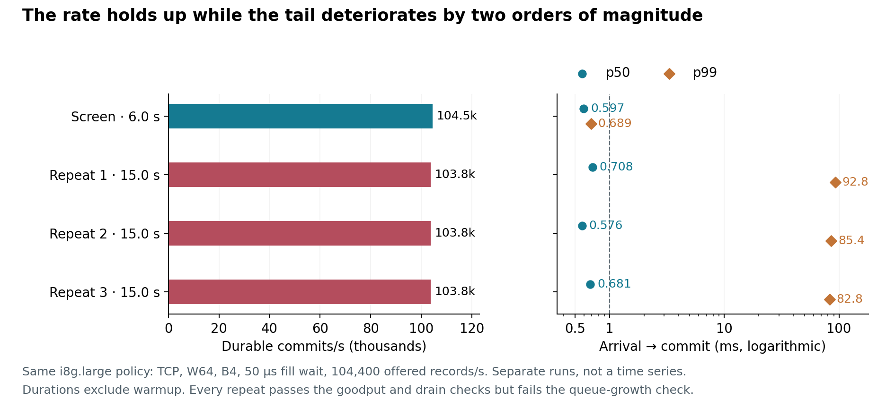
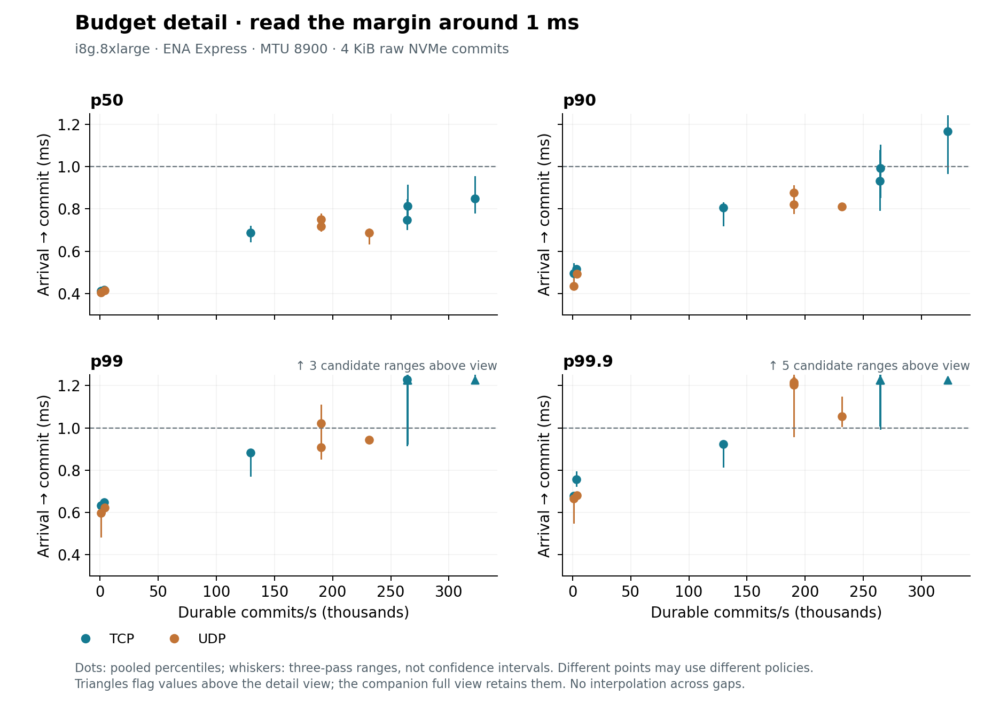

# Original short-run throughput choices

The original pipeline experiments ask how much useful throughput survives a
latency preference when arrivals continue independently of completions. This
guide preserves those short screens and repeated choices. **The later
[cliff follow-up](cliff.md) changes their interpretation:** the near-130,000/s
Express choice had 0.923 ms pooled p99.9 here, but a fresh-cohort 60-second raw
control reached 2.053 ms. The follow-up also identifies the small-instance
storage ceiling and tests live file preparation and adaptive controls.

The [main report](../RESULTS.md) connects both studies to storage and placement.
For the original sampled landscape, jump to
[small instances](#small-instances-the-repeated-tail-changes-the-choice),
[larger standard ENA](#larger-standard-ena-instances-more-throughput-less-tail-margin)
or [ENA Express](#ena-express-removing-the-per-flow-constraint).

All original cohorts replicate **4 KiB records to raw NVMe with direct `O_DSYNC` writes**
in the good placement: leader `use1-az4`, followers `use1-az2` and `use1-az1`.
Each voter has one pinned application CPU. The
[commit method](README.md) explains batches, windows, arrival timing and the
platform controls. Here, **W** is the maximum retained batches, **B** is the
maximum records per batch, and **wait** is the maximum batch-fill wait. Actual
batches can be smaller than B.

## Read the choices as a sampled landscape

Primary latency runs from scheduled arrival to quorum commit, including queueing,
batch formation and preparation. **Goodput** counts unique durable commits per
second during the offered-load interval, without a deadline filter. A high value
can coexist with an unacceptable tail. Offered rates in the prose are configured
Poisson rates; the realized rate varies over each finite interval, so measured
goodput can slightly exceed that nominal number.

The comparison admits a candidate only when **all three repeated passes** meet
the [finite-run stability rule](README.md#count-waiting-from-the-arrival-schedule).
That rule checks goodput, queue growth and draining through both followers.
Latency preferences then select the greatest eligible goodput within 10% or 25%
of the best observed **pooled** percentile, or below 1 ms at that percentile.
Pooling combines individual latency observations before computing a percentile;
it does not average the three pass percentiles. Each percentile has its own
baseline. Exact goodput ties prefer lower latency.

Throughput sacrificed is `1 - chosen_goodput / largest_repeated_stable_goodput`
within the same cohort. It measures the cost among the tested choices. Sparse
sampling can make that cost look abrupt: neither the selected points nor a line
between them establish an untested operating region or hardware capacity.
Pass ranges below describe observed variation, not confidence intervals.

## Small instances: the repeated tail changes the choice

In the original **i8g.large cohort with standard ENA and MTU 9001**, the highest
repeated stable candidate offered **52,700 records/s**, using TCP, W16, B16 and a 50 µs wait.
It delivered **52,693 commits/s**, with pooled p50/p90/p99/p99.9 of
**0.602/0.708/0.790/0.834 ms**. Its three pass p99.9 values ranged
**0.766–0.845 ms**; the largest all-follower drain was **0.873 ms**.
The pool contains 2,370,844 post-warmup records over **44.993 seconds total**
across three passes. Whole-pass batches averaged **3.78 records**, well below
the configured cap of 16; the fill wait limits amortization at this arrival rate.

The same point is the highest eligible goodput below 1 ms at each of the four
percentiles. Preserving something close to the best median is a different choice
from preserving something close to the best tail:

| Percentile | Best pooled latency, ms | Within 10%: commits/s (sacrificed) | Within 25%: commits/s (sacrificed) |
| --- | ---: | ---: | ---: |
| p50 | 0.432 | 1,000 (98.1%) | 5,318 (89.9%) |
| p90 | 0.484 | 1,000 (98.1%) | 5,213 (90.1%) |
| p99 | 0.646 | 1,000 (98.1%) | 52,693 (0%) |
| p99.9 | 0.703 | 1,000 (98.1%) | 52,693 (0%) |

The 1,000/s choices use W16, B1 and no fill wait: UDP gives the lowest pooled
p50, TCP the other three percentiles. The p50 +25% choice uses TCP W64/B64/wait
50 µs at 5,300 offered/s, with a **0.518 ms** median. The p90 +25% choice uses
TCP W64/B4/wait 50 µs at 5,200 offered/s, with **0.605 ms** p90.
The [complete choice table](../images/throughput-small/choices.png)
and [exact selections](../evidence/20260914-durable/throughput-small/knees.csv)
retain every requested percentile and its pass range.

These are pooled preferences. For example, the selected 52,693/s point meets the
pooled p99 +25% limit of **0.807 ms**, while one pass reaches **0.810 ms**.
A requirement applying separately to each pass would select from a different
eligible set.

### Why the 104,000/s screen is not the recommendation

The same TCP W64/B4/wait 50 µs policy, at **104,400 offered records/s**, appeared
stable in the short open-loop screen. All three longer repetitions failed the
stability rule. The median concealed a slow population:

| Pass | Post-warmup seconds | Goodput, commits/s | p50, ms | p90, ms | p99, ms | p99.9, ms |
| --- | ---: | ---: | ---: | ---: | ---: | ---: |
| Screen | 5.994 | 104,471 | 0.597 | 0.643 | 0.689 | 0.783 |
| Repeat 1 | 14.990 | 103,820 | 0.708 | 39.529 | 92.780 | 97.142 |
| Repeat 2 | 14.997 | 103,824 | 0.576 | 39.388 | 85.427 | 89.029 |
| Repeat 3 | 15.000 | 103,793 | 0.681 | 34.285 | 82.805 | 87.225 |

Goodput barely changed, but the final backlog rose from **63 records** in the
screen to **8,859–9,812 records** in the repeats. Only **83.5–83.8%** of repeated
arrival-cohort commits completed below 1 ms, versus **99.989%** in the screen.
The repeats satisfy the goodput and both drain checks; their growing queues
reject them. Throughput and median latency alone cannot establish an acceptable
policy.

Four original repeated policies around 104,000–105,000 offered/s failed in every
pass; six of the ten candidates were stable. The original repeated set had
**no candidate between about 53,000 and 104,000 offered/s**. The
[later 60-second probes](cliff.md#batching-cannot-remove-the-bytes-that-must-be-written)
add a 90,000/s comparison and show why its observed headroom still does not
establish a continuing-capacity guarantee.

The leader's outbound bandwidth-allowance counter increased in every experiment
phase, including **2,872 / 3,249 / 2,547** across the three tail phases. These
counters count queued-or-dropped packets and are aligned to whole phases, not
individual cases. They support bandwidth-allowance involvement, without identifying
credit depletion or uniquely explaining this policy's reversal. Other hosts'
bandwidth counters and all PPS, connection-tracking and link-local allowance
counters remained zero.

The later reproduction resolves that ambiguity for its first 16-second case:
all three hosts' network allowance counters stayed zero, the leader's local
durable prefix limited the tail, and a local-only control identified NVMe
throughput limiting. The [causal comparison](cliff.md#removing-replication-identifies-the-resource)
keeps those case-specific measurements separate from the phase totals above.

The [offered-load screen](../images/throughput-small/offered-load.png)
shows the earlier short passes; the
[repeated latency–goodput plot](../images/throughput-small/throughput.png)
flags the later failures; its [full-tail view](../images/throughput-small/throughput-full.png)
shows their complete pass ranges. Their different conclusions are the result above,
not contradictory views of the same observations.

## Larger standard-ENA instances: more throughput, less tail margin

On **i8g.8xlarge with standard ENA and MTU 8900**, all nine repeated candidates
were stable. The highest observed goodput came from TCP W16/B64/wait 50 µs at
**128,800 offered/s**: **128,881 commits/s**, with pooled
p50/p90/p99/p99.9 **0.755/0.842/0.919/0.987 ms**. Its pool contains
5,613,976 post-warmup records over **43.559 seconds total** across three passes.
Whole-pass batches averaged **7.92 records**, despite the cap of 64.

**Pooled p99.9 below 1 ms does not mean every pass was below 1 ms:** the pass
range was **0.894–1.019 ms**. P99 had more observed margin, with a pass range
of **0.871–0.956 ms**. The largest all-follower drain was **0.835 ms**.
The nearby repeated UDP candidate, W64/B4/wait 50 µs at 128,200 offered/s,
delivered 128,164 commits/s with p99/p99.9 **1.019/1.049 ms**. Their batch and
window settings differ; this compares selected policies, not transport alone.

| Percentile | Best pooled latency, ms | Within 10%: commits/s (sacrificed) | Within 25%: commits/s (sacrificed) |
| --- | ---: | ---: | ---: |
| p50 | 0.413 | 3,996 (96.9%) | 3,996 (96.9%) |
| p90 | 0.486 | 1,000 (99.2%) | 3,996 (96.9%) |
| p99 | 0.594 | 1,000 (99.2%) | 3,996 (96.9%) |
| p99.9 | 0.701 | 3,996 (96.9%) | 7,501 (94.2%) |

At 1,000 offered/s, W16/B1/no-wait TCP gives the lowest p50/p90 and UDP gives
the lowest p99/p99.9. The 3,996/s selections use TCP W64/B1/wait 50 µs at
4,000 offered/s; B1 means each write still contains one record. The 7,501/s
selection uses TCP W64/B4/wait 50 µs at 7,500 offered/s.
The [complete choice table](../images/throughput-scale/choices.png)
and [exact selections](../evidence/20260914-durable/throughput-scale/knees.csv)
show their latencies and pass ranges.

A sharp table boundary can be scientifically weak. The 7,500/s TCP policy's
**0.516929 ms** median misses the p50 +25% limit, **0.515922 ms**, by about
**1 µs**, amid much larger pass variation. The resulting choice of 4,000/s
is faithful to the stated calculation; it is not evidence of a decisive change
in user experience. There are also **no repeated rates between 7,500 and about
128,000/s**, so these large sacrifice percentages do not resolve the best
intermediate operating point.

The [repeated-candidate plot](../images/throughput-scale/throughput.png) shows
each percentile and its pass range. All observed tails fit in its 0.3–1.25 ms
budget view. The sparse sampling remains visible; there is no fitted curve
through the gap.

### What the network ceiling explains

The larger platform has **25 Gbps baseline and peak instance bandwidth**, removing
the small platform's **1.172/10 Gbps** baseline/peak distinction. It also changes
hardware resources and tuning, as detailed in the
[cohort controls](README.md#network-cohorts-and-controls). The comparison does
not isolate instance bandwidth.

Standard ENA has a [5 Gbps single-flow limit in this placement](https://docs.aws.amazon.com/AWSEC2/latest/UserGuide/ec2-instance-network-bandwidth.html).
The study uses one flow per follower. For 4 KiB records, the ideal payload-only
ceiling is `5,000,000,000 / (4,096 × 8) ≈ 152,588 records/s` per follower,
before framing or retries. More aggregate instance bandwidth alone does not
remove that constraint; using multiple flows or a different network path would
change it.

The best closed-loop TCP and UDP screens reached **151,474 and 150,929 records/s**.
Multiplying by the 4 KiB record size
gives **4.964 and 4.946 Gbit/s of logical payload per follower**, consistent with
that ceiling. These are calculated payload rates, not measured wire traffic;
the leader sends a copy to each follower. The 25 Gbps instance allowance does
not provide 25 Gbps to each flow.

All captured allowance counters remained zero across the 21 standard-large
intervals. Those instance counters do not establish absence of a per-flow limit.
The [offered-load screen](../images/throughput-scale/offered-load.png)
also shows queueing and latency rising sharply at the highest offered rate.
It supports the distinction between an implementation's short throughput screen
and a repeatedly acceptable arrival-driven policy.

## ENA Express: removing the per-flow constraint

All **eleven repeated ENA Express candidates** met the finite-run stability rule
in every pass. The highest-goodput candidate nevertheless had severe tails.
TCP W16/B64/wait 50 µs at 320,900 offered/s delivered **322,317 commits/s**, with
pooled p50/p90/p99/p99.9 **0.850/1.167/27.914/48.861 ms**. Only **74.814%** of
arrival-cohort commits completed below 1 ms. Pass p99.9 ranged
**1.477–50.567 ms**: a stable queue over these passes does not imply a consistently
fast path.

A 1 ms latency budget chooses four different points:

| Budget applies to | Selected commits/s | Sacrificed | Pooled target latency, ms | Pass range for that percentile, ms | Policy / offered records/s |
| --- | ---: | ---: | ---: | ---: | --- |
| p50 | 322,317 | 0% | 0.850 | 0.783–0.951 | TCP W16/B64/wait 50 µs / 320,900 |
| p90 | 264,624 | 17.9% | 0.993 | 0.857–1.101 | TCP W16/B64/wait 100 µs / 264,300 |
| p99 | 231,309 | 28.2% | 0.945 | 0.932–0.955 | UDP W64/B4/wait 50 µs / 231,100 |
| p99.9 | 129,537 | 59.8% | 0.923 | 0.816–0.930 | TCP W64/B4/wait 50 µs / 129,600 |

The **p99 choice** delivered 231,309/s with a full percentile profile of
**0.686/0.812/0.945/1.055 ms**. Every pass's p99 was below 1 ms, while every
pass's p99.9 exceeded it, ranging **1.008–1.144 ms**. The **p99.9 choice**
delivered 129,537/s with **0.687/0.806/0.882/0.923 ms** percentiles and more
observed p99.9 margin than the larger standard-ENA maximum. This compares selected
policies on fresh cohorts; it is not an isolated same-host network intervention.

**The longer follow-up did not preserve that sub-millisecond p99.9 choice.**
At the same 129,600 offered/s, a fresh-cohort 60-second raw B4 control had
2.053 ms p99.9. Initialized files had 1.648–2.544 ms across two passes, and
preparing them during arrivals added further cost. The
[file and controller comparison](cliff.md#the-longer-runs-change-the-original-1-ms-choice)
states the changed observation window, instrumentation and preparation conditions;
the difference is not an isolated duration effect.

The exact p90 selection deserves another look. Its 100 µs fill wait gives only
**0.18% more goodput** than the matching 50 µs-wait point, while pooled p90 rises
from **0.932 to 0.993 ms** and p99.9 from **1.500 to 19.216 ms**. Maximizing
eligible goodput mechanically picks the former. That small rate difference and
large tail penalty give an engineer reason to prefer the 50 µs alternative;
neither met the p90 limit in every pass. The complete distributions are part of
the decision even when the requested constraint names only p90.

**High-rate observation windows are short.** The two-million-record cap leaves
only **15.685 seconds total** after warmup across the three 320,900/s passes,
**22.941 seconds** at 231,100/s and **43.321 seconds** at 129,600/s. Their pooled
populations are 5,036,537, 5,306,414 and 5,611,702 records respectively. That is
about **5.2, 7.6 and 14.4 seconds per pass**, not a long sustained-capacity trial.
Whole-pass batch averages at those points were **22.70, 4.00 and 3.96 records**.

Staying close to the best latency gives a different scale of choice:

| Percentile | Best pooled latency, ms | Within 10%: commits/s (sacrificed) | Within 25%: commits/s (sacrificed) |
| --- | ---: | ---: | ---: |
| p50 | 0.405 | 3,996 (98.8%) | 3,996 (98.8%) |
| p90 | 0.436 | 1,000 (99.7%) | 3,996 (98.8%) |
| p99 | 0.597 | 3,996 (98.8%) | 3,996 (98.8%) |
| p99.9 | 0.665 | 3,996 (98.8%) | 3,996 (98.8%) |

UDP W16/B1/no wait at 1,000 offered/s gives all four best pooled percentiles.
The 3,996/s selection uses UDP W64/B1/wait 50 µs at 4,000 offered/s, with
**0.414/0.494/0.624/0.681 ms** percentiles. There are **no repeated rates between
4,000 and 129,600/s**. The 98.8% sacrifice describes the selected set; intermediate
rates remain unresolved. [Exact choices and pass ranges](../evidence/20260914-durable/throughput-express/knees.csv)
and the [choice table](../images/throughput-express/choices.png)
retain each selection.

This view expands the region around 1 ms. Triangles flag a point or pass range
extending above 1.25 ms; the [full-tail view](../images/throughput-express/throughput-full.png)
retains all of them on a logarithmic scale, including the 49 ms pooled p99.9.
Both views use the same candidate set. No line connects different policies or
interpolates unmeasured rates.

### What changed in the network

SRD mode was enabled for both transports in all 21 captured intervals. More than
**99.978% of eligible packets** used SRD during every measurement-phase interval
on every host, and more than **99.996%** during the tail phases. This verifies
actual use, beyond an enable flag.

Its completed **closed-loop screen** shows why the per-flow distinction matters.
TCP W16/B64 reached **377,587 records/s**, equivalent to **12.373 Gbit/s of
logical payload per follower**, beyond standard ENA's 5 Gbps flow ceiling.
Two copies total **24.746 Gbit/s**, consistent with the larger instance's 25 Gbps
aggregate allowance. That screen's p50/p90/p99/p99.9 were
**2.307/2.638/2.750/2.797 ms**. It measured only **0.597 post-warmup seconds**,
so it establishes neither sustained capacity nor an arrival-driven operating
choice. UDP W64/B4 reached **271,928/s** over **0.828 seconds**, with
**0.891/0.930/0.962/1.005 ms** percentiles. Both are short implementation screens.

The leader's outbound bandwidth-allowance counter increased by
**263,389 / 508,028 / 80,662** across the three tail phases. Other hosts' allowance
counters and the other leader allowance counters remained zero. Phase-level
counters cannot attribute the transient tails of an individual policy to a
particular limit. The [offered-load screen](../images/throughput-express/offered-load.png)
and [network counters](../evidence/20260914-durable/throughput-express/network-counters.csv)
retain that surrounding evidence.

## Coverage and recovery

The original small cohort contains **132 passes and 56,866,000 native records**;
the larger standard cohort contains **77 passes and 37,729,500**; ENA Express
contains **79 passes and 80,972,000**. Those totals
include preflights, screens and warmup, unlike the selected point populations above.
[Retained evidence](../evidence.md) supplies the cases, passes, independent
recovery checks and captured source. Continue with the [longer-run cliff and
preparation findings](cliff.md), or return to the [main report](../RESULTS.md)
for their implications alongside storage, placement and failure behaviour.
