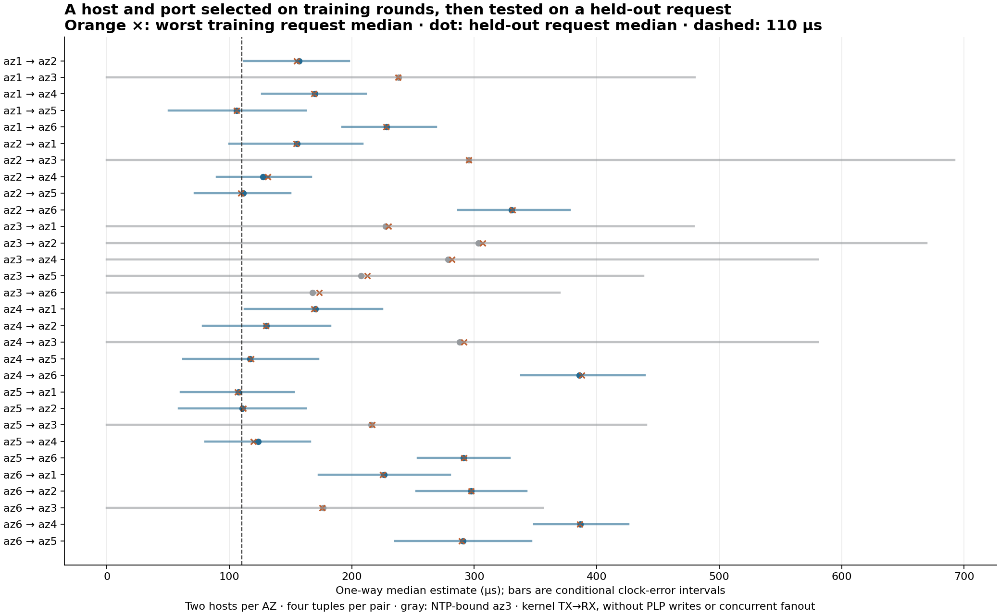

# Selecting hosts and ports for a fast outgoing edge

**Changing one endpoint's UDP port can select a different, repeatable latency
class on the same hosts.** The result extends beyond az2–az4. In this cohort,
27 of 60 cross-AZ host pairs had four-port RTT spreads above 20 µs; five exceeded
100 µs. Repeated same-tuple observations were much more stable. This provides
a cheap selection mechanism, not evidence that fresh flows are IID or that
an AZ has one characteristic latency.

The subsequent [4/16/32-port policy comparison](studies/port-sampling.md) found
little general benefit from scattering ports at equal budgets. More candidates
helped both policies. It also observed occasional fixed-tuple changes up to
103 µs over an 18-minute capture, so the repeatability below is a cohort result,
not a stationarity guarantee. Its new hosts and complete candidate scores are
kept separate from the September 24 results on this page.

The main table below comes from the broad cohort, measured
**24 September 2026, 23:25:34–23:27:23 UTC**: twelve fresh hosts, two
per AZ, all fifteen AZ pairs and six same-AZ controls, four fixed tuples per
host pair and five shuffled rounds. Only the lower-numbered host's port changed
(48000–48003); the other endpoint stayed on 48100. All **105,600 exchanges**
completed. [Controlled method](method.md), [clock bounds](clocks.md), and
[retained evidence](../evidence/20260924-variance-broad/README.md).

## Same hosts, one port, different latency

For az2b / az6a, the five RTT medians below use the same machines and fixed
upper endpoint port. Units are microseconds; peer turnaround is excluded.

| Lower endpoint port | Round 0 | Round 1 | Round 2 | Holdout 3 | Holdout 4 |
| --- | ---: | ---: | ---: | ---: | ---: |
| 48000 | 893.6 | 893.3 | 891.5 | 896.1 | 894.6 |
| 48001 | 914.8 | 918.3 | 917.8 | 917.9 | 915.9 |
| 48002 | 771.3 | 772.0 | 770.7 | 770.9 | 773.6 |
| 48003 | 1036.7 | 1038.1 | 1039.4 | 1038.9 | 1037.4 |

The median across rounds of this pair's port-induced RTT span is **266.2 µs**.
Its same-role revisits differ by a median **2.07 µs**, maximum **3.14 µs**.
Across all sixty cross-AZ host pairs, the median of per-pair same-role median
changes is **0.91 µs**, with a largest individual same-role change of **9.43 µs**.
The comparisons include rounds 0→2, 1→3 and 2→4. Different role pairs are not
silently treated as pure temporal repeats.

Port sensitivity differs between host/AZ pairs. The following ranges show the
smallest and largest **within-host-pair four-port RTT spans**, each summarized
by its median over rounds, among the four host combinations per AZ pair.

| AZ pair | Smallest–largest four-port RTT span (µs) |
| --- | ---: |
| 1–2 | 3.9–54.2 |
| 1–3 | 2.2–7.1 |
| 1–4 | 9.9–42.3 |
| 1–5 | 1.9–5.4 |
| 1–6 | 2.9–17.3 |
| 2–3 | 16.7–114.7 |
| 2–4 | 11.8–119.9 |
| 2–5 | 4.1–45.2 |
| 2–6 | 63.9–266.2 |
| 3–4 | 16.9–33.9 |
| 3–5 | 1.8–3.3 |
| 3–6 | 29.2–66.8 |
| 4–5 | 18.8–43.7 |
| 4–6 | 7.9–47.4 |
| 5–6 | 2.6–54.3 |

These spans are clock-offset-independent. They show an effect of the tuple,
but cannot distinguish physical-route selection from flow-dependent NIC or
virtual-network behavior. Four consecutive ports do not exhaust the port space
or independently sample every underlying path. The small sampled spreads on
az1–az5 and az3–az5 are not proof that those AZ pairs lack unfavorable tuples.

## Host selection still changes the attainable result

The [dense control](studies/tuple-dense.md) tested four hosts each in az2 and
az4, all sixteen host pairs and sixteen tuples per pair. On az2c/az4a, two
fixed tuples repeatedly gave ~290 versus ~511 µs RTT over four rounds.
On az2a/az4c, **every tested tuple** stayed between **195.0 and 200.8 µs RTT**;
az2a/az4a instead stayed between **406.1 and 455.2 µs**. No sampled port made
that latter pair comparable to the best pair. These are sampled ranges, not
proof of a minimum over every possible port or host in either AZ.

Changing ports is useful on existing machines; sampling additional machines
can expose opportunities that a small port sweep misses. Neither AZ pair nor
host pair alone describes the observed latency. Host labels are local to each
cohort: az2a in this dense control is a different machine from az2a in the
broad comparison below.

The dense ~220 µs tuple gap greatly exceeds the few-microsecond change in
modeled hardware-to-software RX delay. That narrows one receive-side explanation,
but without hardware TX stamps it cannot identify an egress queue, virtual
network path or physical routing mechanism. The RTT result remains valid
without resolving the one-way split.

## Port-only improvement with hosts held fixed

Train on rounds 0–2, selecting the lowest worst **request-role median**, with
worst request p90 as tie-breaker. Evaluate the selected flow on its held-out
request in round 3 or 4. Each directed host pair has its own selected port;
none of these comparisons replaces a machine. A separate table allows joint
host/port selection for each AZ direction.

Against the specified **flow-0 baseline on the same hosts**, 72 of 120 directed
cross-AZ host pairs improved in the held-out request point estimate; 37 improved
by more than 5 µs. The median gain across all 120 was **0.98 µs**, maximum
**205.6 µs**, and the largest regression was **2.55 µs**. Many baseline tuples
were already good, and the sample has only four candidate ports per pair.
These are conditional measured gains, not an expected gain for a random
production connection. The direction and clock bounds remain in the CSVs.

Examples of held-out request median estimates:

| Fixed directed host pair | Flow 0 | Training-selected flow | Selected flow index |
| --- | ---: | ---: | ---: |
| az6b→az2b | 550.4 | 344.9 | 2 |
| az6a→az2a | 468.4 | 297.4 | 2 |
| az6a→az2b | 534.8 | 387.4 | 2 |
| az4b→az2b | 229.9 | 130.3 | 3 |

For these reverse directions the changed port is at the follower. For ascending
directions it is the initiating endpoint's port. This experiment therefore
establishes one-endpoint tuple selection, not a separate source-port-only test
for every possible leader. Both endpoints are controllable in the proposed
shard deployment, but QUIC's eventual socket/connection behavior still needs
validation.

## Held-out candidates for every AZ direction

Each direction below selects independently among **sixteen host/flow candidates**
(four host combinations × four ports) using training requests. The table reports
the selected candidate's **held-out request median [conditional clock interval]**
in microseconds at the 100 ppm rate envelope. Opposite directions can select
different hosts and tuples, so subtracting these cells is not an asymmetry test.
This is the sampled selection frontier, not an intrinsic AZ ranking.

| AZ pair A–B | Selected A→B | Selected B→A |
| --- | ---: | ---: |
| 1–2 | 156.8 [112, 198] | 155.5 [100, 209] |
| 1–3 | 238.1 [0, 480] | 227.7 [0, 479] |
| 1–4 | 169.7 [127, 211] | 170.2 [112, 225] |
| 1–5 | 105.8 [51, 163] | 107.4 [60, 153] |
| 1–6 | 228.2 [192, 269] | 226.6 [173, 280] |
| 2–3 | 295.3 [0, 692] | 303.5 [0, 669] |
| 2–4 | 127.5 [90, 167] | 130.3 [78, 182] |
| 2–5 | 111.5 [72, 150] | 110.4 [59, 162] |
| 2–6 | 330.6 [287, 378] | 297.4 [253, 343] |
| 3–4 | 278.7 [0, 581] | 288.1 [0, 581] |
| 3–5 | 207.4 [0, 438] | 215.9 [0, 441] |
| 3–6 | 167.8 [0, 370] | 176.4 [0, 356] |
| 4–5 | 116.8 [62, 173] | 123.7 [80, 166] |
| 4–6 | 385.9 [338, 439] | 386.5 [349, 426] |
| 5–6 | 291.0 [254, 329] | 290.9 [235, 347] |

The selected **az1a→az5a** median was **105.8 µs**, p90 **112.0 µs**, p99
**123.8 µs**; reverse selection **az5a→az1a** yielded **107.4 / 110.2 / 113.2 µs**.
That host pair's twenty block RTT medians stayed between **211.2 and 214.2 µs**.
It is a promising pair in a different AZ combination from the original az2–az4
example. The clock bounds do not prove ≤110 µs or which side is slightly faster.
Az3's NTP-only bounds remain too broad to resolve its one-way split.

Request-only and all-leg selection chose the same host/tuple for 29 of 30 AZ
directions. The remaining choice was another tuple on the same host pair.
Both rankings are retained separately. This does not validate the joint
two-follower race, PLP write costs, simultaneous fanout, production load or
arborescence propagation. With sixty post-warmup packets per block, the p99s
are particularly weak tail estimates. Clock fitting uses the full capture's
independent references, so the holdout is offline, not a demonstrated online
decision available at the end of training.

## A cheap reroll and what retaining it means

The supported operational hypothesis for the [witness design](README.md) is:

1. Screen actual host pairs with offset-independent RTT to find promising pairs.
2. Sample a modest set of explicit UDP tuples on each pair, then validate the
   outgoing request in a separate window. Keep clock bounds with directional
   estimates; RTT alone cannot choose the faster initiating side.
3. Retain the selected addresses and ports, and recheck after host, connection
   or workload changes. Validate the real packet sizes and simultaneous durable
   fanout before using probe results as a branch-start budget.

Sixteen candidates at 100 64-byte request/reply exchanges each consume only
**0.2944 MB of IPv4+UDP traffic**. That is a logical byte budget, excluding
encapsulation and control traffic. A new machine is unnecessary to change the
sampled latency class. Reopening the **same tuple** generally reproduced its
class over these few minutes; it was not an effective reroll of that class.
Closing/reopening and elapsed time occurred together, so their separate effects
are not identified.

UDP or QUIC is the intended transport. The measured knob is one endpoint's
**UDP port**, not a connection identifier. A new QUIC connection that preserves
the IP/port tuple is not the tested reroll; migration, connection IDs, handshake
costs and the eventual QUIC implementation were not measured. For reverse
leader directions in the broad experiment, the changed endpoint was the
follower. Both endpoints can participate in selection, but a leader-source-port
sweep has not separately been validated in every direction.

Independent random ports sampled with replacement would produce IID class
samples **if** the tuple-to-class mapping stayed fixed. A finite, nonuniform
set of classes does not itself defeat independence. What remains unestablished
is that stationary mapping over operational timescales and independence of
added load/jitter. These consecutive-port sweeps and short repeats do not
supply a production retry-success probability, an optimal search budget or a
long-term guarantee. Broad-cohort gains against flow 0 are conditional comparisons,
not an IID estimate of the benefit of rerolling a random connection.

## Checks and recovery

No packets were missing or duplicated. The physical tuple and complete
host/flow/round/direction grids passed verification. All ten PHC hosts had
zero PHC failures and reference gaps below 57 ms; twelve NTP timeouts were
discarded without persistent stale-reply poisoning. Az3's reference gaps were
below 1.005 s. All three rate-envelope analyses passed, with maximum closure
error **0.067 µs**. Raw archives, exact capture/analysis hashes and resource
records are linked from the [evidence index](../evidence/20260924-variance-broad/README.md).

The [evidence guide](../evidence.md#network-cohorts) accounts for all four
September 24 cohorts and links their immutable exports and recovery commands.
