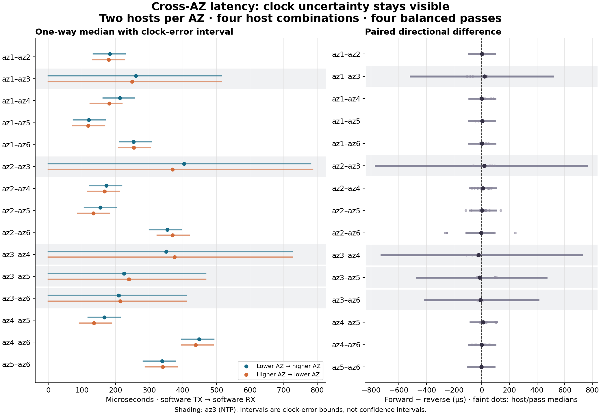
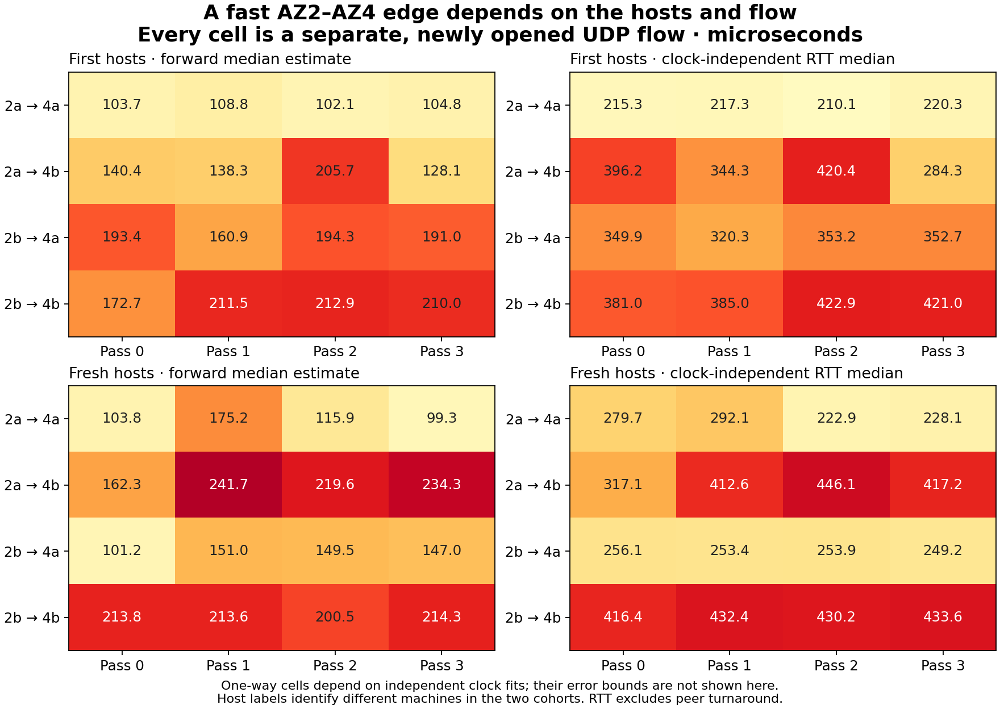

# Fresh-host confirmation of the one-way method

The corrected clock sampler kept PHC on all ten supported hosts, with median
sampling gaps near **50 ms**. This fresh cohort had typical PHC-pair median
uncertainty of **±45–50 µs**, compared with roughly ±60 µs in the initial cohort.
That comparison changes hosts and capture conditions as well as the sampler. It still cannot establish a
110 µs one-way guarantee or resolve a few-microsecond directional preference.

Measured **24 September 2026, 22:54:18–22:56:14 UTC** on twelve fresh hosts:
two per AZ, four host combinations per AZ pair, four passes, 500 exchanges per
block. All **132,000 exchanges** completed; 20 warmup exchanges per block are
excluded from statistics. There are 7,680 retained observations per pooled
cross-AZ direction. [Method](../clocks.md), [first cohort](oneway-initial.md), and
[confirmation evidence](../../evidence/20260924-oneway-confirmation/README.md).

## Both directions

Microseconds; median point estimate followed by its conditional clock-and-
causality interval at 100 ppm. P99s are descriptive point estimates for this
window, not guarantees. AZ numbers abbreviate stable IDs `use1-azN`.

| AZ pair A–B | A→B median [interval] | B→A median [interval] | p99 estimates A→B / B→A |
| --- | ---: | ---: | ---: |
| 1–2 | 183 [134, 229] | 179 [131, 227] | 205 / 210 |
| 1–3 | 260 [0, 514] | 249 [0, 514] | 379 / 360 |
| 1–4 | 213 [163, 256] | 181 [124, 219] | 279 / 274 |
| 1–5 | 120 [75, 169] | 119 [73, 167] | 141 / 169 |
| 1–6 | 253 [212, 307] | 254 [208, 303] | 303 / 290 |
| 2–3 | 404 [0, 780] | 370 [0, 786] | 449 / 429 |
| 2–4 | 172 [123, 218] | 168 [116, 211] | 244 / 231 |
| 2–5 | 154 [107, 202] | 133 [87, 182] | 274 / 259 |
| 2–6 | 354 [300, 395] | 369 [324, 419] | 636 / 633 |
| 3–4 | 350 [0, 725] | 376 [0, 726] | 370 / 401 |
| 3–5 | 225 [0, 468] | 240 [0, 468] | 347 / 368 |
| 3–6 | 209 [0, 410] | 214 [0, 410] | 252 / 272 |
| 4–5 | 167 [118, 214] | 136 [93, 188] | 249 / 240 |
| 4–6 | 449 [397, 492] | 438 [396, 490] | 543 / 555 |
| 5–6 | 338 [283, 378] | 340 [289, 383] | 366 / 373 |

Twelve of 240 cross-AZ host/pass blocks resolve a directional difference at
both 50 and 100 ppm; five survive 1000 ppm. None of the 15 pooled AZ-pair
differences excludes zero at any of these settings. These fresh hosts are not
repeated observations of the original physical placements. Their differences
combine host placement, new flow tuples and elapsed time.

## The fast az2–az4 edge

The first cohort's **az2a→az4a** was the strongest candidate: four pass medians
of **103.7, 108.8, 102.1, 104.8 µs** and p99s **110.8, 116.4, 107.8, 110.7 µs**.
Its offset-independent network RTT medians were **215.3, 217.3, 210.1, 220.3 µs**.
That is evidence for a consistently good host pair during the tested window,
even though the exact one-way split remains uncertain. The other three host
combinations in that AZ pair had substantially worse RTTs.

The fresh cohort also found ~100 µs legs, but not the same repeatability:

| Fresh host edge | Pass 0 median | Pass 1 median | Pass 2 median | Pass 3 median | Worst pass p99 |
| --- | ---: | ---: | ---: | ---: | ---: |
| az2a→az4a | 103.8 | 175.2 | 115.9 | 99.3 | 184.4 |
| az2a→az4b | 162.3 | 241.7 | 219.6 | 234.3 | 249.2 |
| az2b→az4a | 101.2 | 151.0 | 149.5 | 147.0 | 162.0 |
| az2b→az4b | 213.8 | 213.6 | 200.5 | 214.3 | 221.6 |

The best fresh edge by **worst-pass estimated p99** was az5b→az1a: medians
**110.1–114.0 µs**, p99s **122.0–124.6 µs**, and pair RTT medians **227.5–230.8 µs**.
No fresh edge had all four estimated medians ≤110 µs. Neither cohort had an
edge with all four estimated p99s ≤110 µs, or all four median upper bounds
≤110 µs. `host-edges.csv` preserves every candidate rather than selecting only
the favorable ones. Ranking after observing these samples is exploratory.

Choosing a good pair has stronger support here than choosing its leader side:
the original pair's small apparent forward advantage is below clock resolution.
The [fixed-tuple comparisons](../selection.md) subsequently separated host and
flow selection with held-out assessment. The [network guide](../README.md)
places these probes in the witness design's outgoing-edge boundary; they do not
measure PLP writes, a simultaneous two-follower race or admission propagation.

## Calibration and capture audit

- All ten M7i hosts retained PHC, with **zero PHC errors**; maximum PHC gaps
  were below 55 ms. Median advertised PHC errors were **21.46–22.15 µs**.
  The two I4i hosts in az3 remained NTP-only with reference gaps ≤1.006 s,
  and broad bounds that allow almost any split of their RTT.
- Two az6 hosts each had one NTP timeout followed by stale-nonce rejections
  (97 and 118). Reusing the UDP socket could leave a delayed reply one request
  behind. Invalid replies were discarded; their uninterrupted PHC references
  remained authoritative. The current sampler uses a fresh socket per NTP
  request so a timed-out reply cannot poison subsequent requests. This later
  capture fix does not add references to the archived cohort.
- Independent affine clock rates ranged from **−7.78 to +5.22 ppm**. All
  reference intervals, observable realtime-rate checks, packet identities,
  sequence ranges and causal point checks passed. One az2 host slewed its wall
  clock during startup at an observed lower bound near 741 ppm, within the
  mapping envelope, more than four minutes before packet measurement.
- The maximum four-timestamp closure discrepancy was **0.0247 µs**.
  There were 220,000 hardware RX stamps. Relevant allowance-exceeded, drop,
  error and PHC-failure counters did not increase. These checks do not prove
  that an unknown constant inter-host clock bias is zero.
- Review corrected small conservative RAW/realtime mapping terms and added
  fail-closed offline joins/checks. Both cohorts were reanalyzed at 50, 100
  and 1000 ppm; their substantive findings are unchanged. Subsequent TX
  metadata and device-specific PHC checks are in the current runner; captured
  source digests identify precisely what each cohort executed.

## Traffic, resources and recovery

This confirmation used **22.08 MB IPv4+UDP / 15.36 MB payload** across AZs.
Together the two cohorts used **66.24 MB / 46.08 MB**. The cross-AZ probe-byte
cost model is **$0.001325 total**, excluding control traffic and encapsulation;
it is not a billing observation. Compute through archive completion models to
**$0.764 total**, including the first cohort's preflight lifetimes, excluding
shutdown lag, EBS, public IPv4, S3 and tax. Exact inputs and scopes are in each
`campaign.json`. All 24 cohort instances are confirmed terminated and the
scoped study networks removed.

All raw archives are referenced in the evidence's `workers.json`. Recover with
`oneway/recover.py` as described in the [evidence index](../../evidence/20260924-oneway-confirmation/README.md);
recovery and reanalysis do not launch workers or repeat probes.
