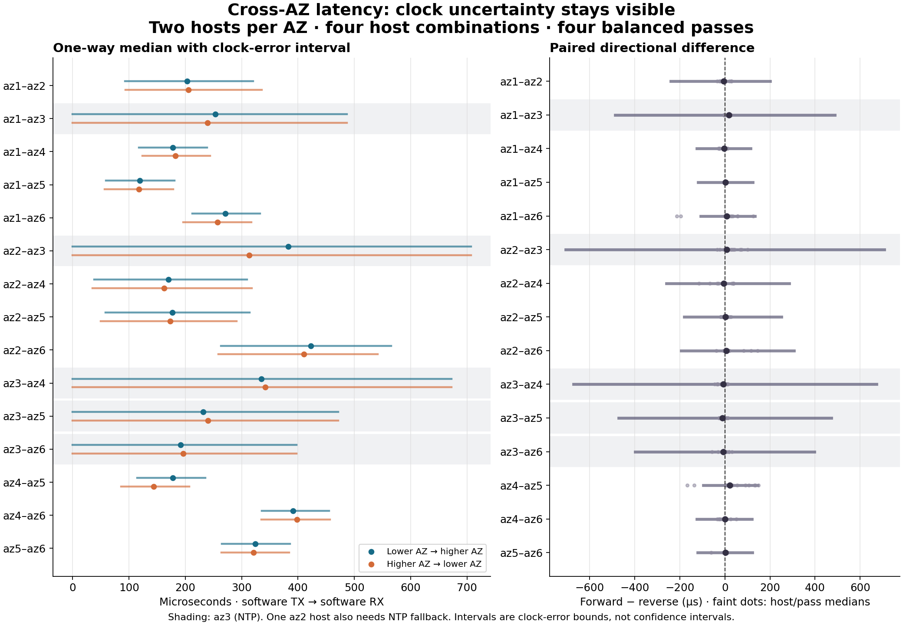

# One-way latency between all six AZs

This page retains the first cohort. The [fresh-host confirmation](oneway-confirmation.md)
has continuous PHC on all ten supported hosts and the comparison of the fast
az2a→az4a edge. [Host/port selection](../selection.md) contains the current findings from
fixed-tuple controls across all six AZs.

**Individual flows can be materially asymmetric, but this cohort does not
establish a persistent directional bias for any AZ pair.** Several host/pass
comparisons separate the two directions beyond their clock bounds, and two
host pairs reverse the faster direction between passes. Pooling them conceals
that behavior. AZ3's clock uncertainty is too large to resolve its one-way split.

Measured **24 September 2026, 22:25:00–22:28:47 UTC**: two hosts per AZ, all four
host combinations across each of the 15 AZ pairs, four balanced passes, and six
same-AZ controls. There were **264,000 complete exchanges**, with no missing or
duplicate packets. Each exchange sends a 64-byte UDP request and reply. These
are software-kernel TX→RX timings, distinct from the original
[TCP application RTT study](tcp-method.md).

The [method](../clocks.md) explains timestamp boundaries, independent reference
clocks, drift correction, error bounds, packet causality and the remaining
identifiability problem. [Retained evidence](../../evidence/20260924-oneway/README.md)
contains all host/pass rows and references to the raw archives.

## Both directions, with uncertainty visible

All values below are **microseconds**. `A–B` abbreviates stable IDs
`use1-azA` and `use1-azB`. Median cells contain a point estimate followed by its
**clock-and-causality interval**, using the 100 ppm raw-clock rate envelope.
These are conditional measurement-error bounds, not confidence intervals.
Each direction has 15,680 post-warmup observations, balanced across four host
combinations and four passes.

| AZ pair A–B | A→B median [interval] | B→A median [interval] | p99 estimates A→B / B→A |
| --- | ---: | ---: | ---: |
| 1–2 | 203 [93, 320] | 205 [94, 335] | 248 / 299 |
| 1–3 | 253 [0, 487] | 240 [0, 487] | 270 / 266 |
| 1–4 | 177 [118, 238] | 182 [124, 244] | 205 / 212 |
| 1–5 | 119 [59, 181] | 117 [57, 178] | 134 / 127 |
| 1–6 | 271 [212, 333] | 257 [196, 317] | 375 / 483 |
| 2–3 | 382 [0, 707] | 314 [0, 707] | 463 / 438 |
| 2–4 | 170 [38, 309] | 162 [35, 318] | 270 / 258 |
| 2–5 | 177 [58, 314] | 173 [50, 291] | 278 / 229 |
| 2–6 | 423 [264, 565] | 410 [258, 541] | 509 / 498 |
| 3–4 | 335 [0, 672] | 342 [0, 672] | 358 / 392 |
| 3–5 | 231 [0, 472] | 240 [0, 472] | 249 / 249 |
| 3–6 | 192 [0, 398] | 196 [0, 398] | 234 / 243 |
| 4–5 | 177 [114, 235] | 144 [86, 207] | 329 / 322 |
| 4–6 | 391 [336, 455] | 398 [335, 457] | 454 / 456 |
| 5–6 | 324 [265, 386] | 321 [264, 385] | 392 / 391 |

**The AZ3 point estimates are especially model-dependent:** their bounds permit
almost any division of the observed RTT between the two legs. Similar-looking
point estimates do not establish symmetry. P99s also depend on the clock model;
their intervals, unrounded values and clock-only median bounds are in
[directions.csv](../../evidence/20260924-oneway/directions.csv).



## The asymmetry that an AZ average hides

At the main 100 ppm envelope, **9 of 240 cross-AZ host/pass blocks** have median
paired directional-difference intervals excluding zero. They involve AZ pairs
1–6, 2–6 and 4–5. None of the 15 pooled AZ-pair intervals excludes zero. That
does not prove symmetry; it limits what these observations establish about a
persistent AZ-wide bias.

Two examples, with `a`/`b` identifying the two hosts in each AZ. Pass numbers
here are zero-based; positive differences mean the lower-numbered AZ's outgoing
leg is slower. The difference is the median of **paired** leg differences,
which need not equal the difference of separately pooled medians.

| Host pair | Pass | Lower AZ→higher AZ median | Reverse median | Paired difference [interval] |
| --- | ---: | ---: | ---: | ---: |
| az1a / az6b | 0 | 268 | 480 | −213 [−334, −93] |
| az1a / az6b | 1 | 366 | 240 | +126 [+2, +252] |
| az4a / az5b | 2 | 288 | 140 | +148 [+25, +269] |
| az4a / az5b | 3 | 141 | 277 | −136 [−261, −12] |

These blocks open new UDP sockets and alternate the initiator; the ephemeral
client port changes too. They demonstrate **flow/host/pass dependence**, not
a fixed flow changing direction over time. Routing, flow selection, initiator
role and time are not independently identified. The kernel boundary also
includes guest and virtual-network effects, so this is not a propagation-only
asymmetry measurement.

The rate-envelope sensitivity matters. A 50 ppm envelope resolves 11 blocks;
100 ppm resolves 9; a deliberately much wider 1000 ppm envelope resolves none.
All three retain zero resolved pooled AZ-pair differences. The observed
independent-reference point-model rates range from **−29.69 to +5.25 ppm**.
The envelope is an explicit assumption rather than a hardware-certified limit;
the archived `sensitivity.csv` preserves the result at every setting
([recovery](../../evidence/20260924-oneway/README.md#recover-archived-detail)). Clock error is never reduced by treating packets or hosts as
independent samples of a shared reference bias.

## What the extra machines revealed

The same-AZ controls had markedly different **offset-independent network RTTs**.
This is the median of the four pass medians, with their range:

| Same-AZ host pair | RTT median (µs) | Pass-median range (µs) |
| --- | ---: | ---: |
| az1a / az1b | 41.1 | 40.3–42.8 |
| az2a / az2b | 306.3 | 273.3–317.2 |
| az3a / az3b | 67.4 | 65.2–71.1 |
| az4a / az4b | 227.1 | 208.1–248.9 |
| az5a / az5b | 41.0 | 40.7–42.8 |
| az6a / az6b | 134.8 | 133.5–135.7 |

Clock offset cannot explain these RTT differences. Multiple machines help expose
host/path placement variation, while providing no reason to average away shared
Nitro time-reference error. Two hosts still cannot characterize an AZ's full
host/rack/path distribution.

## Clock and instrumentation audit

- Nine M7i hosts retained PHC throughout measurement. Median advertised PHC
  errors were about **23–25 µs per host**, larger than the reference's observed
  short-term noise. For fully PHC-backed pairs, typical one-way median intervals
  span about ±60 µs, and paired asymmetry intervals about ±120 µs.
- The second AZ2 M7i host lost PHC reads before measurement (`EBUSY`, 1,792
  failed reads). Its NTP references kept the measurement bounded, more broadly;
  its earlier PHC readings still constrain the independently fitted affine point
  model. Driver-source review explained the persistent failure: the sampler
  checked the cached error bound before refreshing the clock. Once a transient
  failure invalidated that cache, the pre-read itself returned `EBUSY`, preventing
  recovery. The initiating transient's cause remains unknown. ENA's PHC error
  counters did not record those subsequent sysfs failures, so the raw log matters.
- AZ3's two I4i hosts had no PHC. NTP uncertainty dominates their directional
  results. NTP replies frequently timed out across the cohort: the intended
  20 Hz loop achieved roughly 5–6 Hz PHC readings and roughly 1 Hz successful NTP
  replies. Maximum combined-reference gaps were about **204 ms** on healthy PHC
  hosts and **2.06 s** on NTP-only/fallback hosts. Bounds expand across actual
  gaps. This was not a reliable 20 Hz NTP calibration service.
- The continuous affine point trajectories fit every independent reference
  interval. The calibrated-leg sum agrees with source elapsed time minus peer
  turnaround to within **0.109 µs**, across all 264,000 exchanges. This checks
  implementation and drift consistency, not absolute clock accuracy.
- The ten M7i hosts supplied **440,000 hardware RX timestamps**. Their modeled
  hardware-to-software RX gaps had per-host medians of **6.0–9.2 µs** and p99s of
  **9.6–15.9 µs**, with occasional millisecond outliers. This is a diagnostic
  boundary comparison; occasional negative estimates expose mapping/model noise.
  There is no hardware TX timestamp, so no wire-to-wire claim is made.
- Application receive scheduling added per-host medians of **7.5–12.2 µs**;
  pre-send to kernel TX medians were **2.2–3.2 µs**. Kernel timestamps keep those
  userspace costs outside the reported network legs. Recorded ENA allowance,
  drop and error counters did not increase.

## Traffic, cost and recovery

The cross-AZ probes transferred **30.72 MB of application payload / 44.16 MB
including IPv4 and UDP headers**. The six same-AZ controls were additional.
At the published regional EC2 transfer rates, the cross-AZ probe-byte model is
**$0.000883**, before small control traffic and link encapsulation. This is not
an observed bill. [AWS EC2 transfer pricing](https://aws.amazon.com/ec2/pricing/on-demand/).

EC2 compute through archive completion models to **$0.468**, including both
preflight hosts' lifetimes and reuse. The recorded rates are $0.2016/hour for
M7i.xlarge and $0.343/hour for I4i.xlarge. This excludes shutdown lag, EBS,
public IPv4, S3 and tax; [pricing and calculation](../../evidence/20260924-oneway/campaign.json)
retain the scope. All twelve instances are confirmed terminated and the study's
security group removed.

From the repository root on Linux (prefix with `orb -m ubuntu` on the Mac):

```sh
python3 workbench/spikes/cft-commit-latency/oneway/check.py
python3 workbench/spikes/cft-commit-latency/oneway/recover.py \
  workbench/spikes/cft-commit-latency/evidence/20260924-oneway \
  --output build/recovered-az-oneway
```

Recovery downloads the twelve immutable raw worker archives and recomputes the
tables without new EC2 instances or cross-AZ probes. A new experiment uses
`oneway/launch.py`; its comment and flags distinguish the optional clock preflight
from the twelve-host run. The captured worker source is authoritative for these
measurements. The current sampler refreshes PHC before reading its bound and
separates PHC sampling from paced NTP requests; the [confirmation](oneway-confirmation.md)
tests the PHC and scheduling fixes. The later [fixed-tuple controls](../method.md)
separate tuple identity from same-role revisits. These changes do not silently
narrow this first cohort's error bounds.
