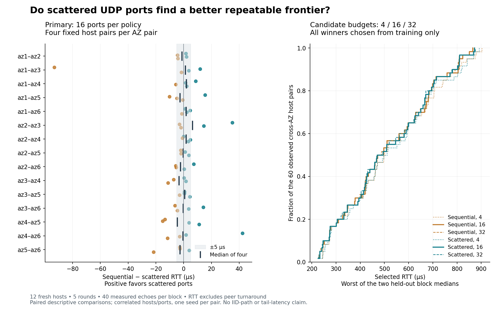

# Consecutive versus scattered UDP ports

**Increasing the candidate budget helped more consistently than scattering the
ports.** At the predeclared 16-port budget, scattered ports' median held-out RTT
gain was only **0.41 µs** across 60 cross-AZ host pairs. Gains varied by pair,
including substantial wins in either direction. This cohort does not establish
a general advantage for scattered ports or identify the underlying hash.

Capture: **25 September 2026, 00:59:38–01:17:29 UTC**. All **1,265,700 exchanges**
completed, with no missing or duplicate events. The 4,224 logical candidates
share five accidental overlaps, leaving 4,219 physical tuples, of which 3,836
are cross-AZ. [All candidates, paired scores and recovery](../../evidence/20260925-port-sampling/README.md).

## Equal budgets

Each policy chooses its winner from training rounds 0–2, then reports the worse
of its RTT medians in holdouts 3 and 4. Positive gain is sequential minus
scattered. The ±5 µs counts are descriptive, not a significance threshold.

| Ports per policy | Median scattered gain (µs) | Scattered better by >5 µs | Sequential better by >5 µs | Gain range (µs) |
| --- | ---: | ---: | ---: | ---: |
| 4 | +0.21 | 15 / 60 | 19 / 60 | −114.18 to +97.16 |
| **16: primary** | **+0.41** | **9 / 60** | **12 / 60** | **−93.10 to +42.45** |
| 32 | +0.91 | 9 / 60 | 11 / 60 | −32.35 to +35.14 |

At 16 ports, requiring the >5 µs advantage in **each** holdout separately leaves
nine scattered wins and eight sequential wins. For example, az4a/az6a favored
scattered by 45.27 and 40.08 µs; az1a/az3a favored sequential by 93.07 and
93.24 µs. Both examples use fixed hosts and the fixed training-selected port.
Five same-AZ controls differed by less than 1.5 µs; az4a/az4b instead favored
sequential by 43.20 µs (165.95 versus 209.15 µs worst held-out RTT).

## More candidates and adjacent-port diversity

Moving **4→32** improved 31/60 cross-AZ pairs by >5 µs for **each** policy.
Median gains were 5.47 µs sequential and 5.21 µs scattered; the largest were
98.91 and 105.18 µs. Moving 4→16 improved 25 and 29 pairs respectively; 16→32
improved ten pairs under each policy, with median incremental gain zero.
No budget increase worsened a pair's held-out score by more than 5 µs.

Four consecutive ports already exposed widely separated, repeatable latency
classes on az2b/az6a. These are RTT medians, in microseconds:

| Lower endpoint port | Train 0 | Train 1 | Train 2 | Holdout 3 | Holdout 4 |
| --- | ---: | ---: | ---: | ---: | ---: |
| 50503 | 980.55 | 980.85 | 981.36 | 981.39 | 980.86 |
| 50504 | 984.96 | 983.19 | 983.20 | 983.95 | 984.14 |
| 50505 | 1161.07 | 1161.24 | 1164.99 | 1162.48 | 1163.32 |
| 50506 | 805.07 | 805.89 | 805.77 | 803.04 | 804.41 |

Their training-median spread is **355.47 µs**. Adjacent input ports therefore
need not produce similar observed latency. Neither this observation nor the
random arm counts physical paths or demonstrates independent rerolls.

## Repeatability has exceptions

Across cross-AZ pairs, the median of each pair's same-role median RTT change is
**1.08 µs**. But 36/3,836 physical tuples on six host pairs had at least one
same-role change above 20 µs: 63 of the 11,508 comparisons, with a maximum
**103.15 µs**. For az2a/az3a on port 49843, round medians were 888.49, 887.32,
785.35, 786.62 and 785.78 µs. The change survives initiator reversal and cannot
be explained by inter-host clock offset. It does not identify a routing or
host/NIC mechanism.

The practical result is to screen a modest port budget on the actual hosts,
validate the selected tuples, and revalidate over time. Scattering is a reasonable
sampling choice, but these observations support **more candidates**, not a
special advantage from spacing or an IID stationary path distribution. No QUIC,
PLP write or concurrent follower race is measured here.

## Directional estimates and clock audit

The separate 16-port outgoing-request policy also showed no broad scattered
advantage in point estimates: median gain −0.34 µs across 120 directions;
13 scattered and 15 sequential gains exceeded 5 µs. These point comparisons
remain subject to the retained clock-error intervals.

The affine clock model failed its independent-reference check on three hosts.
After capture, the secondary directional analysis used a continuous feasible
curve within the **unchanged** reference/rate bounds, with no link timing used
to fit clocks. This is an explicit analysis deviation; the primary RTT selection
and results are unaffected. The [clock guide](../clocks.md) explains the algorithm
and the 2.85/16.92 µs maximum corrections during measurement. All 50/100/1000 ppm
reductions passed reference consistency, coverage and packet causality; maximum
four-timestamp closure discrepancies were 0.075/0.103/0.405 µs respectively.

For illustration, the scattered RTT winner on az1a/az5a held out at 226.34 and
225.07 µs. Its outgoing request medians were 113.29 µs az1a→az5a
with bounds [58.58, 168.80], and 113.23 µs az5a→az1a with [71.80, 155.05].
Those bounds cannot certify a 110 µs edge or its faster initiating side.
Host labels identify this fresh cohort only.

## Cost and recovery

Measured cross-AZ probe traffic was **211.7472 MB** including warmup. The model
is **$1.0156 compute through archive completion plus $0.00423 cross-AZ probes**,
excluding shutdown lag, EBS, public IPv4, S3, control traffic and tax. All twelve
instances are verified terminated and the study security group removed. No
allowance-exceeded/drop/error counter increased. The [evidence](../../evidence/20260925-port-sampling/README.md)
keeps every candidate score and the executable offline report recipe; raw,
per-block and full-plan detail are in verified S3 archives.

## Design recorded before capture

The question is whether spreading a fixed candidate budget across the ephemeral
port range improves the repeatable latency frontier. Changing ports does not
prove independent physical paths: hash inputs, host processing and routing remain
unobserved. Adjacent input values do not establish adjacent output hash buckets.

One fresh cohort has two hosts in each of six AZs: ten M7i with PHC references,
two I4i in az3 with NTP references. All 66 unordered host pairs are measured,
including six same-AZ controls. Hosts are reused for both sampling policies.

For each pair, the lower-numbered host's port is varied while the other stays
48100. The sequential arm chooses a uniformly random legal start for 32
consecutive ports in 49152–65535. The scattered arm independently samples 32
distinct ports without replacement from that range. Accidental arm overlap is
allowed; a shared tuple is measured once and reused for both logical candidates.
The seed is 250926, with independent per-pair/per-arm random streams.

Budgets 4, 16 and 32 use nested prefixes of each arm's logical candidate order.
**16 is the primary comparison.** The logical sequential prefixes really are
consecutive; execution order is separate. Each round shuffles matching/candidate
units, then measures the two arms back-to-back in randomized order. Six disjoint
pairs run concurrently, with one outstanding 64-byte UDP request per pair.
Each block has 60 exchanges at 2 ms pacing, discarding the first 20. This is a
screen of typical latency, not an estimate of p99 reliability.

Five rounds alternate initiators: lower host in 0/2/4, higher in 1/3. Endpoint
ports remain attached to their hosts. Rounds 0–2 train; 3 and 4 are held out.
Within each pair/arm/budget, the primary policy minimizes the worst training
RTT p50, breaking ties by median training RTT p50 and then numeric port.
The winner is frozen before evaluating either holdout. Report both holdouts
separately and their worst median. Positive sequential-minus-scattered gain
favors scattered ports. Do not select the budget or a different score from
holdout results.

A separate, secondary outgoing-edge policy ranks training **request** p50s for
each direction (two training blocks from the lower host, one from the higher).
Tie-break by median training request p50 and port. Evaluate the matching request
holdout, with the independent clock bounds. These winners differ from RTT-policy
winners and must be labeled. Calibration and clock sensitivity follow
[the clock model](../clocks.md); persistent clock bias cannot be removed by
training/holdout splitting. RTT is the primary offset-independent comparison.

Capture the full plan, actual execution order, socket ports, clock references
and boundary diagnostics. Reserve the sampled range and fixed port against
automatic ephemeral allocation on these disposable workers, preserving existing
reservations. Any bind failure, missing packet, incomplete round or unexpected
tuple invalidates the affected comparison; do not silently reduce an arm's
candidate budget. The reducer requires the complete planned physical grid.

Report paired host differences and AZ context, including null results and
same-AZ controls. Hosts, ports and packets are correlated; do not manufacture
IID sample counts or packet-level confidence intervals. One seed/window per
pair does not estimate seed-to-seed variability on a fixed host pair. Results
apply to these UDP tuples, hosts and this capture period, not an AWS ASIC hash
specification, QUIC validation or a stationary independent path distribution.

The upper probe budget is 211,968,000 cross-AZ IPv4 bytes, reduced slightly by
overlap, modeled at $0.00424 using $0.02/GB for both endpoint sides. Compute is
bounded by the worker deadline and one-hour instance age limit. Retain the plan,
all candidate scores (including losers), paired comparisons and context in Git;
archive raw and per-block detail in S3 using the repository retention helper.
