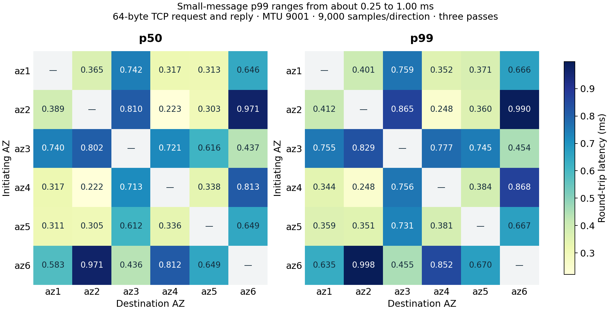
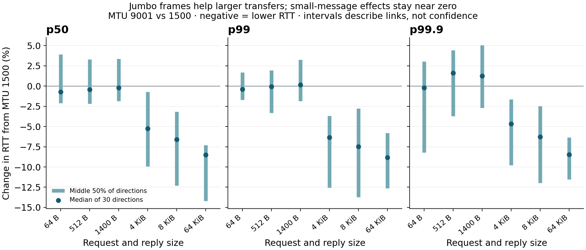

# Original TCP cohort: RTT, message size and modeled triples

**The fastest and slowest sampled 64-byte pairs differed by more than fourfold.**
At MTU 9001, their p50/p99 RTTs were **0.223/0.248 ms** and **0.971/0.997 ms**.
With one host per AZ and fresh connections between cases, this measured a
particular set of host/connection configurations. It did not isolate AZ identity
as the cause. The later [host/port controls](../selection.md) show why these
rankings cannot choose a permanent AZ winner or a production leader side.

The tables below retain the original cohort and models. For current placement
reasoning, start with the [network guide](../README.md). Its independent-clock
UDP measurements have a different boundary and do not retrospectively turn
these TCP RTTs into measured one-way delays.

These are network-only observations from six identical `i4i.xlarge` instances
on 14 September 2026, 15:23:46–15:34:27 UTC. The study covers all 15 AZ pairs,
both initiating directions, two MTUs and three passes. See the
[measurement method](tcp-method.md) and [retained evidence](../../evidence/20260914/README.md).
The [durable commit experiment](../../commit/README.md) measures the additional
persistence and joint replication work.

## The sampled pair links

A fixed leader needs one of its two followers for a healthy quorum. One fast
link can therefore give a good healthy path even if the third AZ is slow. When
that fast follower is unavailable, the remaining link matters. If any node may
become leader, all six directed links within the triple deserve attention.
These are different placement questions; a single ranking cannot answer all three.

The heatmaps preserve direction. The table below pools both initiating directions:
18,000 samples per row, **64-byte request and 64-byte reply, persistent TCP,
MTU 9001**. Values are **milliseconds**. These are round trips including both
hosts' processing; dividing by two does not measure one-way latency.

| AZ IDs (`use1-` prefix) | p50 | p90 | p99 | p99.9 |
| --- | ---: | ---: | ---: | ---: |
| az1–az2 | 0.371 | 0.397 | 0.409 | 0.431 |
| az1–az3 | 0.741 | 0.749 | 0.757 | 0.777 |
| az1–az4 | 0.317 | 0.328 | 0.348 | 0.394 |
| az1–az5 | 0.312 | 0.343 | 0.366 | 0.385 |
| az1–az6 | 0.612 | 0.654 | 0.664 | 0.687 |
| az2–az3 | 0.806 | 0.855 | 0.863 | 0.870 |
| az2–az4 | 0.223 | 0.233 | 0.248 | 0.284 |
| az2–az5 | 0.304 | 0.341 | 0.355 | 0.385 |
| az2–az6 | 0.971 | 0.987 | 0.997 | 1.007 |
| az3–az4 | 0.715 | 0.758 | 0.772 | 0.819 |
| az3–az5 | 0.615 | 0.718 | 0.740 | 0.759 |
| az3–az6 | 0.436 | 0.447 | 0.455 | 0.472 |
| az4–az5 | 0.337 | 0.365 | 0.382 | 0.517 |
| az4–az6 | 0.812 | 0.847 | 0.864 | 0.902 |
| az5–az6 | 0.649 | 0.658 | 0.669 | 0.692 |

Use AZ IDs for portable placement. This account's letter mapping is `az1=c`,
`az2=d`, `az3=e`, `az4=a`, `az5=f`, `az6=b`, abbreviating `us-east-1…`.
[AWS documents the consistent physical identity of AZ IDs across accounts](https://docs.aws.amazon.com/global-infrastructure/latest/regions/az-ids.html).
All sizes, MTUs, directional statistics and maxima remain in
[directed.csv](../../evidence/20260914/directed.csv) and [pairs.csv](../../evidence/20260914/pairs.csv).

## All 20 triples in this cohort

The score is the **largest directional p99 among all six edges**, for 64-byte
TCP. It exposes a triple's slowest alternative path, useful when the leader may
change or its fast follower may disappear. It is not healthy-quorum p99. The
mean directional p50 breaks ties. [triples.csv](../../evidence/20260914/triples.csv)
retains every message size and both MTUs.

| Rank at MTU 9001 | AZ IDs (`use1-az` numbers) | Worst edge p99, MTU 9001 (ms) | MTU 1500 (ms) |
|---:|---|---:|---:|
| 1 | 2, 4, 5 | 0.384 | 0.475 |
| 2 | 1, 4, 5 | 0.384 | 0.388 |
| 3 | 1, 2, 4 | 0.412 | 0.455 |
| 4 | 1, 2, 5 | 0.412 | 0.475 |
| 5 | 1, 5, 6 | 0.670 | 0.681 |
| 6 | 3, 5, 6 | 0.745 | 0.733 |
| 7 | 1, 3, 5 | 0.759 | 0.759 |
| 8 | 1, 3, 6 | 0.759 | 0.759 |
| 9 | 3, 4, 5 | 0.777 | 0.749 |
| 10 | 1, 3, 4 | 0.777 | 0.759 |
| 11 | 2, 3, 5 | 0.865 | 0.891 |
| 12 | 2, 3, 4 | 0.865 | 0.891 |
| 13 | 1, 2, 3 | 0.865 | 0.891 |
| 14 | 1, 4, 6 | 0.868 | 0.867 |
| 15 | 4, 5, 6 | 0.868 | 0.867 |
| 16 | 3, 4, 6 | 0.868 | 0.867 |
| 17 | 2, 5, 6 | 0.998 | 1.272 |
| 18 | 1, 2, 6 | 0.998 | 1.272 |
| 19 | 2, 4, 6 | 0.998 | 1.272 |
| 20 | 2, 3, 6 | 0.998 | 1.272 |

**{2,4,5} and {1,4,5} tie at 0.384 ms worst-edge p99** under MTU 9001;
{2,4,5} wins the mean-link-median tie-break (0.288 versus 0.322 ms).
At MTU 1500, {1,4,5} ranks first. This ranks the sampled six-machine topology,
not all host/flow choices in those AZ sets. The worst sampled sets include
{2,3,6}, whose worst edge is 0.998 ms at MTU 9001 and 1.272 ms at MTU 1500.

## Modeled first-reply latency from these marginals

For the acknowledgment-based model used in this study, the network term is
the first follower reply,
`min(RTT_to_follower_1, RTT_to_follower_2)`. Normal Raft log replication takes one
RPC round to a majority; the minority need not delay that quorum.
[Raft, §5.3](https://raft.github.io/raft.pdf).

Compare two configurations from this network cohort. These good/bad labels
refer to different AZ sets from the later durable experiment: i8g availability
excluded az5 there, and its good set uses {az1, az2, az4}.

- **Good:** {az2, az4, az5}, leader az4, MTU 9001. It combines the fast az4–az2
  path with a relatively fast alternative and ties for the best worst-edge score.
- **Bad:** {az2, az3, az6}, leader az2, MTU 1500. Both follower paths are
  substantially slower in these observations.

The links were measured separately, so their simultaneous delay relationship is
unknown. The healthy rows bound the first reply across possible relationships
between the two observed link distributions. This is a modeled network result,
not a measured quorum or a statistical confidence interval. The independence
scenario makes an additional assumption and is shown separately.

| Network contribution / condition | Good (ms) | Bad (ms) | Advantage |
|---|---:|---:|---|
| Healthy majority p50, marginal-coupling bounds | 0.222 | 0.797–0.824 | 3.6–3.7× |
| Healthy majority p99, marginal-coupling bounds | 0.248 | 0.827–0.855 | 3.3–3.5× |
| Healthy majority p99, independent-links scenario | 0.248 | 0.854 | 3.4× |
| Fast follower unavailable, remaining-link p50 | 0.338 | 0.885 | 2.6× |
| Fast follower unavailable, remaining-link p99 | 0.384 | 1.272 | 3.3× |

The modeled healthy p99 difference is **0.58–0.61 ms per network round**
between these configurations. It is neither an isolated AZ effect nor a
measured commit gain. The [current branch-start model](../README.md#optimize-the-first-durable-followers-branch-start)
has an outgoing leg and follower write instead of a return acknowledgment; this
first-reply table does not supply that model's one-way percentiles.

The remaining-link rows use the original measured RTTs with the normally faster
follower omitted from the model. No failure or election was injected. The [joint commit fallback comparison](../../commit/latency.md#a-healthy-quorum-can-conceal-a-costly-fallback)
then tests a known-absent follower with actual durable writes. All 720
leader/placement/MTU/size scenarios, including
p99.9, remain in [consensus-scenarios.csv](../../evidence/20260914/consensus-scenarios.csv);
the [method](tcp-method.md#three-node-network-model) explains the bounds.

## MTU and message-size observations

Each table entry is the median percentage change over the **same 30 host directions**,
comparing MTU 9001 with 1500 after pooling repetitions. Negative means lower RTT.
The plot's intervals span the middle 50% of directions. They describe link
variation, not confidence in an estimated mean.

| TCP request and reply size | p50 change | p99 change | p99.9 change |
|---|---:|---:|---:|
| 64 bytes | -0.73% | -0.39% | -0.21% |
| 512 bytes | -0.41% | -0.05% | +1.62% |
| 1,400 bytes | -0.20% | +0.16% | +1.27% |
| 4,096 bytes | -5.26% | -6.35% | -4.68% |
| 8,192 bytes | -6.59% | -7.49% | -6.27% |
| 65,536 bytes | -8.51% | -8.83% | -8.45% |

For 64 KiB messages, median paired p99 changes in the three passes were
**−10.17%, −6.45%, −11.32%**; for 64 bytes, **+1.34%, −1.38%, −0.35%**.
Thus the association with lower large-message RTT recurs, while the small-message
change switches sign. Hosts were paired, but TCP connections were recreated
between MTU/size/pass cases. Their tuples and paths were not held fixed.
The later UDP tuple controls do not identify the cause of each TCP difference,
but expose an uncontrolled variable in assigning this whole difference to MTU.
The table describes the measured policies; it is not a pure MTU treatment effect.

These TCP messages were echoed in full. Replication with a small acknowledgment
returns fewer bytes, so that exact MTU benefit requires the actual commit path.
For the good/bad placements above, 64 KiB echoes give modeled healthy network
p99 bounds of **0.371–0.396 ms versus 0.985–1.058 ms**: a size sensitivity,
not measured WAL replication latency. `TCP_NODELAY` was enabled throughout;
offloads, IRQ placement, buffers, congestion control, UDP, TLS and Nagle on/off
were not swept in this network cohort.

IPv4 DF checks confirmed the expected boundaries: ICMP payloads of 1472/8973 bytes
fit MTU 1500/9001, while 1473/8974 do not. All **360 oversize cases** failed
locally as expected, separately from network loss; every TCP case reported the
configured PMTU. [AWS's MTU guidance](https://docs.aws.amazon.com/AWSEC2/latest/UserGuide/network_mtu.html)
explains packet sizes and path limits.

## How far the observations travel

One host per AZ and three short passes cannot establish region-wide or long-term
rankings. In particular, `az2→az6`, 64 bytes, MTU 1500 had per-pass p50
**0.747–1.260 ms** and p99 **0.762–1.277 ms**. At MTU 9001 its p50 ranged
**0.748–0.974 ms**. Flow choice, routing, host placement and scheduling were not isolated;
attributing the full change on that link to MTU would exceed the evidence.

The sweep recorded **3.24 million TCP RTTs**, **540,000 successful ICMP replies**,
five TCP retransmissions and no missing fitting ICMP replies. Recorded ENA
allowance-exceeded/drop/error counters did not increase. Aggregate CPU busy time
was 9.1–15.7% over an epoch, which does not establish per-case saturation.
The largest TCP outlier was **9.464 ms**. Maxima and p99.9 describe this window;
they do not set safe timeouts. Per-pass statistics, threshold exceedances and
recovery checks are retained with the evidence. Continue to the
[joint commit comparisons](../../commit/latency.md) to see how placement and message
size interact with persistence, then the [arrival-driven pipeline](../../commit/throughput.md)
for queueing and bandwidth under load.
