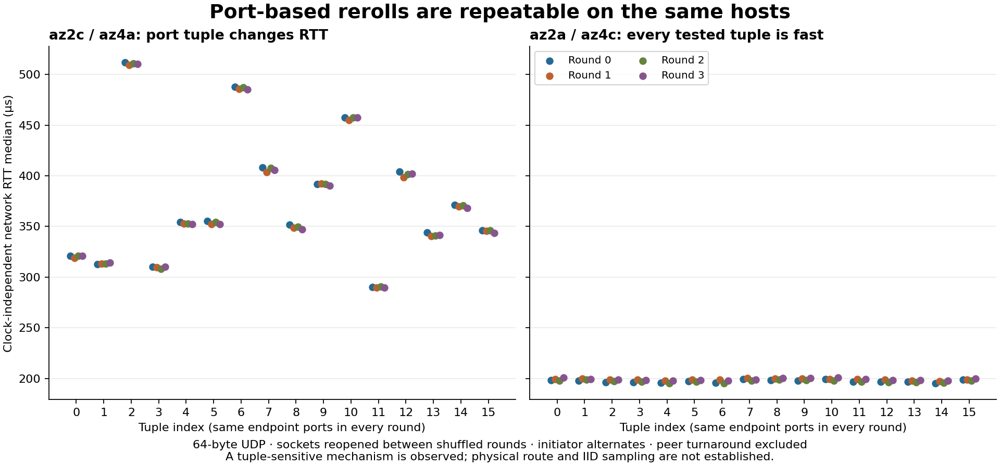

# Dense fixed-tuple control: az2–az4

This supporting study isolates tuple effects with sixteen flows on each of
sixteen az2–az4 host pairs. The [current selection findings](../selection.md)
combine it with the broader, one-port comparison across all six AZs. See the
[experiment design](../method.md) for controls and the [network guide](../README.md)
for the witness branch-start boundary.

## Dense control: ports reroll latency, machines constrain the outcome

Eight fresh M7i hosts, four each in az2 and az4, tested all sixteen host pairs
and sixteen tuples per pair over four shuffled rounds. This ran on
**24 September 2026, 23:12:35–23:15:03 UTC**. All 102,400 exchanges completed.
Both endpoint ports varied in this control and stayed attached to their hosts
when the initiator reversed. Sockets closed and reopened between blocks.

On **az2c / az4a**, these two tuples reproduced very different offset-independent
network RTTs. Values are pass medians in microseconds; peer turnaround is removed.

| Tuple | Round 0 | Round 1 | Round 2 | Held-out round 3 |
| --- | ---: | ---: | ---: | ---: |
| 48011 ↔ 48111 | 290.1 | 289.5 | 290.9 | 289.5 |
| 48002 ↔ 48102 | 511.8 | 509.5 | 511.1 | 510.6 |

The IP addresses and machines are unchanged. Within this pair, the median
across rounds of the sixteen-tuple RTT span is **220.6 µs**. Same-role revisits
of each tuple change by a median **0.97 µs**, at most **3.76 µs**. Across all
sixteen host pairs, the median of their same-role median changes is **0.73 µs**,
and the largest same-role change is **5.13 µs**. Thirteen pairs have RTT
correlations above 0.95 for both same-role repeat comparisons; the weaker
correlations occur where tuple differences are small relative to noise.

The **az2a / az4c** pair stays at **195.0–200.8 µs RTT** over all sixteen tuples
and four rounds; its az2a→az4c fitted medians are **97.3–100.4 µs**. In contrast,
az2a / az4a stays at **406.1–455.2 µs RTT**. Port selection helped many pairs,
but none of the sixteen tested tuples made that latter pair comparable to the
best pair. This is an observed sampled floor, not a proven limit on all ports.

The large port effect cannot be caused by inter-host clock offset: the RTT
comparison uses local elapsed intervals. On the ~290/~511 µs example, modeled
hardware-to-software RX medians remain roughly **5–11 µs**; their few-microsecond
changes do not explain the ~220 µs RTT difference. This is evidence for a
tuple-sensitive mechanism beyond that receive timestamp boundary. Hardware TX
is unavailable, so the experiment does not separate NIC egress, virtual network
and physical route contributions or identify ECMP as the cause.

## Selection survives a short holdout

The declared dense-control rule selects the lowest **worst training median**
over rounds 0–2, breaking ties with worst p90. Round 3 is withheld from selection.
All 256 host/tuple candidates per direction remain in the evidence.
This is an offline holdout: the independent local clock fit uses references
from the full capture, while the held-out packet delays do not enter selection.

| Selected direction / tuple index | Worst training p50 | Held-out p50 [clock interval] | Held-out p90 / p99 |
| --- | ---: | ---: | ---: |
| az2a→az4c / 4 | 98.7 | 97.8 [43.0, 153.7] | 100.8 / 105.2 |
| az4c→az2a / 14 | 99.7 | 100.2 [44.3, 156.1] | 102.3 / 103.4 |

The first held-out row is a reply-role observation; the second is a request,
the closer analogue of a leader send. The broad design holds out both roles.
With 80 post-warmup packets per block, p99 is descriptive and close to the
sample maximum. The first selected direction also had a training p99 of
166.1 µs; selection on median does not promise a 110 µs tail. Neither clock
interval proves that the true one-way median is ≤110 µs, or which endpoint has
a few-microsecond advantage. The good **pair** has stronger evidence than the
precise split of its RTT.

## Evidence and resource accounting

The dense control used **18.8416 MB IPv4+UDP / 13.1072 MB payload** across AZs,
with modeled EC2 compute through archive completion of **$0.1645**. The transfer
byte/rate model is **$0.000377**, not an observed bill; other charges and
shutdown lag are excluded as documented in `campaign.json`. All eight instances
are confirmed terminated and the scoped network removed.

Six transient PHC `EBUSY` errors recovered, with combined-reference gaps at
most 101 ms. Eight NTP timeouts did not leave subsequent requests permanently
out of step. All three raw-clock rate envelopes (50/100/1000 ppm), packet joins,
fixed-tuple checks and point causality checks passed; maximum closure error was
0.0148 µs. These tests validate the measurement implementation within its
stated assumptions, not absolute clock accuracy.

[Dense evidence](../../evidence/20260924-variance-dense/README.md) retains every
host/tuple/round, selected and unselected candidates, local boundary diagnostics,
clock sensitivity, exact source hashes, resource records and raw archive refs.
The [all-AZ, one-port comparison](../selection.md) retains its own complete evidence
and both request-only and all-leg rankings. [Cohort accounting](../../evidence.md#network-cohorts)
collects traffic, cost scope and cleanup across the full follow-up.
