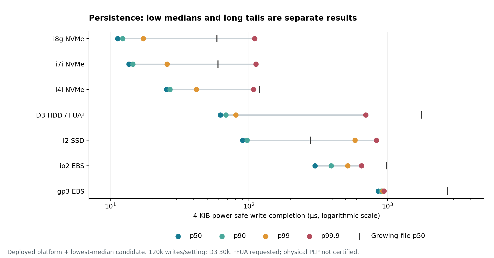

# Choosing a persistence path

**Preparing the log region changed these write costs far more than the tested
ext4 mount switches.** Across device choices, the NVMe paths had low medians but
still showed occasional longer completions. The decision therefore has two parts:
which work can move ahead of record arrival, and which remaining distribution
fits the commit budget.

Measurements below are from 14 September 2026 in `use1-az4`. The
[method](README.md) explains destination preparation, direct I/O and durable
completion as separate choices. All admitted paths request synchronized
data-integrity completion.

## Pay preparation before the record arrives

The matched screen holds the syscall and filesystem constant: **4 KiB buffered
write + fdatasync, ordinary ordered ext4**. Values are **microseconds**.

| Device / preparation | p50 | p90 | p99 | p99.9 |
| --- | ---: | ---: | ---: | ---: |
| i8g NVMe / growing file | 62.5 | 65.2 | 106.1 | 119.4 |
| i8g NVMe / preallocated | 54.6 | 57.5 | 113.0 | 129.0 |
| i8g NVMe / initialized overwrite | 17.4 | 18.2 | 24.0 | 107.1 |
| gp3 EBS / growing file | 2,731.2 | 2,777.6 | 2,827.1 | 2,886.7 |
| gp3 EBS / preallocated | 2,654.6 | 2,705.9 | 2,750.7 | 2,885.2 |
| gp3 EBS / initialized overwrite | 853.0 | 900.6 | 915.3 | 926.7 |

Each screen row pools 6,000 writes from three passes, giving limited p99.9 support.
The large median change motivates the longer device comparisons below.
Preallocation alone leaves unwritten-extent conversion and associated persistence
work on the first-write path. The experiment measures the modes as a whole;
it does not separately time those internal filesystem operations. Initialization
was paid before timing, so a real log needs segment preparation ahead of use.

For initialized i8g buffered-fdatasync writes, ordered ext4, ordered with
`noatime,max_batch_time=0`, and tuned writeback gave p50 **17.35, 17.26 and
17.29 µs**. Those differences do not support a useful mount-option preference in
this trial. Required barriers remained enabled.

## Compare the remaining latency distributions

Each row selects the **lowest pooled median among repeated 4 KiB tail candidates
for that device**. All four percentiles come from that same configuration; the
selection does not optimize p99.9. Values are **microseconds**.

The plot also marks each device's growing-file median. The selected-path
percentiles below expose values that overlap visually. [Complete cases and
repetitions](../evidence.md) retain the other paths and preparation modes.

| Device / worker | p50 | p90 | p99 | p99.9 |
| --- | ---: | ---: | ---: | ---: |
| gp3 EBS (3,000 IOPS) | 859.1 | 900.4 | 923.7 | 944.2 |
| io2 EBS (3,000 IOPS) | 299.8 | 393.1 | 517.0 | 651.0 |
| D3 HDD instance store | 62.2 | 68.1 | 80.3 | 697.3 |
| I2 SSD instance store | 90.1 | 96.8 | 583.4 | 834.3 |
| i4i NVMe instance store | 25.5 | 26.9 | 41.7 | 108.1 |
| i7i NVMe instance store | 13.6 | 14.5 | 25.7 | 112.3 |
| i8g NVMe instance store | 11.3 | 12.3 | 17.3 | 109.9 |

These are device/platform/path combinations. EBS ran on c8a.xlarge with fresh
encrypted 32 GiB volumes; gp3 had 125 MiB/s provisioned throughput. Instance
stores ran on d3.xlarge, i2.xlarge, i4i.xlarge, i7i.xlarge and i8g.large. One worker
and one device per class cannot isolate media effects from the host platform.

Every selected path uses `O_DIRECT|O_DSYNC`. The exact destinations and delivery
methods are:

| Selected device | Destination | Delivery |
| --- | --- | --- |
| gp3, I2 | Raw region | `io_uring` |
| i7i, i8g | Raw region | Blocking call |
| io2 | Initialized file, ordered ext4 | Blocking call |
| i4i | Initialized file, tuned ordered ext4 | Blocking call |
| D3 | Initialized file, tuned writeback ext4 | Blocking call |

SSD/EBS rows contain 120,000 writes in three passes; D3 has 30,000. The full screen
and tails span 5,106,000 writes, 1,374 passes and 458 configurations, including
512 B, 4 KiB, 16 KiB and 64 KiB operations. Setup and 32 warmup writes per pass
are excluded.

The i8g raw path's p99.9 was about **110 µs** against an **11 µs** median. D3's
per-pass p99.9 ranged **182–941 µs** around a pooled **697 µs**. The spread matters
when judging a tail budget. A low median alone does not describe the remaining
commit cost, and a device percentile cannot simply be added to a network percentile.

## D3: explain the completion contract before the surprising speed

The low D3 median is surprising for HDD-class storage. A fresh diagnostic cohort
traced block and NVMe commands, with timing collected separately from tracing.
Initialized-file `O_DSYNC` and raw `io_uring O_DSYNC` issued **FUA writes without a
following whole-device FLUSH**. Adding explicit `fdatasync` issued FLUSH and
moved median completion to approximately **1 ms**. Raw blocking `O_DSYNC` also
issued a following FLUSH on this kernel. The syscall name alone therefore did
not identify the commands reaching the virtual device.

All eight diagnostic traces contain 42 data writes each. Block flags identify
FUA; decoded NVMe CDW12 also has its FUA bit set. The installed trace-cmd formatter
cannot decode every Linux 7 payload, so decoded counts and original traces remain
part of the evidence.

This verifies a requested FUA completion contract. Available documentation does
not establish why this virtual HDD path completes FUA writes so quickly. It does
not measure physical platter latency or certify capacitor-backed hardware. The
explicit-flush comparison remains relevant when interpreting the fast result.

D3 advertised an enabled volatile cache and FUA support; I2 exposed a Xen block
device with writeback cache and flush semantics. The tested NVMe SSDs advertised
no volatile write cache, consistent with requiring no separate FLUSH for their
synchronized writes. The [qualification account](README.md#what-makes-completion-durable)
explains the OS/device/AWS contract and readback checks. The next decision uses
these paths inside the [joint durable commit](../commit/README.md), including
both follower and leader persistence.
