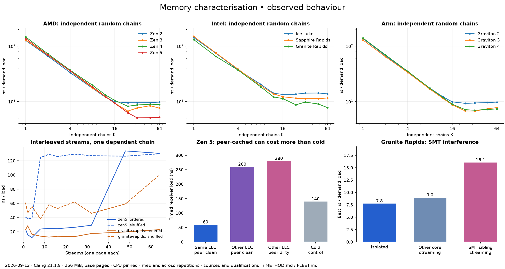

# Findings: automatic memory and host characterisation

2026-09-13. The spike ran on **13 EC2 instance types** plus the local Apple ARM
Linux VM. It produced **12 qualified lookup contexts**: `c6i.xlarge` and
`i4i.xlarge` expose the same CPU/environment key and their four runs are pooled.
The [fleet table](FLEET.md), [lookup](lookup.json), [method](METHOD.md) and
[retained evidence](evidence/README.md) keep the qualifications and raw comparisons.

The useful result is a set of conditional cost curves and scheduling candidates.
A single global “MLP” or “stream count” loses information that materially changes
placement and ring choices. Exact miss-slot counts, exact prefetch-table sizes
and a proven direct L2-to-L2 route remain unresolved. No Loom or Engine module
has been created or given a new contract.

## Recognition, lookup and initialization cost

`initialise.py` reads the selected CPU, looks up the complete recorded context,
and falls back to short sweeps on a miss. The live lookup path succeeded on
Zen 5 and Granite Rapids in **0.04 and 0.06 seconds**, including Python process
startup and the validation wrapper; no measurement binary ran. The
[local unknown-model path](evidence/local-unknown/initialisation.json) ran its
64 MiB quick sweep in **1.36 seconds**, including allocation and validation,
excluding build/capture. The fleet's 256 MiB quick repeats took roughly **7–8
seconds**. A screen including SMT/core comparisons took **34 seconds** on the
small Zen 5 instance and **56 seconds** on Granite Rapids; the two-node screen
including stream and NUMA experiments took **104 seconds**.

These measurements support cheap lookup and an optional bounded fallback.
They do not establish a hard initialization deadline. A latency-sensitive caller
should be able to accept partial knowledge and defer expensive diagnostics.
The quick profile's footprint can be too small to establish memory residency
on a large-LLC host. The lookup returns conditional observations; it does not
assume the sibling is idle or that pages have actually been allocated huge.

The keys include identity, microcode where exposed, kernel, cache geometry and
visible sharing widths, SMT width, governor and page policy. Live page options
are read again. CPU numbering and current hugepage pool counts are not identity.
NUMA placement and active interference remain explicit conditions. Migration,
firmware/prefetch controls hidden by a hypervisor, and different physical hosts
need further validation before these profiles become deployment-wide defaults.

## Lines, pages, adjacency and learning

All tested EC2 cores report **64-byte data lines**; the local VM reports **128
bytes**. The independent two-writer offset sweep corroborated 64 bytes on Zen 5:
8/16/32-byte separations cost about **6.3 ns per atomic increment**, falling to
**2.2 ns** at 64 bytes and staying there through 512 bytes. Graviton 4 shows the
same breakpoint, approximately **7.3 → 2.5 ns**. These are coherence-granule
observations; single-read spatial fetching alone could confuse line size with
adjacent prefetch.

All these Linux guests use **4 KiB base pages**. x86 guests advertise 2 MiB and
1 GiB HugeTLB sizes, with empty reserved pools during this campaign. Graviton
also exposes 64 KiB and 32 MiB HugeTLB options. The requested 256 MiB THP mappings
on the measured servers report 262,144 KiB of `AnonHugePages`; the small 16 KiB
and 512 KiB controls remain base mappings. `KernelPageSize: 4 kB` in `smaps`
alone would have missed this distinction. The translation/packed control sweep
is retained, but no exact TLB entry-count default is justified by it.

After one miss, **forward i+1 latency benefit repeated on Zen 2–5 at both line
parities**. The Intel profiles do not show a repeatable benefit under this
particular one-access test; Graviton's result is mixed. “No clear benefit” is
not a proof that a core has no adjacent prefetcher under other histories.

Short strided training often produces consistent benefit after **2–6 accesses**,
depending on direction and architecture. For example, Zen 5's stride-two and
stride-four tests have a consistent beneficial suffix beginning at three
accesses; the pooled Ice Lake observations need six. Granite Rapids has
non-monotonic cases, so several fields remain unknown. The lookup stores the
start of a consistently beneficial suffix across both seeds, not an asserted
exact activation threshold. Lookahead and page-boundary cases are also retained;
physical contiguity and target cache level are not inferred.

The local VM's 24 MHz counter has approximately 41.7 ns ticks. Its hot/cold
prefetch distributions did not consistently separate, so these fields remain
unresolved there. The implementation's unknown result is preferable to a
spurious zero or an imported server constant.

## Random access and stream concurrency are different axes

The smallest consistently near-best tested K for 256 MiB random pointer chains
is roughly **12 on Ice Lake, 16 on Zen 2/Sapphire Rapids, 16–24 on Graviton 2,
24 on Zen 3/4 and Graviton 3/4, and 32 on Zen 5**. The full candidate sets matter:
Granite Rapids moved from a 10%-threshold choice of 64 to 24 between runs while
its best throughput stayed at about 7.76 ns/load. At a 15% tolerance the common
candidates include 24 and 64. This is threshold sensitivity on a broad,
non-monotonic optimum, not evidence that miss-buffer capacity changed.

Most measured contexts repeated closely across independent random seeds. The
lookup requires intersecting near-optimal candidates and no more than 30%
movement in best throughput. These are explicit spike qualification rules,
not a universal statistical confidence model. Most pairs reuse one worker;
only the pooled Ice Lake entry also spans different instance types/hosts.

The **serialized stream walk** removes independent demand MLP by using one
true pointer dependency across interleaved pages. Ordered stride-two streams
are compared with shuffled positions in the same pages. Zen 5's ordered cost
is **29.2 ns/load at 32 streams**, then **133.9 at 48**, close to the shuffled
control. This brackets a useful interference cliff between 32 and 48 streams
for this shape. Granite Rapids degrades more gradually: about **13.2 at 24,
17.5 at 32 and 23.1 at 64**. Its shuffled control remains substantially worse.
Those two follow-up sweeps have three repetitions but only one seed each.

The resumed-victim retention probe is less decisive: the no-competitor baseline
is sometimes poor, and adding competition can improve prediction, presumably
through history, timing or retraining effects. That probe cannot assign a table
size. The first version also probed an already-prefetched answer; it was replaced.
The serialized walk provides the more useful observed cliff so far. Calico's
prior MLP/stream/ring numbers used different workloads and are not inherited.

## SMT, cache domains and NUMA materially change the answer

On Granite Rapids, the retained isolated best is **7.76 ns/load**. A separate
streaming core raises it to **9.03**, while a streaming SMT sibling raises it
to **16.09**. The sibling also largely destroys the short prefetch-training
benefit. A compute-only sibling has a different effect. The memory stressor
shares several resources simultaneously, so the result is not an isolated
measurement of shared prefetch entries.

Zen 5's `c8a.24xlarge` guest exposes one NUMA node but multiple LLC domains.
A recently peer-read line in the **same LLC domain costs about 60 ns** to the
receiver. Across LLC domains it costs **260 ns clean / 280 ns dirty**, compared
with a **140 ns cold control**. Thus guest NUMA node identity alone is too coarse
for cache-aware placement, and a peer-cached line need not be cheaper than a
cold load. The experiment does not identify the internal snoop/forwarding route.

The two-node `c7i.48xlarge` host shows approximately **160 ns** for a same-socket
peer-clean line and **349 ns** across nodes; matched cold controls are roughly
143–149 ns. For the 256 MiB random workload, binding memory from the receiver's
node 0 to node 1 changes serial cost from **80.5 to 106.2 ns/load**, and best
cost from **9.89 to 15.94 ns/load**. The 10% K candidate changes from **24 to 16**.
Both initial and final receipts show all **65,536 pages on the requested node**.
These are mixed cache/translation/memory workload costs, not pure DRAM timings.

The first explicit-binding run failed because the probe supplied an insufficient
node-mask length to Linux. The corrected call was rerun on a fresh worker;
that successful campaign owns the NUMA findings. The implementation also has a
first-touch fallback for systems without `mbind`, retaining placement receipts.

## Storage and network widen the profile, not the CPU lookup

On `i4i.xlarge`, the same 64 MiB temporary-file test produced:

| Operation | EBS-backed root filesystem | Instance-store filesystem |
| --- | ---: | ---: |
| 4 KiB direct random read, median | 248 µs | 102 µs |
| 4 KiB write + `fdatasync`, median | 409 µs | 34 µs |

The instance-store filesystem was prepared only on an explicitly requested,
fresh disposable worker, after checking the NVMe model, empty signatures,
absence of partitions and absence of mounts. It used a 1 GiB extent; the probe
itself wrote a temporary file. Initialization never formats devices.

The direct-read concurrency sweeps show useful queueing effects, but some
short EBS samples exceed the root volume's sustained provisioning rate. They
must not become a static IOPS ceiling. Buffered warm reads are largely memory
measurements, and `fdatasync` is an acknowledged durability path, not a power-loss
test. These device/volume/instance-specific facts and observations stay outside
the CPU lookup. [The fleet table](FLEET.md) preserves all comparisons.

TCP loopback and three fresh regional HTTPS connections provide diagnostic
baselines. The loopback numbers visibly include runtime/scheduler placement;
HTTPS fields are cumulative timestamps for DNS/connect/TLS/first byte, not
independent stage durations. This campaign does **not** establish peer network
bandwidth, fabric RTT, p99 tails, cross-AZ cost or sustained ENA/credit limits.
Those require controlled paired hosts and longer load sweeps; no network tuning
constant is fabricated from the endpoint probe.

## What this suggests for SixDB

A small host analyser could plausibly live with **Loom's placement and resource
mechanics**, while **Engine** combines its observations with hash-table and
TuplePack workload shape. That is a proposal, not a selected module boundary.
Return reported facts, measurement conditions, candidate sets, provenance and
unknowns; preserve live page/topology information separately from cached costs.

For buckets and TuplePacks, line footprint, hit/miss frequency, load factor and
useful bytes determine whether another line is worthwhile. For rings, random
chases and ordered streams need separate limits, and real useful work/software
prefetch/scheduler bookkeeping must be charged. For placement, distinguish SMT,
LLC domains and NUMA; batching ownership transfers may repay more than merely
increasing the ring. Runtime validation against the consuming kernel is the
next evidence that would justify graduating any of these candidate choices.

No production analyser was promoted. The reusable result is the executable
probe, automatic lookup/fallback prototype, curated fleet data and explicit
failure/uncertainty handling. [METHOD.md](METHOD.md) also retains ideas for
reader fanout, invalidation pressure, private-cache eviction before transfer,
producer/consumer batching, directory pressure and controlled two-host transport.
