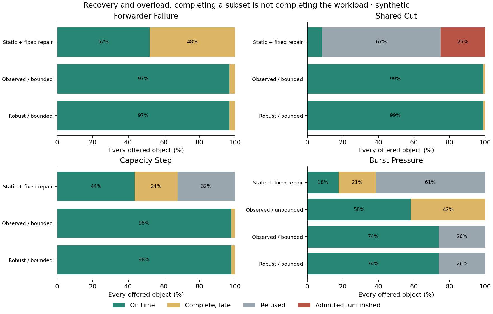

# Routing for fast, cheap delivery

The useful unit of optimization is a **delivery policy**, including its response
to missing progress and resource pressure. An edge-price tree is only a baseline.
The first version incorrectly presented that baseline as the main candidate:
equal-price chains introduced avoidable latency, and injecting failures into
the simulator did not make the route selection failure-aware.

The corrected [workbench](evidence/20260918/index.html) compares price/latency
search, an uncertainty/failure design ensemble, and an observation-driven
controller. It retains the weak baselines to make their failures visible.
All figures here are **synthetic model results**, not cloud measurements or CFT
commit timings. Delivery means every required recipient has the payload;
durability, admission and clearance remain outside this experiment.

## Equal dollars do not mean equal routes

In the original regional tree, `a0 → b2 → b0 → b1` could become
`a0 → b2 → {b0, b1}` at identical byte charges. The other destination zone had
the same unnecessary hop. Removing both reduces modeled 4 KiB p99 at 100/s from
297 µs to 258 µs. Changing only the b-zone branch improves its recipient latency
but leaves the c-zone critical path unchanged; the all-recipient p99 alone hides
that improvement. `regional-hop-check` preserves the one-branch and two-branch
comparisons under identical arrivals.

Depth is a useful proposal, not a substitute for capacity accounting. If a
relay already has K chunks, one outgoing NIC takes roughly `2K·s + d` to send
two branches, whereas a two-hop pipeline takes `(K+1)·s + 2d` under idealized
independent full-duplex NICs. Here s is one chunk's serialization and d is a
hop's propagation. A shorter route can lose when it concentrates sending work.
The apparatus has a hand-solvable test on both sides of that crossover.

The new regional bulk route sends two source copies, delegates another boundary
copy to a local recipient, and branches inside destination zones. It preserves
the two charged zone crossings while distributing NIC work.

This bulk fixture sends **1 MiB to eight recipients: nine hosts across three
modeled AZs**, with assumed 10 Gbit/s NICs and Poisson offers. Its p99 includes
burst contention. The [critical-path diagnostic](CRITICAL_PATH.md) traces the
actual tail objects and their overlapping work; it also explains why this
number cannot be compared directly with xmem's approximately 2 ms durable
small-write commits. It does not establish an optimized latency floor.

| Regional 1 MiB, 100 objects/s | Delivery p99 | Variable $/source GiB | Within 10 ms |
| --- | ---: | ---: | ---: |
| Direct fanout | 36.341 ms | 0.1447 | 16.7% |
| Price-only tree | 11.922 ms | 0.0483 | 95.8% |
| Same-price depth reduction | 11.902 ms | 0.0483 | 95.8% |
| Price + latency search | **5.322 ms** | **0.0483** | **100%** |

The revised search improves p99 by 55% against the price-only tree, at the same
charge. At 300 objects/s, its p99 is 7.073 ms versus 52.431 ms for price-only and
180.318 ms for direct fanout. With the root restricted to 25% of its nominal TX
capacity, explicit load distribution gives 12.658 ms instead of 292.689 ms for
price-only. These are conditional finite-cohort comparisons, not measured
steady-state capacity claims.

The search first minimizes incomplete planning objects, then chooses the
cheapest simulated shortlist candidate within a stated allowance of the best
planning percentile. The default is 10% above planning p90. It uses independent
planning arrivals, counts mean recipient completion when maxima tie, and uses
depth as a later tie-break. A five-round beam proposes candidates with shared
capacity, CPU, pipeline and queue proxies; only the simulator supplies reported
percentiles. The workbench exposes proposal/shortlist sizes and planning horizon.

## The deadline and the speed preference are different inputs

For the global bulk fixture, price-only delivery p99 is 67.282 ms at
$0.0425/source GiB; the faster selected plan is 55.522 ms at $0.1870/GiB.
Both deliver every offered object within the 100 ms deadline. The 10% relative
speed preference chooses the more expensive plan; the absolute deadline does
not require that expense. This is a real tradeoff to expose, rather than hiding
it behind a comparison against direct fanout, which is worse on both axes.

The private corridor's $1/hour is additional and excluded from those variable
prices. A deployment decision must amortize provisioned resources at its actual
traffic volume. The price ledger also distinguishes boundary transfer charges,
NAT processing, requests and total wire volume: fewer charged crossings can
cost less while moving the same total number of bytes.

## Chunking and MTU compose with route selection

For the revised regional route, whole-object forwarding yields 13.046 ms p99,
64 KiB chunks 5.322 ms, and 4 KiB chunks 4.933 ms. The smaller chunks improve
overlap but increase framing/CPU work and variable price from $0.0483 to
$0.0497/source GiB. Outer MTU 9000 with 64 KiB chunks gives 4.741 ms and
$0.0439/GiB. The parameters are modeled framing and CPU inputs; these results
do not establish a TCP/UDP/io_uring or WireGuard implementation ranking.

## Failure, uncertainty, exhaustion and live changes

The current mechanisms and their limits are explicit in [MODEL.md](MODEL.md):

| Factor | What is implemented | Remaining boundary |
| --- | --- | --- |
| Failure | Data-egress and shared-pool blackholes, delayed missing-progress reports, direct/holder repair, retries and charged duplicates | Not source loss, process death, loss of retained data, dead required recipients or membership changes. |
| Uncertainty | Independent planning/evaluation seeds; declared capacity haircut and common per-source failure design cases; worst-design risk before price/latency | No learned probability distribution, calibrated confidence bounds or exhaustive correlated-failure ensemble. |
| Exhaustion | Shared network/CPU queues plus a finite admitted-object window and payload reservations; refusals and unfinished obligations remain in results | No independent per-host buffer allocator, durable spill, connection caps or tenant scheduler. |
| Live graph rewriting | Reports drive temporary edge/pool suspicion; queued decisions cost source CPU; hysteresis; subsequent objects capture a revised tree; old objects receive repair copies from acknowledged holders | No free cancellation, instantaneous global cutover, proactive rejoin probing or distributed controller consensus. |

The controller cannot read the evaluation failure schedule. Possession is known
at the root only after a receipt arrives. A report about an unreceived downstream
copy traces back to the first unacknowledged holder; otherwise an upstream cut
could cause the controller to blacklist innocent downstream receivers. Distinct
failed paths sharing a declared network pool support a temporary common-pool
suspicion. Repair through a different logical edge that shares that pool does
not count as an independent alternative.

Old forwarding trees remain acyclic and fixed per object. Repair is a direct
overlay to a named missing recipient; duplicate chunks never forward twice.
Commands and all overlapping traffic consume modeled CPU/network service and
charges. The object window is released only after complete confirmations and
all outstanding transmissions drain. Missing a deadline does not discard an
admitted obligation or silently free its reservation.

The [decision framework](DECISIONS.md) explains how to judge these policies and
which observations and costs further algorithms must supply.

### Online comparisons

These bulk cases offer the same 96 objects to each policy. The fixed and
adaptive policies both have an eight-object window, except the four-object
burst case. All costs include repair and overlap.

| Disturbance | Fixed tree + absolute repair | Observed repair + rewriting |
| --- | --- | --- |
| Permanent forwarder egress failure | p99 33.871 ms; 52.1% within 10 ms | p99 11.914 ms; 96.9% within 10 ms |
| Shared A→B pool blackhole | 8/96 complete; 64 refused; 24 admitted and unfinished | 96/96 complete; p99 10.060 ms; 99.0% within 10 ms |
| Relay TX falls to 10% capacity | 65/96 complete; 31 refused | 96/96 complete; p99 12.122 ms; 97.9% within 10 ms |
| Transient forwarder failure | p99 29.236 ms; 80.2% within 10 ms | p99 5.538 ms; 100% within 10 ms |
| Healthy traffic, overly eager repair timer | p99 29.236 ms; 662 repairs; 4,061 duplicate chunks | p99 5.322 ms; no repairs or duplicate chunks |

Failure handling improves these outcomes but does not establish a 10 ms p99
guarantee. The permanent-forwarder case still makes 28 rewrites across three
seeds. Suspicions expire; the controller can reconsider a bad path without a
positive recovery probe. Its bounded hold interval prevents instant toggling,
but it is not a validated failure detector or production rejoin policy.

The 400/s burst workload demonstrates the exhaustion tradeoff. An unbounded
adaptive policy completes 96/96, but p99 reaches 112.437 ms and only 58.3% meet
the 15 ms deadline. The four-object window completes 71 on time and refuses 25;
its offered-work p90/p99 are therefore infinite. Calling the accepted subset a
successful low-latency service would hide the refusal rate. Peak active objects
are 16 versus 4; these imply 144 versus 36 MiB of reserved unique payload across
the source and eight required recipients in this fixture.

**Reactive routing also has a negative result.** With 4 KiB objects, a 600 µs
deadline and 100 µs stall threshold, the reactive policy makes 39 rewrites,
issues 1,859 repairs, and reaches 1.321 ms p99 with 77.9% on time. Fixed repair
delivers all on time at 0.518 ms p99. Robust design selects direct fanout before
traffic begins: 0.247 ms p99, 100% on time, no repairs. Its variable price is
$0.1711/source GiB, versus $0.1180 for fixed repair and $0.2247 for the reactive
policy. The design ensemble changes the choice because forwarding failures
cannot be repaired cheaply enough for that deadline; adaptation is not always
the right first response.

## Offered load and the useful operating region

For the revised 1 MiB regional route, 25→150 objects/s raises offered throughput
sixfold while p50 stays near 2.43 ms. The tail still moves: p90 grows from
2.435 to 3.935 ms and p99 from 3.687 to 5.763 ms. At 200/s, p50 is 2.457 ms and
p99 6.551 ms; at 300/s, p50 is 3.661 ms and p99 7.073 ms. That suggests testing
150–200/s as a useful median-latency operating region under these assumptions,
while choosing a lower rate if the tail matters more. It does not locate a
universal knee or demonstrate steady-state throughput at larger loads.

## Fetch remains a distinct choice

In the illustrative holder fixture, request fees make the peer cheaper at
1–16 KiB; by 64 KiB the blob copy is cheaper, but its p99 is 7.219 ms versus
0.371 ms from the peer. At 1 MiB, blob p99 is 10.208 ms and only 22.9% meet the
8 ms deadline. The nominal-deadline selector still chooses it: an unloaded
estimate does not constrain queueing. Tightening that nominal limit to 2 ms
selects the peer, with 1.797 ms evaluated p99. These holder selectors are
retained baselines, not claims that fetch eligibility or tail-aware selection
has been solved by the propagation controller.

## Reproduction and limits

The retained campaign uses evaluation seeds 17, 29 and 43, with 96 or 384 offered
objects in most comparisons. p50, p90, p99 and p99.9 are separate outputs. With
these populations, p99.9 is near the synthetic maximum and is not an empirical
tail guarantee. Incomplete delivery and admission refusal remain in quantiles
as infinity; deadline success uses every offered object.

The run preserves exact inputs, source snapshots, outcome rows, per-policy
routes, first-object schedules, resource/charge ledgers, controller events and
planning design trials. The [README](README.md) has rerun commands. Eighteen
focused checks cover capacity conservation, causal chunk forwarding, independent
planning, minimum-price/latency toy oracles, observation timing, acknowledged
holders, common-cut inference, overlap accounting, and bounded admission.

The model's static optimizer is a bounded heuristic; its controller is also a
specific experimental policy. The graph sizes, traffic distributions, prices,
CPU assumptions and fault observations are inputs to challenge. This workbench
does not choose Orbital's consensus or turn a transport completion into a
durability/admission/clearance guarantee.
